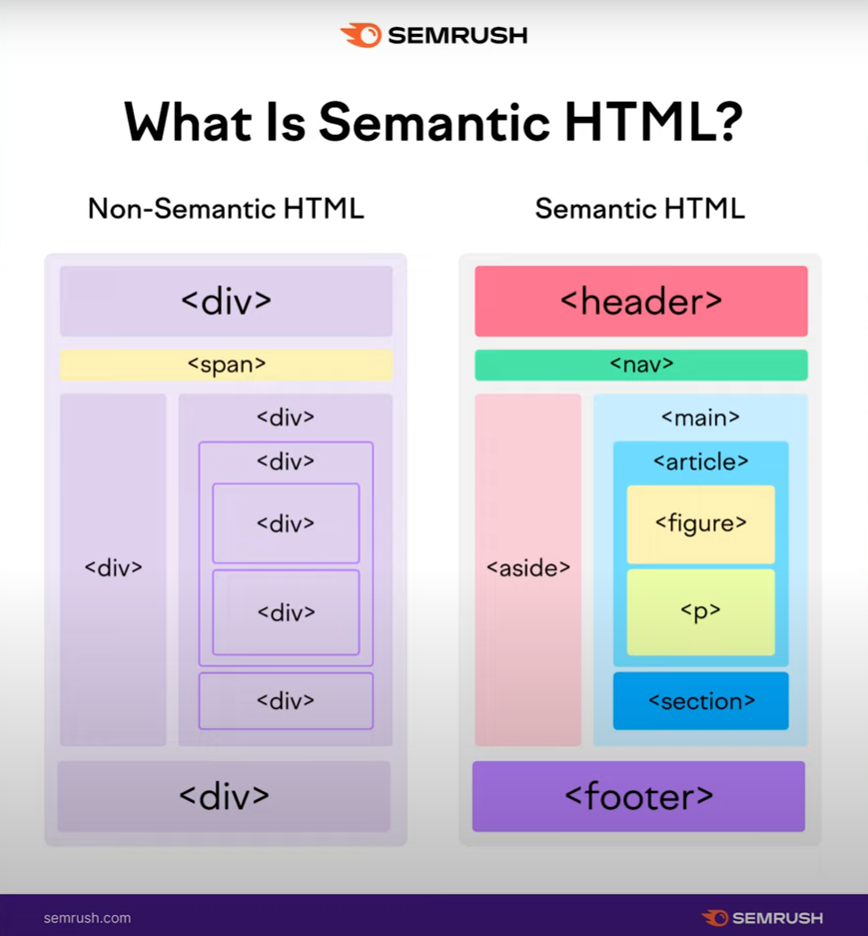

<!--
https://www.youtube.com/watch?v=yE4Rlp0OeVc&list=PL0MUAHwery4ot0KmgGxlBSB7rXssLeA6h
-->

# HTML

- [Что такое HTML](#html) 
  - Понятие тега - Страница HTML состоит из тегов.
  - Парные теги
  - Одиночные теги
  - Понятие вложенности
  - Порядок открытия и закрытия тегов
  - Атрибуты

- [Блочные и строчные теги](#tags-included) 
  - Как вкладывать теги

- [Описание блочных и строчных тегов](#tags-types) 
  - Семантическая разметка
  - 2 тега с нейтральными ролями

- [Теги: заголовков, параграфов и списков](#tags-h-p-li) 
- [Форматирование текста](#formated-text) 
- [Ссылки и кнопки](#links-buttons) 
- [HTML изображения — тег img](#images) 
- [Относительные и абсолютные пути](#patch) 
- [Цитаты](#citate) 
- [Теги медиаконтента - видео, аудио, фреймы](#media-tags) 
- [HTML - таблицы](#tables) 
- [HTML формы. Теги form, fieldset, legend, label и поле ввода input](#forms) 
- [HTML тег input и его вариации.](#input)
- [Формы в HTML](#forms-in-html)
- [Атрибуты required, disabled, readonly, placeholder, inputmode, type и autocomplete](#attributes) 
  - Как браузер понимает какие данные давать для авто подсказки
- [Семантические теги HTML: header, main, footer, section, aside, nav и остальные.](#semantic) 
- [HTML векторная графика, тег svg. Как выгрузить SVG изображение из Figma](#vector-images) 
- [Глобальные атрибуты HTML — class, id, title, hidden, tabindex, lang и др. Комментарии в разметке](#global-attributes) 
- [Актуальность HTML-тегов и атрибутов.](#current-tags) 
- [Используемые ресурсы](#resources) 

---
<a name="html"><h2> </h2></a>
## Что такое HTML - (HyperText Markup Language) - язык гипертекстовой разметки

- Понятие тега - Страница HTML состоит из тегов.

```html

<button>Кнопка 1</button>
<button>Кнопка 2</button>
<a href="/">Ссылка 1</a>
<a href="/">Ссылка 2</a>
<p>Параграф с текстом...</p>
<p>Ещё один параграф с текстом</p>
<button>Кнопка 3</button>
```

- Парные теги

```html
<p>Параграф с текстом</p>

<div>Содержимое тега</div>
```

- Одиночные теги

```html
<input>
<input/>


<br /> 
```

Поток документа - последовательность тегов и контента - который отображается в браузере на странице

- Браузер считывает теги слева на права и сверху вниз - создавая поток. В этой последовательности будут выведены
  элементы

Понятие вложенности - Одни теги могут содержать другие, и так до бесконечности

```html
<!-- Emmet: article>div>p{Я параграф с текстом}+input -->

<article>
    <div>
        <p>Я параграф с текстом</p>
        <input type="text"/>
    </div>
</article>
```

Порядок открытия и закрытия тегов   
Неправильное закрытие тега может привести к ошибкам отображения

```html
<!--article>div{...}-->

<article>
    <div>
        ...
    </div>
</article>
```

Атрибуты - дополнительные свойства которые могут быть присвоены тегами для определения их характеристик и поведения

- Атрибуты размещаются в открывающей части тега.
- Атрибутов у тега может быть несколько, разделять их нужно через пробел, можно переносить на другую строку
- Есть атрибуты со значением, есть одиночные атрибуты - состоящие из одного названия  (без знака `=` и `значения`)
- Существуют глобальные атрибуты - которые применимы ко всем тегам `class`

- Атрибут `href` имеет значение `https://localhost`

```html
Атрибут [href] содержащий значение
<a href="https://localhost"</a>

Атрибут [disabled] состоит из названия - не имеет значения
<button type="submit" disabled>Кнопка 1</button>

Перечисление атрибутов через пробел и их перенос

```

```html
div.some-block{...}+a.some-link[href="/"]{...}+input.some-input[placeholder="Введите имя"]

<div class="some-block">...</div>
<a href="/" class="some-link">...</a>
<input type="text" class="some-input" placeholder="Введите имя"/>
```

У любой HTML страницы есть базовая структура состоящая из нескольких обязательных тегов

```html
<!doctype html>
<html lang="ru">
<head>
    <meta charset="UTF-8"/>
    <meta name="description" content="Описание страницы"/>
    <meta name="keywords" content="ключевое слово 1, ключевое слово 2"/>
    <meta name="viewport" content="width=device-width, initial-scale=1"/>
    <title>Документ</title>
</head>
<body>
Здесь будет весь контент страницы
</body>
</html>
```

---
<a name="tags-included"><h2> </h2></a>
## Блочные и строчные теги

- блочные теги - занимают всю доступную ширину
- строчные теги - занимают ширину равную внутреннему содержимому

```html
<p style="background-color: chocolate">
    Параграф с каким-то текстом,
    а <b style="background-color: cornflowerblue">это часть текста</b>
    выделена жирным
</p>
```

Как вкладывать теги:
- строчный в блочный - можно
- строчные в строчные - можно
- блочный в строчный - нельзя

```html
<!--Можно-->
<p>
    <b>Текст...</b>
</p>

<!--Можно-->
<p>
    Параграф с <b>жирным и <i>курсивным текстом</i></b>
</p>

<!--Нельзя-->
<b>
    <p>Текст...</p>
</b>
```

---
<a name="tags-types"><h2> </h2></a>
## Описание блочных и строчных тегов

- [https://developer.mozilla.org/ru/docs/Web/HTML](https://developer.mozilla.org/ru/docs/Web/HTML)
  описание тегов HTML

---
Семантика - когда каждый тег используется по его назначению

Семантическая разметка

```html
<!--h1{Я главный заголовок}+button{Я кнопка}+a{Я ссылка}+p{Я параграф}+ul>li{Я элемент списка}*3-->

<h1>Я главный заголовок</h1>
<button>Я кнопка</button>
<a href="/">Я ссылка</a>
<p>Я параграф</p>
<ul>
    <li>Я элемент списка</li>
    <li>Я элемент списка</li>
    <li>Я элемент списка</li>
</ul>
```

В HTML есть 2 тега с нейтральными ролями

- `div` - нейтральный блочный тег (занимает всю доступную ширину)
- `span` - нейтральный строчный тег (занимает содержимое контента)

```html
<!--div{Нейтральный блочный тег}+span{Нейтральный строчный тег}-->

<div>Нейтральный блочный тег</div>

<span>Нейтральный строчный тег</span>
```

---
<a name="tags-h-p-li"><h2> </h2></a>
## Теги: Заголовков, параграфов и списков

- Заголовки

```html
<!--p>h${Заголовок $-го уровня}*6-->

<h1>Заголовок 1-го уровня</h1>
<h2>Заголовок 2-го уровня</h2>
<h3>Заголовок 3-го уровня</h3>
<h4>Заголовок 4-го уровня</h4>
<h5>Заголовок 5-го уровня</h5>
<h6>Заголовок 6-го уровня</h6>
```

- `h1` - главный заголовок, на каждой странице должен быть только 1 такой заголовок
- Все заголовки на странице должны идти по порядку без пропусков

```html
<!--section>h2{Я заголовок секции}+(article>h3{Я заголовок карточки товара})*3-->

<section>
    <h2>Я заголовок секции</h2>
    <article>
        <h3>Я заголовок карточки товара</h3>
    </article>
    <article>
        <h3>Я заголовок карточки товара</h3>
    </article>
    <article>
        <h3>Я заголовок карточки товара</h3>
    </article>
</section>
```

Заголовки должны быть осмысленными

```html
<!--h1{}+section>h2{}+(article>h3{})*3^section>h2{}+article{}$2-->
<!--h1{Онлайн-магазин}+section>h2{Каталог товаров}+(article>h3{lorem3})*3^section>h2{}+(article>h3{})*2-->

<!--
h1{Онлайн-магазин}+section>h2{Каталог товаров}+
(article>h3{Светильник $})*3^
section>h2{Доставка и оплата}+(article>h3{Районная доставка $})*2^
section>h2{Гарантии}+div>h3{Клятва начинающего}^
div>h3{Отзывы от друзей}^div>h3{Контакты}-->

<h1>Онлайн-магазин</h1>
<section>
    <h2>Каталог товаров</h2>
    <article>
        <h3>Светильник 1</h3>
    </article>
    <article>
        <h3>Светильник 2</h3>
    </article>
    <article>
        <h3>Светильник 3</h3>
    </article>
</section>
<section>
    <h2>Доставка и оплата</h2>
    <article>
        <h3>Районная доставка 1</h3>
    </article>
    <article>
        <h3>Районная доставка 2</h3>
    </article>
</section>
<section>
    <h2>Гарантии</h2>
    <div>
        <h3>Клятва начинающего</h3>
    </div>
    <div>
        <h3>Отзывы от друзей</h3>
    </div>
    <div>
        <h3>Контакты</h3>
    </div>
</section>
```

---
Тег параграфа - абзаца

```html
<!--div>(p{lorem5})*3-->

<p>Lorem ipsum dolor sit amet.</p>
<p>Lorem ipsum dolor sit amet.</p>
<p>Lorem ipsum dolor sit amet.</p>
```

- Тег параграфа является блочным, занимает всю ширину.
- Всё что в этом теге - начинается с новой строки
- Тегом `p` оборачивать как минимум одно предложение, или несколько.
- НЕ оборачивать им 1 слово.

---
Списки - являются блочными

Списки бывают 2 видов

- `ul` - не упорядоченный маркированный
- `ol` - упорядоченный нумерованный

```html
<!--ul>(li{Я элемент маркированного списка})*3^ol>(li{Я элемент нумерованного списка})*3-->

<ul>
  <li>Я элемент маркированного списка</li>
  <li>Я элемент маркированного списка</li>
  <li>Я элемент маркированного списка</li>
</ul>
<ol>
  <li>Я элемент нумерованного списка</li>
  <li>Я элемент нумерованного списка</li>
  <li>Я элемент нумерованного списка</li>
</ol>
```

- В качестве прямых потомков для тегов `ul` и `ol` могут быть только `li`

```html
<!--ul>li{...}^ul>p{...}^ul-->

<!--    Можно-->
<ul>
  <li>...</li>
</ul>

<!--    Нельзя-->
<ul>
  <p>...</p>
</ul>

<!--    Нельзя-->
<ul>
  Какой-то текст
</ul>
```

- `li` - внутри себя может содержать любые теги в любом количестве

```html
<!--ul>li>article>h3{...}+p{...}+button{...}-->

<ul>
  <li>
    <article>
      <h3>...</h3>
      <p>...</p>
      <button>...</button>
    </article>
  </li>
</ul>

<!--ul>li>ul>li{Элемент внутреннего списка}*3-->

<ul>
  <li>
    <ul>
      <li>Элемент внутреннего списка</li>
      <li>Элемент внутреннего списка</li>
      <li>Элемент внутреннего списка</li>
    </ul>
  </li>
</ul>
```

- тег `li` не может использовать сам по себе без
- он может быть только в теге `ul` или `ol`

> Списками стоит оборачивать любую последовательность

```html
<!--h2{Список дело:}+ul>li{lorem3}*3^h2{Рецепт "Шакшука"}+ol>li{lorem5}*4-->
<!--header>nav>ul>(li>a{lorem})*3-->

<h2>Список дело:</h2>
<ul>
  <li>lorem3</li>
  <li>lorem3</li>
  <li>lorem3</li>
</ul>

<h2>Рецепт "Шакшука"</h2>
<ol>
  <li>lorem5</li>
  <li>lorem5</li>
  <li>lorem5</li>
  <li>lorem5</li>
</ol>

<header>
  <nav>
    <ul>
      <li>
        <a href="">lorem</a>
      </li>
      <li>
        <a href="">lorem</a>
      </li>
      <li>
        <a href="">lorem</a>
      </li>
    </ul>
  </nav>
</header>
```

---
<a name="formated-text"><h2> </h2></a>
## Форматирование текста

Все теги форматирования текста являются строчными, их можно использовать совместно (вкладывать друг в друга) в любых
комбинациях

- `b` - выделяет текст жирным, (не семантический, просто выделяет)
- `strong` - выделяет текст жирным, (семантический, добавляет важность)
  - можно вкладывать друг в друга для усиления важности 
  - `<strong>и вышел он <strong>к морю</strong></strong>`
- `i` - выделение текста курсивом, (не семантический)
- `em` - выделение текста курсивом, (семантический, придаёт особый смысл)
- `s` - выделение текста который уже потерял свою актуальность, `Цена: <s>$1000</s> $700`
- `u` - стилистическое выделение текста, которое отличается от остального текста
- `sub` - используется чтобы сделать текст подстрочным, например для формулы воды `H2O` - `H<sub>2</sub>O`
- `sup` - используется чтобы сделать текст надстрочным
- `small` - задаёт мелкий размер шрифта, размер на 20% меньше чем текст который его окружает. 
- `mark` - выделяет важный фрагмент, по умолчанию выделяет жёлтым цветом
- `br` - указывает место разрыва строки, после которого текст нужно перенести на новую строку
- `hr` - добавляет горизонтальную линию на странице
- `code` - используется для вывода фрагментов кода
- `pre` - выводит в браузере пробелы и переносы строк так как это записано

```html
<!--p>{text }+b{select}+{ text }+i{text}+{, }+sub{text}+{, text }+sup{text}-->

<p>
  text <b>select</b>
  text <i>text</i>,
  <sub>text</sub>,
  text <sup>text</sup>
</p>
```

```html
<!--p>b>i>s>{А в этом параграфе всё жирное, курсивом и перечёркнутое}-->

<p>
  <b>
    <i>
      <s>
          А в этом параграфе всё жирное, курсивом и перечёркнутое
      </s>
    </i>
  </b>
</p>
```

- `s`
```html
<!--div>{Цена: }+s{\$1000}+{ \$700}-->

<div>
    Цена: <s>$1000</s> $700
</div>
```

- `u`
```html
<!--p>{Специально допустим }+u{ашибку}+{ в этом предложении.}-->

<p>Специально допустим <u>ашибку</u> в этом предложении.</p>

```

- `sub`
```html
<!--p>{H}+sub{2}+{O - это соединение водорода с кислородом, так же называют оксид водорода.}-->

<p>
    H<sub>2</sub>O - это соединение водорода с кислородом, 
    так же называют оксид водорода.
</p>
```

- `sup`
```html
<!--p>{(a + b)}+sup{2}+{ = a}+sup{2}+{ + 2ab + b}+sup{2}-->

<p>
    (a + b)<sup>2</sup> = a<sup>2</sup> + 2ab + b<sup>2</sup>
</p>
```

- `small`
```html
<!--p>lorem5-->
<!--p>small>{И. И. Иванов, перевод на русский язык, 2020}-->

<p>Lorem ipsum dolor sit amet.</p>

<p><small>И. И. Иванов, перевод на русский язык, 2020</small></p>
```

- `mark`
```html
<!--h3>{Результаты поиска по запросу "HTML"}^p>mark{HTML}+{ - язык гипертекстовой разметки. Язык }+mark{HTML}+{ предназначен для веб-страниц}-->

<h3>Результаты поиска по запросу "HTML"</h3>
<p>
    <mark>HTML</mark> - язык гипертекстовой разметки. 
    Язык <mark>HTML</mark> предназначен для веб-страниц
</p>
```

- `br`
```html
<!--div>{Супер предложение "два по цене одного"}+br+{- только до 11.11}-->

<div>Супер предложение "два по цене одного"<br>- только до 11.11</div>

<p>
    У лукоморья дуб зелёный,<br/>
    Златая цепь на дубе том:<br/>
    И днём и ночью кот учёный<br/>
    Всё ходит по цепи кругом.<br/>
</p>
```

- `hr`
```html
<!--p>{lorem5}^p>{lorem5}^hr^p>{lorem5}-->

<p>Lorem ipsum dolor sit amet.</p>
<p>Lorem ipsum dolor sit amet.</p>
<hr/>
<p>Lorem ipsum dolor sit amet.</p>
```

- `code`, `pre`
```html
<code>
const user = {
  name: 'Aleksander',
  age: 27,
  isDeveloper: true,
}
</code>

<pre>
    <code> 
const user = {
  name: 'Aleksander',
  age: 27,
  isDeveloper: true,
} 
    </code>
</pre>
```

---
<a name="links-buttons"><h2> </h2></a>
## Ссылки и кнопки

- `a` - ссылка может
  - вести на любую страницу на текущем сайте
  - вести на любую страницу в интернете
  - указывать на конкретный элемент на текущей странице
  - вести на файл
  - вести на электронную почту
  - вести на телефон
- `button` - кнопки

```html
<!--p>{Детали заказа №4815162342 доступны по }+a[href="order-details.html"]{ссылке}-->

<p>
    Детали заказа №4815162342 
    доступны по <a href="order-details.html">ссылке</a>
</p>
```

- `a` - якорная ссылка
```html
<!--a[href="#contacts"]>{Наши контакты}-->
<!--(p>{lorem50})*5-->
<!--h1[id="contacts"]>{Контакты...}-->
<!--(p>{lorem50})*5-->

<a href="#contacts">Наши контакты</a>

<p>lorem50</p>
<p>lorem50</p>
<p>lorem50</p>
<p>lorem50</p>
<p>lorem50</p>

<h1 id="contacts">Контакты...</h1>

<p>lorem50</p>
<p>lorem50</p>
<p>lorem50</p>
<p>lorem50</p>
<p>lorem50</p>
```

- ссылка для скачивания файла по ссылке
```html
<!--a[href="./some-file.zip" download]>{скачать}-->

<a href="./some-file.zip" download>скачать</a>
```

- ссылка для электронной почты
```html
<!--p>{Связь с отделом продаж: }+a[href="mailto:example@mail.com"]>{example@mail.com}-->

<p>
    Связь с отделом продаж: 
    <a href="mailto:example@mail.com">example@mail.com</a>
</p>
```

- ссылка на телефон, при нажатии - устройство предложит позвонить по указанному номеру
```html
<!--p>{Связь с отделом продаж: }+a[href="tel:+79999999999"]>{+7 (999) 999-99-99}-->

<p>
    Связь с отделом продаж: 
    <a href="tel:+79999999999">+7 (999) 999-99-99</a>
</p>
```

- открытие ссылки в новой вкладке браузера
```html
<!--h2>{Наши соц. сети}^ul>(li>a[href="https://example.com" target="_blank"]>{example})*3-->

<h2>Наши соц. сети</h2>
<ul>
    <li><a href="https://vk.com/blabla" target="_blank">VK</a></li>
    <li><a href="https://t.me/blabla" target="_blank">Telegram</a></li>
    <li><a href="https://f-book.com/" target="_blank">F***book/a></li>
</ul>
```

Для обработки пользовательских действий на сайте используются кнопки
```html
<!--button[type="button"]>{Закрыть уведомление}-->
<!--button[type="submit"]>{Войти}-->
<!--button[type="reset"]>{Сбросить фильтр}-->
<!--button[type="button"]>{< Назад}-->
<!--button[type="button"]>{Вперёд >}-->

<button type="button">Закрыть уведомление</button>
<button type="submit">Войти</button>
<button type="reset">Сбросить фильтр</button>
<button type="button">< Назад</button>
<button type="button">Вперёд ></button>
```

У кнопки для атрибута `type` есть три значения:
- `type="button"` - стоит прописывать всем кнопкам по умолчанию
- `type="submit"` - используется если тег `button` лежит внутри `form` - для отправки формы
- `type="reset"` - используется если тег `button` лежит внутри `form` - сбрасывает введённые в форму значения до значений по умолчанию

```html
<!--form>input[type="password"]+button>{"Иконка с глазом"}^button[type="submit"]>{Войти}-->

<form action="">
    <input type="password">
    <button>"Иконка с глазом"</button>
    <button type="submit">Войти</button>
</form>
```

>Если не указать для кнопки `type` - браузер по умолчанию назначает тип. Если этот тип не `type="button"` и  не `type="reset"`, тогда он назначит `type="submit"`

Часто так бывает что анализируя макет множество элементов выглядят как кнопки, но на уровне кода будут ссылками и наоборот - выглядят как ссылки, а в коде кнопки.


>Если при нажатии на элемент должны переходить на другую страницу 
>- то нужно делать ссылкой - с тегом `a`,  
>
>а если при нажатии будут действия на текущей странице (откроется модальное окно),
>- то такой код нужно оформлять кнопкой - с тегом `button`

---
<a name="images"><h2> </h2></a>
## HTML изображения — тег img

- добавление изображения на страницу

```html

```

Обязательные атрибуты:
- `src` - путь к файлу изображения
- `alt` - текст, который будет показан если изображение не загрузится

Необязательные атрибуты:
- `width` - ширина изображения
- `height` - высота изображения

Для изображений в `html` желательно указывать размеры, т.к. браузер сначала отрисовывает `html`, а потом  `css.

Если у изображения нет размеров, браузер отводит для его размещения 0 размер, при подгрузке изображения будут сдвинуты все элементы
Если у изображение есть размеры - браузер резервирует место в макете для изображения.

Если нужно загружать изображения которые находятся ниже в экране и не видны сразу - стоит использовать "ленивую загрузку"
раньше ленивую загрузку реализовывали средствами JavaScript

Сейчас в HTML есть тег для осуществления ленивой загрузки - `loading="lazy"`
```html
<!--img[src="img/koala-1.jpg" alt="коала" width="250" height="250" loading="lazy"]*3-->


```

---
<a name="patch"><h2> </h2></a>
## Относительные и абсолютные пути

Относительные пути - указывают адрес до ресурса относительно файла в котором используются
```html
<!--a[href="contacts.html"]{Contacts}+img[src=""./img/koala.jpg]+video[src="./video/example.mp4" controls]-->

<a href="contacts.html">Contacts</a>


<video src="./video/example.mp4" controls></video>
```

Абсолютные пути - указывают адрес до ресурса относительно корня сайта,
- абсолютный путь всегда начинается с символа слэша - `/`
```html
<!--h1{Главная}+img[src="/img/koala.jpg"]-->

<h1>Главная</h1>

```

Преимущество абсолютного над относительным путём в том, 
что где бы не находился файл использующий ресурсы - путь до подключаемого файла всегда будет один и тот же.

Пример:
```html
<!--h1{О нас}+img[src="../../img/koala.jpg"]-->

<h1>О нас</h1>

Относительный путь будет меняться в зависимости от вложенности файла где подключается изображение


Абсолютный путь во всех файлах - где подключается изображение будет одинаковый

```

---
<a name="citate"><h2> </h2></a>
## Цитаты 

- `blockquote` - является блочным тегом, служит для большого блока с цитатой
- `q` - строчный тег цитаты, используется для выделения коротких цитат прямо в тексте

>По умолчанию браузер добавить кавычки вокруг текста для тега `q`, вид кавычек отличается в зависимости от языка в  атрибуте `lang=en` тега `html`

```html
<!--blockquote>p{lorem5}-->

<blockquote>
    <p>Lorem ipsum dolor sit amet.</p>
</blockquote>
```

Цитата без указания источника - плохая цитата (без информативности и семантики)

Источник указывается через тег `cite` или атрибут `cite` в теге `blockquote`

```html
1 вариант 
<blockquote>
    <p>Lorem ipsum dolor sit amet.</p>
</blockquote>
<p>Имя автора, <cite>Источник...</cite></p>

2 вариант
<blockquote cite="Источник...">
    <p>Lorem ipsum dolor sit amet.</p>
</blockquote>
```
>Имя автора не должно являться источником и не должно быть частью тега `cite`

Источником является ресурс - откуда эта цитата была взята.

Тег `cite` можно так же использовать для указания книг, картин, предметов искусства 

Тег `q`
```html
<!--p>{Как сказал бы Станиславский: }+q[cite="..."]{Не верю!}-->

<p>Как сказал бы Станиславский: <q cite="...">Не верю!</q></p>
```

---
<a name="media-tags"><h2> </h2></a>
## Теги медиаконтента - видео, аудио, фреймы

- `video` 
  - атрибут `controls` - добавляет на плеер кнопки управления видео
  - атрибуты `width` и `height` задают ширину и высоту 
  - атрибут `autoplay` - добавляют авто проигрывание видео сразу после загрузки страницы
  - атрибут `muted` - идёт в паре с атрибутом `autoplay` - позволяет запустить видео без звука
    - `autoplay muted` - авто воспроизведение не запустится без атрибута `muted`
  - атрибут `loop` - используется для зацикливания воспроизведения 
  - атрибут `poster="./img/video-preloader.jpg"` указывает изображение обложки, которое будет отображаться до загрузки и  воспроизведения
    - если не указать этот атрибут, то пользователь будет видеть первый кадр видео 
  - атрибут `playsinline` меняет стандартное поведение плеера на мобильных устройствах, вместо открытия видео в полноэкранном режиме, оно будет открываться в стандартных рамках своего элемента

- `audio` - выводит на страницу компактный аудио плеер, внешний вид зависит от браузера
  - применяются практически те же атрибуты, что и к видео 
  
- `iframe` - позволяет вывести на сайте виджет (погоды, карты, ютуб канала) или другой сайт. 
- `source` - 


```html
<!--video[src="video/example.mp4" controls]-->

<video src="video/example.mp4" controls></video>
```

```html
<video src="">
    <source src="video/example.mp4" type="video/mp4">
    <source src="video/example.webm" type="video/webm">
    <p>К сожалению, ваш браузер не поддерживает видео</p>
    <!-- или вывести изображение -->
</video>
```

```html
<video 
    src="video/example.mp4" 
    controls
    width="480"
    height="270"
></video>
```

```html
audio[controls]>(source[src="./audio/example.mp3" type="audio/mpeg"])*2+p>{Ваш браузер не поддерживает встроенное аудио. Попробуйте }+a[href="./audio/example.mp3" download]{скачать}+{ файл.}

<audio src="" conrols="">
    <source src="./audio/example.mp3" type="audio/mpeg">
    <source src="./audio/example.ogg" type="audio/ogg">
    <p>
        Ваш браузер не поддерживает встроенное аудио. Попробуйте 
        <a href="./audio/example.mp3" download>скачать</a> файл.
    </p>
</audio>
```

```html
<iframe src="https://www.youtube.com/embed/tgbNymZ7vqY"></iframe>

<iframe src="https://yandex.ru/map-widget/v1/?um=constructor%3A7704c71604dc1b84b6590472c2a1b89903d70e1f9f48eefad41c3f345c54fb3e&amp;source=constructor" width="785" height="582" frameborder="0"></iframe>

<iframe 
  width="560" 
  height="315" 
  src="https://www.youtube.com/embed/6PL2TqBdz0I?si=3_-noR0jR8xjqnJo" 
  title="YouTube video player" 
  frameborder="0" 
  allow="accelerometer; autoplay; clipboard-write; encrypted-media; gyroscope; picture-in-picture; web-share" 
  referrerpolicy="strict-origin-when-cross-origin" 
  allowfullscreen
></iframe>
```

---
<a name="tables"><h2> </h2></a>
## HTML - таблицы

- `table` - обязательный тег любой таблицы, оборачивает все остальные табличные теги
- `tr` - используется для выделения строк в таблицах (располагается внутри тега `table`)
- `td` - используется в качестве обычной ячейки таблицы (располагается внутри тега `tr`)
- `th` - используется в качестве заголовочной ячейки таблицы, (располагается внутри тега `tr`)
- `caption` - общий заголовок таблицы (располагается строго внутри тега `table`, сразу после тега `table`)
  - такой тег в таблице может быть ровно 1 
- `thead` - оборачивает одну или несколько строк
- `tbody` - выделяет основную часть таблицы
- `tfoot` - выделяет нижнюю часть таблицы обычно итого 

Объединение ячеек
- `colspan=3` - растягивает колонку по горизонтали, будет занимать не 1, а 3 колонки 
- `rowspan=2` - растягивает колонку по вертикали, будет занимать 2 строки

```html
<!--table>tr>th{Title}+th{Nomer}^(tr>td{Name}+td{10$})*3-->

<table>
    <caption>Расчётный лист услуг ЖКХ</caption>
    <tr>
        <th>Title</th>
        <th>Nomer</th>
    </tr>
    <tr>
        <td>Name</td>
        <td>101</td>
    </tr>
    <tr>
        <td>Name</td>
        <td>102</td>
    </tr>
    <tr>
        <td>Name</td>
        <td>103</td>
    </tr>
</table>
```

```html
<!--table>caption{Title}+thead>tr>th{Title}*3^^tbody>(tr>td{content}*3)*3^^tfoot>tr>td{content}*3-->

<table>
    <caption>Расчетный лист услуг ЖКХ</caption>
    <thead>
    <tr>
        <th rowspan="2">Вид услуги</th>
        <th rowspan="2">Ед. изм.</th>
        <th colspan="2">Объём коммунальных услуг</th>
        <th rowspan="2">Размер платы</th>
    </tr>
    <tr>
        <th>на индивид. потребл.</th>
        <th>на общедом. нужды</th>

    </tr>
    </thead>
    <tbody>
    <tr>
        <td>Холодная вода</td>
        <td>Куб м.</td>
        <td>3</td>
        <td>4</td>
        <td>1000</td>
    </tr>

    </tbody>
    <tfoot>
    <tr>
        <td>Итого к оплате за расчетный период</td>
        <td colspan="4">9999.0</td>
    </tr>
    </tfoot>
</table>
```

---
<a name="forms"><h2> </h2></a>
## HTML формы. Теги form, fieldset, legend, label и поле ввода input

- `form` - оборачиваются все формы, имеет 2 важных атрибута
  - `action="/"` - адрес куда отправится форма 
  - `method="post"` - метод отправки формы `get`, `post` (по умолчанию используется `post`)
  - `enctype="multipart/form-data"` - атрибут для отправки файлов
- `fieldset` - для визуальной группировки нескольких данных в один набор
  - по умолчанию браузер добавляет к тегу однопиксельную серую рамку
- `legend` - используется в качестве заголовка внутри тега `fieldset`
- `label` - тег метки, к любому интерактивному полю ввода (семантически является обязательным)
- `input` - самый главный и многогранный тег для пользовательских полей (является одиночным)
  - связка тегов `label` и `input`: 
  - `<label for="login">Логин:</label>`
  - `<input id="login" type="text">`
- `name` - определяет имя поля для распознавания данных на сервере
- `value` - для данных где можно вводить - браузер отобразит значение по умолчанию 
- `type` - настройка типа поля через атрибут (по умолчанию `type="text"`)

```html
<form action="/" method="post">
<!--    (fieldset>legend{Title}+{ ...})*3-->
    
    <fieldset>
        <legend>Title</legend>
        <label for="login">Логин:</label>
        <input id="login" type="text" name="user-login">
        ...
    </fieldset>
    <fieldset>
        <legend>Title</legend>
        ...
    </fieldset>
    <fieldset>
        <legend>Title</legend>
        ...
    </fieldset>
</form>
```

---
<a name="input"><h2> </h2></a>
## HTML тег input и его вариации.

- `type="email"` - для электронной почты, перед отправкой браузер проверит корректность введённого `email`
- `type="url"` - для ввода адреса какого либо сайта
- `type="tel"` - для ввода номера телефона (для тач устройств выведет цифровую клавиатуру)
- `type="search"` - для ввода поискового запроса (браузер выведет `input` с крестиком для удаления введённого значения, крестик можно скрыть через CSS)
- `type="number"` - для полей в которых допустимо вводить только числовые значения
- `type="password"` - служит для поля ввода пароля, браузер буде скрывать вводимые значения символами точки
- Для ввода дат есть много форматов, для каждого формата будет специальная клавиатура
  - `type="data"` - формат: день, месяц, год
  - `type="datetime-local"` - формат: день, месяц, год и время в текущем часовом поясе
  - `type="month"` - формат: месяц, год
  - `type="week"` - формат: выбор недели
  - `type="time"` - формат: выбор времени
- `type="color"` - для выбора цвета
- `type="file" multiple` - при клике можно прикрепить файл или несколько файлов - если есть дополнительный атрибут `multiple`
- `type="checkbox"` - квадрат при клике по которому появляется галочка, можно использовать с тегом `label`
  - `type="checkbox" checked` - атрибут `checked` устанавливает галочку в чекбокс
- `type="radio"` - служит для выбора 1 значения из нескольких выбранных
- `type="range"` - ползунок для выбора диапазона, имеет атрибуты:
  - `min="1"` -  минимальное значение
  - `max="100"` - максимальное значение
  - `step="5"` - шаг
  - `value="50"` - значение по умолчанию
  - `<input type="range" min="0" max="100" step="10" value="50">`

```html
<input type="button">
<input type="checkbox">
<input type="color">
<input type="date">
<input type="datetime-local">
<input type="email">
<input type="file">
<input type="hidden">
<input type="image">
<input type="month">
<input type="number">
<input type="password">
<input type="radio">
<input type="range">
<input type="reset">
<input type="search">
<input type="submit">
<input type="tel">
<input type="text">
<input type="time">
<input type="url">
<input type="week">
```

```html
<p>
<input type="checkbox" id="agreement">
<label for="agreement">Я согласен со всеми условиями</label>
</p>
```

- Radio
```html
<!--form>fieldset>legend{Ваш пол}+(p>input[type="radio" id=male name="gender" value="male" checked]+label[for="male"]{Муж.})*2-->

<form action="">
    <fieldset>
        <legend>Ваш пол</legend>
        <p>
            <input type="radio" name="gender" id="male" value="male" checked>
            <label for="male">Муж.</label>
        </p>
        <p>
            <input type="radio" name="gender" id="female" value="female">
            <label for="female">Жен.</label>
        </p>
    </fieldset>
</form>
```
---
<a name="forms-in-html"><h2> </h2></a>
## Формы в HTML

- `textarea` - выводит многострочное поле ввода
- `select` - используется для вывода выпадающего списка, для выбора 1 или нескольких вариантов
  - атрибут `multiple` для выбора нескольких значений зажав левую клавишу `Ctrl`
  - атрибут `required` - обязательный выбор
- `option` - для выбора значения
  - атрибут `selected` - для выбора значения по умолчанию
  - атрибут `disabled` - отключает возможность выбора элемента
- `optgroup` - разделяет значения на группы

textarea
```html
<label for="comment">Ваш комментарий:</label>
<textarea name="user-comment" id="comment" cols="30" rows="10">Текст который будет выведен</textarea>
```

select
```html
<label for="city">Ваш город:</label>
<select name="user-city" id="city" required>
    <option value="" selected disabled>Не выбрано</option>
    <option value="moscow">Москва</option>
    <option value="petersburg" selected>Санкт-Петербург</option>
    <option value="ekaterinburg">Екатеринбург</option>
    <option value="samara">Самара</option>
    <!--  ...  -->
</select>
```

```html
<label for="city">Ваш город:</label>
<select name="user-city" id="city" required>
    <optgroup label="Центральный район">
        <option value="center-1">ул. Пушкина</option>
        <option value="center-2">пр. Ломоносова</option>
        <option value="center-3">бул. Есенина</option>
    </optgroup>
    <optgroup label="Южный район">
        <option value="south-1">ул. Ленина</option>
        <option value="south-2">пл. Революции</option>
    </optgroup>
    <!--  ...  -->
</select>
```

---
<a name="attributes"><h2> </h2></a>
## Атрибуты required, disabled, readonly, placeholder, inputmode, type и autocomplete

- `required` - делает поле формы обязательным для заполнения, его можно применять к тегам:
  - `select` - для проверки в select первое поле нужно сделать пустым `<option value="" disabled selected>Не выбрано</option>`
  - `textarea`
  - `input`
- `disabled` - делает группу элементов или элемент не активным (не позволяет с ним взаимодействовать и перекрашивает в серый цвет)
- `readonly` - делает тег `textarea` или `input` не доступным для редактирования, но доступным для копирования
- `placeholder` - служит подсказкой для поля ввода `input` и `textarea`
- `inputmode` - для указания альтернативной клавиатуры на мобильных устройствах, можно применить к `input` и `textarea`
  - `inputmode="text"` - значение по умолчанию, задаёт стандартную клавиатуру
  - `inputmode="none"` - отключает клавиатуру на устройстве (пригодится если используется собственный компонент клавиатуры)
  - `inputmode="numeric"` - указывает клавиатуру с числами
  - `inputmode="decimal"` - клавиатура будет похожа на `numeric`, но добавится символ разделителя целых чисел 
  - `inputmode="tel"` - выводит клавиатуру для ввода номера телефона содержит числа и спецсимволы,
    - рекомендуется использовать вместе с атрибутом `type="tel"`
  - `inputmode="email"` - указывает клавиатуру с символами для ввода электронной почты
    - рекомендуется использовать вместе с атрибутом `type="email"`
  - `inputmode="search"` - указывает клавиатуру для ввода поискового запроса (будет включать кнопку поиска и голосовой поиск если такое поддерживается устройством)
  - `inputmode="url"` - указывает клавиатуру для ввода адреса url
- `type` - рекомендуется в первую очередь использовать правильный `type`, а `inputmode` как дополнительное средство
- `autocomplete` - автоматически подставить значения в это поле, атрибут имеет 2 значения (всплывающая подсказка с вариантами для заполнения)
  - `autocomplete="on"` - по умолчанию включён для всех полей
  - `autocomplete="off"`
- `autofocus` - Указывает браузеру, что после загрузки данный элемент нужно автоматчики взять в фокус
  - применяется к любому интерактивному элементу 
- `form` - применяется для полей ввода (input, text, textarea, select) чтобы прикрепить их к определённой форме - если они находятся за пределами тега `form`
- `minlength` - минимальное количество символов для ввода (`minlength="10"`) 
- `maxlength` - максимальное количество символов для ввода (`maxlength="100"`)
- `size` - применяется к тегам `input`, `textarea`, `select` - задаёт количество моноширинных символов (`size="3"`)
  - для `input` - количество видимых символов
  - для `select` - количество выбираемых видимых параметров, по умолчанию 1
- `pattern` - соответствие ввода регулярному выражению `pattern="[a-zA-Z]+"`
- `spellcheck` - атрибут правописания, применяется к тегам `input`, `textarea` 
  - `spellcheck="true"` - правописание будет включено (слова с ошибкой будут подчёркнуты)
  - `spellcheck="false"` - правописание будет отключено
- `novalidate` - атрибут применяется к тегу `form`, отправляет форму даже если поля с атрибутом `required` не заполнены
  - этот атрибут применяется когда валидация полей происходит через `JavaScript`
- `rows` - применяются к тегу `textarea`, `rows="5"` - количество строк для поля
- `cols` - применяются к тегу `textarea`, `cols="5"` - количество столбцов для поля
- `wrap` - применяются к тегу `textarea`, указывает как будет форматирован текст при его отправке на сервер
  - `wrap="soft"` - отправленный текст ни как не изменяется
  - `wrap="hard"` - работает в связке с `cols="10"` при отправке длинный текст будет разбит на строки длинной указанной в `cols="10"`

form атрибут
```html
<p>
    <label for="email">Ваш email</label>
    <input 
        type="email" 
        name="email" 
        id="email"
        form="user-info"    
    >
</p>

<form id="user-info">
    <p>
        <label for="name"></label>
        <input name="name" id="name">
    </p>
    
    <p>
        <button type="submit">Отправить</button>
    </p>
</form>
```

---
Как браузер понимает какие данные давать для авто подсказки `autocomplete`

Данные из форм браузер запоминает по именам инпутов
- `name` - для имени 
- `firstname` - имя
- `lastname` - фамилия
- `fullname` - полное имя (имя и фамилия)
- `username` -
- `userid` -
- `email` - email 
- `password` - пароль
- `newpassword` - новый пароль 
- `currentpassword` - текущий пароль 
- `postal-code` - индекс 
- `cc-number` - номер банковской карты 
- `zipcode` - 
- `address` - 
- `country` - 
- `city` - 
- `phone` - телефон
- `browser` - выбор браузера
- `birthdate` - дата дня рождения
- `search` - 
- `query` - 
- `q` - 


```
Авторизация
  nickname — никнейм.
  username — имя пользователя или название аккаунта.
  email — адрес электронной почты.
  current-password — текущий пароль пользователя.
  new-password — новый пароль.
  one-time-code — одноразовый код для верификации пользователя.

Формы имени 
  name — полное имя.
  given-name — имя (в странах, где дают два имени, это первое имя).
  additional-name — второе имя (для стран, где дают два имени).
  family-name — фамилия.
  honorific-prefix — звание или префикс для обращения, например, «Mrs.», «Mr.», «Miss», «Ms.», «Dr.», «Mlle.».
  honorific-suffix — окончание имени, например, «Jr.», «B.Sc.», «PhD.», «IV», «мл.».

Данные банковской карты и деньги 
  cc-given-name — имя (в странах, где дают два имени, это первое имя), как на банковской карте.
  cc-additional-name — второе имя, как на банковской карте (для стран, где дают два имени).
  cc-family-name — фамилия, как на банковской карте.
  cc-name — полное имя в том виде, как оно указано на банковской карте.
  cc-csc — код безопасности (три цифры на обороте карты).
  cc-exp — месяц и год окончания срока действия карты.
  cc-exp-month — месяц окончания срока действия карты.
  cc-exp-year — год окончания срока действия карты.
  cc-number — номер банковской карты или счёта.
  cc-type — платёжная система.
  transaction-amount — сумма перевода.
  transaction-currency — валюта перевода.

Личные данные
  bday — полная дата рождения.
  bday-day — день рождения (число).
  bday-month — месяц рождения.
  bday-year — год рождения.
  language — язык в формате языкового тега из списка BCP 47.
  sex — пол или гендер.
  organization — название организации.
  organization-title — профессия или должность в организации.
  photo - url-адрес изображения.

Адрес
  address-level1 — административная единица первого уровня. Обычно это название области, региона или штата.
  address-level2 — административная единица второго уровня. В странах с двумя уровнями это чаще всего название населённого пункта.
  address-level3 — административная единица третьего уровня.
  address-level4 — административная единица четвёртого уровня, если адрес её содержит.
  address-line1, address-line2, address-line3 — отдельные строки для адресов, которые используются, если нет поля со значением street-address.
  country — код страны.
  country-name — страна.
  street-address — адрес, начиная с улицы. Не должен содержать название города, страны и индекс.
  postal-code — почтовый индекс.

Телефон
  tel — полный номер телефона, включая код страны.
  tel-area-code — телефонный код региона страны.
  tel-country-code — телефонный код страны.
  tel-extension — добавочный номер.
  tel-local — номер телефона без кодов страны и региона.
  tel-local-prefix — номер локальной АТС.
  tel-local-suffix — номер абонента внутри сети АТС.
  tel-national — номер телефона без кода страны.

Ссылки
  impp — адрес сервера для мессенджера, например, xmpp:username@example.net.
  url — адрес сайта.
```

---
<a name="semantic"><h2> </h2></a>
## Семантические теги HTML: header, main, footer, section, aside, nav и остальные. 

Семантика HTML5 - показатель качества веб приложения



- `header` - для выделения верхней части страницы, секции, или любого блока
- `nav` - для выделения блоков навигации, на странице таких тегов может более 1, 
  - желательно иметь 1 тег, обычно это меню в шапке
  - хлебные крошки желательно тоже оборачивать в тег `nav`
- `aside` - для выделения блока с дополнительным, косвенным содержимым 
  - обычно боковая колонка на сайте: блок с новостями, фильтр каталога
  - правил по визуальному расположению тега не существует 
- `main` - для выделения основной части страницы, располагается между `header` и `footer`, тег на странице может быть только один
- `article` - для выделения блока самодостаточной сущности: карточка товара, карточка новости, рекламный банер, виджет и т.п.
- `figure` - 
- `section` - для выделения независимых функциональных блоков: каталог товаров, блок с новостями, блок с контактами ...
  - должен содержать заголовок, обычно это `h2` 
  - разрешается вкладывать друг в друга
- `footer` - служит для выделения нижней части с  

```html
<!doctype html>
<html lang="en">
<head>
    <meta charset="UTF-8">
    <meta name="viewport"
          content="width=device-width, user-scalable=no, initial-scale=1.0, maximum-scale=1.0, minimum-scale=1.0">
    <meta http-equiv="X-UA-Compatible" content="ie=edge">
    <title>Семантика</title>
</head>
<body>
<!-- Шапка страницы -->
<!--header>div{Лого}+div>ul>(li>a[href="/"]{Nav})*3^^+div{Кнопка входа}-->

<header>
    <div>Лого</div>

    <!-- Меню навигации -->
    <div>
        <ul>
            <li><a href="/">Главная</a></li>
            <li><a href="/">Каталог</a></li>
            <li><a href="/">О нас</a></li>
        </ul>
    </div>
    
    <div>Кнопка входа</div>
</header>

<!--div>div>div>h2{Каталог товаров}^(div>div>h3{Название товара $}+div{Название категории товара}^div>{lorem50})*2-->

<!-- основная часть -->
<div>
    <!-- первая секция -->
    <div>
        <!-- шапка первой секции -->
        <div>
            <h2>Каталог товаров</h2>
        </div>

        <!-- первая карточка товара -->
        <div>
            <!-- шапка блока карточки товара -->
            <div>
                <h3>Название товара 1</h3>
                <div>Название категории товара</div>
            </div>
            <div>lorem50</div>
        </div>
        <div>
            <div>
                <h3>Название товара 2</h3>
                <div>Название категории товара</div>
            </div>
            <div>lorem50</div>
        </div>
    </div>
</div>

<!--div>header>h2{Новости}^div{Карточка новости $}*3-->

<!-- вторая секция -->
<div>
    <!-- шапка второй секции -->
    <header>
        <h2>Новости</h2>
    </header>

    <!-- карточка новостей -->
    <div>Карточка новости 1</div>
    <div>Карточка новости 2</div>
    <div>Карточка новости 3</div>
</div>

<!--div>header>h2{}^div>div{г. Москва, ленинградский проспект, д.39}*4^div{Фильтры}-->

<!-- шапка третьей секции -->
<div>
    <header>
        <h2></h2>
    </header>
    <div>
        <div>г. Москва, ленинградский проспект, д.39</div>
        <div>г. Москва, ленинградский проспект, д.39</div>
        <div>г. Москва, ленинградский проспект, д.39</div>
        <div>г. Москва, ленинградский проспект, д.39</div>
    </div>
    <div>Фильтры</div>
</div>

<!--footer{копирайт, доп. ссылки}-->

<!-- нижняя часть страницы -->
<footer>копирайт, доп. ссылки</footer>
</body>
</html>
```

---
<a name="vector-images"><h2> </h2></a>
## HTML векторная графика, тег svg. Как выгрузить SVG изображение из Figma

>Векторная графика - изображение созданное на основе множества точек, объединённые математическими формулами.

- Растровая графика: `gif`, `jpeg`, `png`
- Векторная графика: `svg`

>Основное преимущество векторной графики над растровой - её можно масштабировать (увеличивать) без потери качества.

- формат `svg` - Scalable Vectors Graphics
- `svg` формат - это код который можно использовать напрямую в вебе.

Назначение разных форматов графики
- `svg` - разные логотипы, иконки, фигуры, линии. Всё что рисует дизайнер в `figma`, нужно выгружать в `svg`
  - предназначен для вставки `svg` графики в `html` разметку 
- `jpeg` - фотографии, полезный для пользователя контент: изображение товара, превью к новости и т.п.
- `png` - то что нельзя полностью заменить `svg`, например фотография с прозрачным фоном. 

Подключение графики на страницу
```
1. 
2. использовать код картинки прямо на странице.
```

---
<a name="global-attributes"><h2> </h2></a>
## Глобальные атрибуты HTML — class, id, title, hidden, tabindex, lang и др. Комментарии в разметке

>Глобальные атрибуты - атрибуты которые можно применить практически к любому тегу

- `class` - можно добавить к любому тегу, слова разделены пробелом
- `id` - задаёт идентификатор, который должен быть уникальным в рамках одной страницы, на одной странице не должно быть 2 и более с одинаковым `id`
  - значение атрибут - 1 слово, или набор символов с минимум 1 буквой
  - не может содержать пробелы
  - не может начинаться с цифры
  - Используется для якорных ссылок, для связывания в форме тега `label for="user"` с `input id="user"` 
- `title` - добавляет подсказку браузерного `tooltip`
- `hiden` - используется без указания значения, полностью скрывает элемент как визуально, так и для скринридера. 
  - это единственный вариант скрыть элемент не удаляя его разметку 
- `tabindex` - фокусировка на элементах по сайту с клавиатуры, клавишей `Tab`
  - имеет несколько значений:
    - положительный больше 0 (1,2,3,...) - делает любой элемент (даже параграф) фокусируемым
    - равен 0 - элемент используется в порядке который установит браузер
    - меньше 0 (-1) - элемент исчезнет из цепочки фокусируемых элементов
- `lang` - указывает браузеру язык внутри тега `lang="fr"`
  - этот атрибут помогает настроить пунктуацию, а так же кавычки.
- `contenteditable` - делает любой контент в теге редактируемым
  - `contenteditable` или `contenteditable="true"` - включает редактирование (используется по умолчанию) 
- `spellcheck` - указывает проверять на ошибки ли не проверять
  - `spellcheck="true"` - включено 
  - `spellcheck="false"` - не включено
- `style` - позволяет писать правила стилей к элементам 
- `data` - уникальный атрибут, начинается с `data-`, имя атрибут можно придумать самостоятельно, главное чтобы он начинался со слова `data` и `-`
  - атрибуты могут пригодиться в javaScript чтобы можно было прочить дополнительную информацию 
    - `data-mask="phone"` - 
    - `data-tooltip="Текст подсказки ..."` - 
    - `data-region="ru"` -
- `<!-- коментарий -->` - в коде
  - однострочный - размещается на 1 строке
  - многострочный - размещается на нескольких строках

---
- `class`
```html
<!--h1[class="page-title"]{Главная}+section[class="banner"]>h2[class="banner-title section-title"]{Заголовок банера}+div[class="banner-description"]{Описание банера}-->

<h1 class="page-title">Главная</h1>
<section class="banner">
    <h2 class="banner-title section-title">Заголовок банера</h2>
    <div class="banner-description">Описание банера</div>
</section>
```

- `id`
```html
<!--p[id="paragraph-$"]{Параграф $}*3-->

<p id="paragraph-1">Параграф 1</p>
<p id="paragraph-2">Параграф 2</p>
<p id="paragraph-3">Параграф 3</p>
```

```html
<!--a[href="#contacts"]{Наши контакты}+p{lorem50}*4+h1[id="contacts"]{Контакты}+p{lorem50}*4-->

<a href="#contacts">Наши контакты</a>

<p>lorem50</p>
<p>lorem50</p>
<p>lorem50</p>
<p>lorem50</p>

<h1 id="contacts">Контакты</h1>

<p>lorem50</p>
<p>lorem50</p>
<p>lorem50</p>
<p>lorem50</p>
```

```html
<!--p>label[for="user-name"]{Имя:}+input[id="user-name"]-->
<!--p>label[for="user-message"]{Сообщение:}+textarea[id="user-message"]-->
<!--p>label[for="user-citi"]{Город:}+select[id="user-citi"]>option[value="$"]{$}*3-->

<p>
    <label for="user-name">Имя:</label>
    <input type="text" id="user-name">
</p>

<p>
    <label for="user-message">Сообщение:</label>
    <textarea name="" id="user-message" cols="30" rows="10"></textarea>
</p>

<p>
    <label for="user-citi">Город:</label>
    <select name="" id="user-citi">
        <option value="msk">Москва</option>
        <option value="spb">Санкт-Петербург</option>
        <option value="ekb">Екатеринбург</option>
    </select>
</p>
```

- `title`
```html
<!--a[href="/" title="Подсказка для ссылки"]{Ссылка}+button[title="Подсказка для кнопки"]{Кнопка}-->

<a href="/" title="Подсказка для ссылки">Ссылка</a>
<button title="Подсказка для кнопки">Кнопка</button>
```

- `hiden`
```html
<!--p{Параграф 1}+p[hidden]{Параграф 2}+p{Параграф 3}-->

<p>Параграф 1</p>
<p hidden>Параграф 2</p>
<p>Параграф 3</p>
```

- `tabindex`
```html
<!--button{Кнопка $}*3+p[tabindex=$]{Параграф $}*3-->

<button>Кнопка 1</button>
<button>Кнопка 2</button>
<button>Кнопка 3</button>
<p tabindex="1">Параграф 1</p>
<p tabindex="2">Параграф 2</p>
<p tabindex="3">Параграф 3</p>
```

- `lang`
```html
<!--p{Большинство текста на этой странице - на русском языке}*3+p[lang="fr"]{Et puis il y ale texte en francais}-->

<p>Большинство текста на этой странице - на русском языке</p>
<p>Большинство текста на этой странице - на русском языке</p>
<p>Большинство текста на этой странице - на русском языке</p>
<p lang="fr">Et puis il y ale texte en francais</p>
```

- `contenteditable`
```html
<!--p[contenteditable]{lorem5}+p[contenteditable="true"]{Consectetur adipisicing elit. Ipsam, neque?}-->

<p contenteditable>Lorem ipsum dolor sit amet.</p>
<p contenteditable="true">Consectetur adipisicing elit. Ipsam, neque?</p>

<style contenteditable>
    body{
        font-size: 16px;
        color: red;
    }
    
    style{
        display: block;
        white-space: pre-wrap;
    }
</style>
```

- `spellcheck`
```html
<textarea spellcheck="true">Правиряем ашибки</textarea>
<textarea spellcheck="false">Не правиряем ашибки</textarea>
<p spellcheck="true" contenteditable="true">И снова правиряем ашибки</p>
```

- `style`
```html
<!--p[style="color: red green blue"]{Красный параграф}*3-->

<p style="color: red">Красный параграф</p>
<p style="color: green">Зелёный параграф</p>
<p style="color: blue">Синий параграф</p>
```

- `data`
```html
<!--input[data-mask="phone" data-region="ru"]+p[data-tooltip="Текст подсказки..."]{lorem5}+a[href="/" data-special-link]{lorem5}-->

<input type="text" data-mask="phone" data-region="ru">

<p data-tooltip="Текст подсказки...">
    Lorem ipsum dolor sit amet.
</p>

<a href="/" data-special-link="">Lorem ipsum dolor.</a>
```

---
<a name="current-tags"><h2> </h2></a>
## Актуальность HTML-тегов и атрибутов. 

- Сервисы `caniuse` и `caninclude`. 
- Валидатор разметки от W3C

Сервисы проверки валидности кода
- Проверка актуальности можно сделать на сайте `https://caniuse.com`
- Проверка корректности вложенных тегов `https://caninclude.glitch.me`
- Валидатор разметки `https://validator.w3.org`

---
<a name="resources"><h2> </h2></a>
## Используемые ресурсы
- https://www.w3schools.com/html/default.asp
- https://semrush.com
- https://doka.guide/html/ - Дока HTML
- https://html.spec.whatwg.org/multipage/input.html - Теги форм и атрибуты
- https://doka.guide/html/autocomplete - Атрибут autocomplete
- https://developer.mozilla.org/ru/docs/Web/HTML/Global_attributes - глобальные атрибуты
- https://developer.mozilla.org/ru/docs/Web/JavaScript/Guide/Regular_Expressions - регулярные выражения
- https://developer.mozilla.org/ru/docs/Web/HTML - HTML
- https://developer.mozilla.org/en-US/docs/Web/HTML/Attributes - Атрибуты
