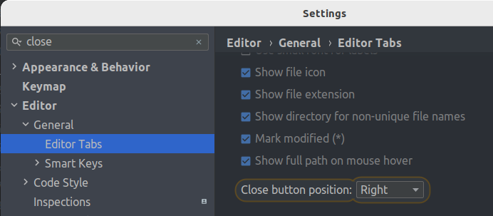
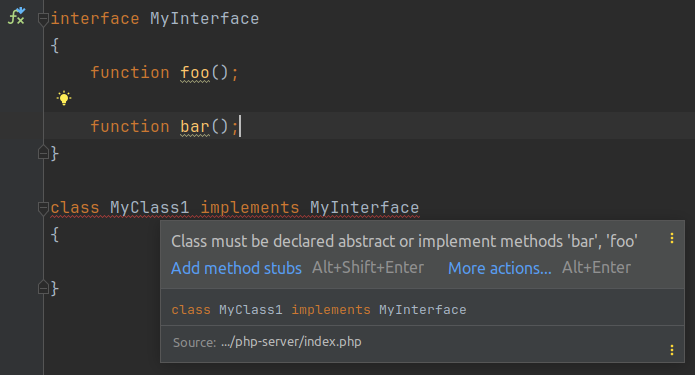
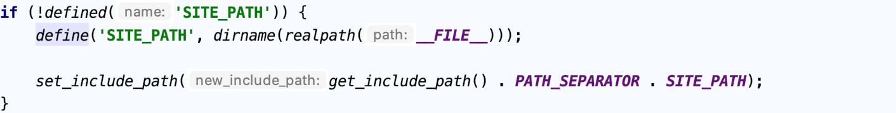
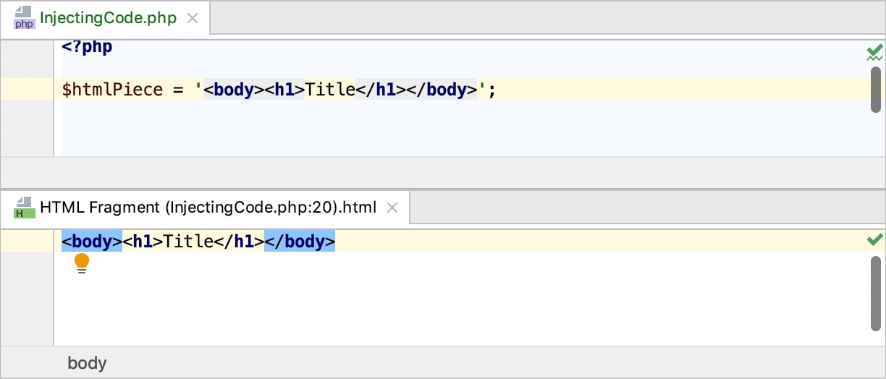
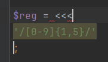
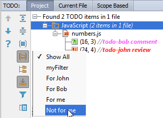

# PhpStorm - help

[Автодополнение кода](#code-completion)

- Интеллектуальное завершение сопоставления типов
- Намерение действия
- Просмотреть полный список доступных действий намерения
- Сгенерировать код
- Живые шаблоны
- Окружить выделенный код другим кодом

[Базовый поиск](#base-search)

- Полномасштабный поиск с помощью `Edit | Find`
- Полномасштабный поиск с помощью `Edit | Find Usages`

[Навигация по проекту](#navigate-on-project)

- поиск везде
- поиск по классу
- поиск по файлу
- Go To Declaration - переносит вас в место, где впервые объявлен определенный символ
- Go to Implementation - переносит вас к реализации определенного класса
- Навигация по истории - `Local History`

[Проверка кода](#check-code)

- Создать класс тестирования и перейти к нему
- Изучите сочетания клавиш во время работы
- Советы по повышению производительности

[Режимы просмотра IDE - `IDE viewing modes`](#viewing-modes)

- Включение и выключение режимов просмотра

[Оптимизация для широкоэкранных мониторов](#optimize-to-monitors)

- Режимы просмотра окна инструмента
- Доступны следующие режимы просмотра окна инструментов:
    - `Dock Pinned`
    - `Dock Unpinned`
    - `Undock`
    - `Float`
    - `Window`

[Макеты `Window | Layouts`](#makets)

- Ускоренный поиск в окнах инструментов

[Написание и редактирование исходного кода](#writing-and-editing)

- Переключить атрибут для файла в `только для чтения` - `read-only`

[Выделить конструкции кода](#select-block-code)  
[Настройка вкладок и отступов](#setting-tab-and-offset)  
[Скопировать и вставить код](#copy-past)

- Скопировать имя файла и номер строки, где находится курсор

[Навигация](#navigate)

- Переключить фокус с окна на редактор
- Вернуться в редактор из терминала командной строки
- Перейти к последнему активному окну
- Используйте переключатель для навигации
- Перейти к панели навигации

[Вкладки редактора](#tabs-editor)

- Копировать путь или имя файла
- Перемещать, удалять или сортировать вкладки
- Закрепить или открепить вкладку
- Отсоединить вкладку
- Переключение между вкладками
- Назначить сочетание клавиш для открытой вкладки
- Изменить лимит вкладок по умолчанию
- Открытие файлов на вкладке предварительного просмотра
- Включить режим предварительного просмотра

[Разделенный экран](#duble-monitor)  
[Настройка поведения конечных пробелов при сохранении](#setting-space-on-save)  
[Несколько курсоров и диапазонов выбора](#many-cursors)

- Добавляйте или удаляйте курсоры в выбранных местах с помощью мыши
- Добавить курсоры выше или ниже текущего курсора с помощью клавиатуры
- Включить режим выбора столбцов
- Добавить курсоры в конец каждой строки в выделенном блоке
- Удалить несколько кареток

[Схемы стиля кода](#styles-code)

- Настроить схемы
- Настроить стиль кода для языка

[EditorConfig](#editorconfig)

- Отключить поддержку EditorConfig

[Переформатировать код](#formating-code)

- Переформатировать фрагмент кода
- Переформатировать файл
- Переформатировать код в папке
- Переформатировать отступы строк

[Автоматически переформатировать код при сохранении](#auto-formating-code)

- Исключить файлы из переформатирования
- Исключить фрагменты кода из переформатирования в редакторе

[Настроить разделители строк для новых файлов](#line-separators)

- Изменить разделители строк для текущего файла
- Изменить разделители строк для файла или каталога

[Навигация по исходному коду](#navigate-to-source-code)

- Навигация с помощью курсора
- Переместить курсор
- Найти недавние местоположения

[Перейти к декларации и ее типу](#go-declaration-type)

- Перейти к реализации

[Открывать файлы `одним щелчком мыши` и `быстро находить файлы` в окне инструментов проекта](#open-to-one-click)

[Навигация между ошибками и предупреждениями](#go-next-errors)

[Найдите элемент кода с помощью всплывающего окна `Структура`](#search-code-in-popap)

[Просмотрите методы - переход между методами](#go-next-mettchods)

[Перейдите к файлу с помощью панели навигации](#go-file-with-panel)

[Найти строку или столбец](#search-srting-or-collumn)

- Найти последние файлы

[Закладки](#bookmarks)

- Добавить закладки
- Добавить закладку мнемонической строки
- Закладки для файлов и папок
- Добавьте вкладку редактора в закладки
- Навигация между закладками
- Перейти к мнемонической закладке с цифрой
- Навигация по закладкам во всплывающем окне
- Переименовать закладки
- Удалить закладки

[Найти и заменить текст в файле](#search-and-replase-text)

- Найти в выделенном коде
- Найти многострочный фрагмент
- Вывод результатов в отдельное окно
- Поиск строки в рамках проекта

[Скопировать пути или ссылки найденных файлов](#copy-path)

- Поиск в определённых типах файлов

[Заменить строку поиска в проекте](#replase-string-on-project)

- Структурный поиск и замена

[Автодополнение кода](#auto-complete-code)

- Для автоматического завершения
- Завершение кода

[Вместо курсора в коде подставляются слова - сначала из текущего файла](#cursore-replase-string)

[Постфиксное завершение кода](#postfix-end-code)

- Список постфиксных выражений для PHP
- Создание пользовательских шаблонов постфиксов
- Создадим постфикс для функции `dd`
- Вызов постфиксной функции `dd`

[Настройка параметров завершения](#settings-postfix-end-code)

[Посмотреть ссылку](#views-links)

- Просмотреть иерархию кода

[Автоматический импорт](#auto-import)

- Настройки авто импортирования
- Вариант авто импортирования
- Автоматически оптимизировать импорт при сохранении
- Оптимизация импорта при переформатировании файла

[Сгенерировать код](#generate-code)

- Создание классов на основе использования
- Генерация пользовательских конструкций кода с использованием живых шаблонов
- Вставьте живой шаблон
- Окружите блок кода живым шаблоном
- Использование живых шаблонов для интеллектуального завершения параметров в вызовах функций
- Включить интеллектуальное завершение параметров
- Использовать шаблоны интеллектуального завершения для функций
- Реализовать методы интерфейса или абстрактного класса
- Переопределение методов супер класса

[Окружить блок кода живыми шаблонами](#surround-code)

- Завершить код закрывающимися фигурными скобками

[Проверки кода](#check-code-this-file)

- Мгновенный анализ текущего файла

[Перейти к обнаруженным проблемам](#go-to-next-errors)

[Намерение действия - (лампочка)](#intentions)

- Выключить и включить предварительный просмотр
- Просмотреть все намерения действий
- Отключить / включить значок лампочки намерения действия

[Справочная информация о коде](#inform-to-code)

- Информация о параметрах
- Показать полные сигнатуры методов или функций
- Настройка всплывающего окна с информацией о параметрах

[Инкрустация подсказки - `Inlay hints`](#inlay-hints)

- Включить / выключить документацию `Popup` через глобальный поиск
- Быстрая документация
- Включить / отключить быструю документацию при наведении
- Быстрая документация в окне инструментов
- Сохраняйте документацию в окне инструментов

[Внешняя документация](#external-documentation)

[Определение и определение типа](#definition-and-type-definition)

- Посмотреть определение символа в каретке
- Определения типов
- Инкрустация подсказки

[Рефакторинг кода](#code-refactoring)

- Вызов рефакторинга

[Языковые инъекции](#lang-injections)

- Временно ввести язык
- Откройте редактор инъекций
- Используйте аннотацию
- Вставить язык в строку
- Выбор языка - для вставки
- Kомментарии с языковыми инъекциями
- Отменить инъекции
- Настроить правила для автоматических инъекций

[TODO комментарии](#todo-comments)

- Отключить / включить многострочные элементы TODO
- Создайте многострочный элемент `TODO`
- Просмотреть пункты TODO
- Добавить пользовательские шаблоны и фильтруйте элементы `TODO`
- Создание шаблонов для элементов TODO
    - Создадим шаблоны:
    - И создадим фильтры:
- Создание элементов `TODO` в исходном коде
- Просмотр элементов `TODO`
- Создание живого шаблона и переменных

[Шаблоны файлов](#templates-to-files)

- Создать новй шаблон файла
- Сохранить файл как шаблон
- Синтаксис
- Предопределённые переменные шаблона
- Пользовательские переменные шаблона
- Повторно используемый контент в шаблонах
- Шаблоны с несколькими файлами

[Живые шаблоны](#live-templates)

- Создание живых шаблонов
- Переменные живых шаблонов
- Предопределенные переменные шаблона
- Функции, используемые для переменных шаблона в реальном времени
- Обертывание тега. Пример применения шаблонов `Surround Live`

[Сравнение файлов, папок и текстовых источников](#comparing-files-folders-and-text-sources)

- Сравнить файлы
- Сравните два или три файла
- Сравните активный редактор с буфером обмена
- Сравнить активный редактор с файлом проекта
- Сравните активный редактор с любым файлом
- Сравнить папки
- Сравните любые текстовые источники
- Советы по повышению производительности

[Советы по повышению производительности](#productivity-tips)

[Скретч-файлы](#scretch-files)

- Создать файл `Scratch` с нуля
- Создать файл с содержимым текущего выделения в редакторе
- Создать буфер для скретч-памяти
- Просмотреть все файлы и буферы
- Запуск файлов `Scratch` в нескольких версиях PHP
- Запуск PHP-кода на `3v4l.org` из IDE

[Макросы](#macros)

- Запись макроса
- Назначьте сочетание клавиш для нового макроса
- Файлы со значениями, разделенными разделителями

[Редактировать CSV в табличном виде](#edit-as-table)

[Сохранить проект как шаблон](#save-project-as-template)

- Создать проект из шаблона
- Удалить шаблоны проектов

[Переименовать проекты](#rename-projects)

[Браузеры](#browsers)

- Просмотр и настройка списка браузеров
- Настройка автоматической перезагрузки HTML-страниц

Среда разработки / Настройте IDE / Браузеры

---
<a name="code-completion"><h2> </h2></a>

## Автодополнение кода

- `[Ctrl]` + `[Space]`

> Чтобы увидеть больше вариантов, нажмите еще раз. Ctrl Space

---

## Интеллектуальное завершение сопоставления типов

- `[Ctrl]` + `[Shift]` + `[Space]`

---

## Намерение действия - `Intention actions`

> PhpStorm следит за тем, что вы в данный момент делаете,
> и делает `умные предложения`, называемые `намеренными действиями`.

- `[Alt]` + `[Enter]`

---

## Просмотреть полный список доступных действий намерения

В диалоговом окне `Settings` перейдите в раздел `Editor | Intentions` .

---

## Сгенерировать код

- `[Alt]` + `[Insert]` - `Code | Genetare...`
- `[Ctrl]` + `[O]` - `Code | Override Methods...`
- `[Ctrl]` + `[I]` - `Code | Implement Methods...`

Меню `Code | Generate` поможет с генерацией конструкторов, геттеров/сеттеров, комментариев PHPDoc, а также предложит
переопределить/реализовать некоторые методы.

---

## Живые шаблоны - `live templates`

`Editor | Live templates`

- `Code | Insert Live Template`b
- `[Ctrl]` + `[J]`

---

## Окружить выделенный код другим кодом

- `Code | Surround With`
- `[Ctrl]` + `[Alt]` + `[T]`

> `[Alt]` + `[T]` - пользовательская комбинация, так как в Ubuntu - открывает терминал

---
<a name="base-search"><h2> </h2></a>

## Базовый поиск

## Полномасштабный поиск с помощью `Edit | Find`

- `[Ctrl]` + `[F]`

## Полномасштабный поиск с помощью `Edit | Find Usages`

- `[Ctrl]` + `[F7]`
- `[Ctrl]` + `[Shift]` + `[F7]`

---
<a name="navigate-on-project"><h2> </h2></a>

## Навигация по проекту

- `[Shift]` + `[Shift]` - поиск везде
- `[Ctrl]` + `[N]` - поиск по классу
- `[Ctrl]` + `[Shift]` + `[N]` - поиск по файлу

---

## Go To Declaration - переносит вас в место, где впервые объявлен определенный символ.

- `[Ctrl]` + `[B]`
- `[Ctrl]` + `Click`

> Этот тип навигации работает из любого места исходного кода, даже из другого класса или комментария.

---

## Go to Implementation - переносит вас к реализации определенного класса.

- `[Ctrl]` + `[Alt]` + `[B]`

> Если есть несколько реализаций, PhpStorm показывает их в списке, где вы можете выбрать нужную для перехода.

---

## Навигация по истории - `Local History`

`File | Local History | Show History`

> Здесь вы можете просмотреть изменения, отменить их (Кнопка отката изменений)  или создать патч (название для
> последнего изменения)

---
<a name="check-code"><h2> </h2></a>

## Проверка кода

> PhpStorm интегрируется с наиболее популярными фреймворками тестирования PHP:
> такими как PHPUnit , Behat , PHPSpec и Codeception .

## Создать класс тестирования и перейти к нему

- `[Ctrl]` + `[Shift]` + `[T]`

Действия

- Двойной `[Shift]` - Искать везде. Быстро находите любой файл, действие, класс, символ, окно инструмента или настройку
  в PhpStorm, в вашем проекте и в текущем репозитории Git.
- `[Ctrl]` + `[Shift]` + `[A]` - Найти действие. Найдите команду и выполните ее, откройте окно инструментов или найдите
  параметр.
- `[Alt]` + `[Enter]` - Показать контекстные действия. Быстрые исправления для выделенных ошибок и предупреждений,
  намеренные действия по улучшению и оптимизации вашего кода.
- `[F2]`, `[Shift]` + `[F2]` - Навигация между проблемами кода. Перейти к следующей или предыдущей выделенной ошибке.
- `[Ctrl]` + `[E]` - Просмотреть последние файлы. Выберите недавно открытый файл из списка.
- `[Ctrl]` + `[W]`, `[Ctrl]` + `[Shift]` + `[W]` - Расширить или сузить выбор. Увеличивайте или уменьшайте область
  выбора в соответствии с конкретными конструкциями кода.
- `[Ctrl]` + `[/]`, `[Ctrl]` +  `[Shift]` +  `[/]` - Добавить/удалить строку или заблокировать комментарий.
  Закомментируйте строку или блок кода.
- `[Alt]` + `[F7]` - Найти использование. Покажите все места, где элемент кода используется в вашем проекте.

---

## Изучите сочетания клавиш во время работы

> Функция «Найти действие» позволяет искать команды и настройки во всех меню и инструментах.

- `[Ctrl]` + `[Shift]` + `[A]`

> Чтобы добавить или изменить сочетание клавиш для любого действия,
> нажмите кнопку, когда оно выбрано в списке.`[Alt]` + `[Enter]`

---

## Используйте расширенные функции - `Быстрые списки`

- `Быстрые списки` - группа действий, которые вы часто используете, создайте быстрый список для доступа к ним с помощью
  пользовательского сочетания клавиш.
- `File | Settings | Appearance & Behavior | Quick Lists`
-

---

## Советы по повышению производительности

Используйте быстрый переключатель

- 1 - `[Ctrl]` + ``[`]`` - или выберите `View | Quick Switch Scheme` в главном меню.
- 2 - Во всплывающем окне «Переключить» выберите «Theme», а затем выберите нужную тему интерфейса.

---
<a name="viewing-modes"><h2> </h2></a>

## Режимы просмотра IDE - `IDE viewing modes`

> PhpStorm позволяет переключаться между несколькими режимами просмотра для разных стилей использования и сценариев.
> Например, когда вам нужно сосредоточиться на коде или представить его аудитории.

- `Zen modeFull Screen mode` `(Полноэкранный режим)` - PhpStorm расширяет главное окно, чтобы занять весь экран.
- `Distraction-free mode` `(Режим без отвлекающих факторов)` - Редактор занимает все главное окно с исходным кодом в
  центре. Все остальные элементы пользовательского интерфейса скрыты
- `Presentation mode` `(Режим презентации)` - PhpStorm расширяет редактор, чтобы занять весь экран, и увеличивает размер
  шрифта, чтобы вашей аудитории было легче видеть, что вы делаете.
- `Zen mode` `(Режим дзен)` - PhpStorm объединяет полноэкранный режим и режим без отвлекающих факторов.

---

## Включение и выключение режимов просмотра

- 1 - Перейдите в раздел `View | Appearance`и выберите `Enter <viewing mode>` или `Exit <viewing mode>`
- 2 - Используйте быстрый переключатель:
    - 1 - Перейдите в раздел `View | Quick Switch Scheme` или нажмите `[Ctrl]` + ``[`]``
    - 2 - Во всплывающем окне выберите `View Mode` а затем выберите `Enter <viewing mode>` или `Exit <viewing mode>`


---
<a name="optimize-to-monitors"><h2> </h2></a>

## Оптимизация для широкоэкранных мониторов

> PhpStorm предоставляет несколько вариантов оптимизации расположения окон инструментов на широкоэкранных мониторах.

`File | Settings | Appearance & Behavior | Appearance` -> `Tool Windows` -> `Widescreen tool window layout`

- `Widescreen layout disabled`


- `Widescreen layout enabled`


---
Режимы просмотра окна инструмента

- В главном меню выберите `Window | Active Tool Window | View Mode`
- Либо нажмите на строку заголовка окна инструмента `настройка` выбрать `View Mode`


## Доступны следующие режимы просмотра окна инструментов:

- `Dock Pinned` - (Закреплено) : это режим просмотра по умолчанию, когда окно инструментов прикреплено к панели окон
  инструментов и всегда видно вместе с редактором и другими закрепленными окнами инструментов.
- `Dock Unpinned` - (Dock Unpinned) : Окно инструментов прикреплено к панели окон инструментов, но видимо только тогда,
  когда оно активно. Оно не мешает редактору или другим окнам инструментов, когда теряет фокус.
- `Undock` - (Открепить) : Окно инструментов прикреплено к панели окон инструментов и закрывает часть редактора или
  других окон инструментов, когда активно. Оно не видно, когда активно другое окно инструментов.
- `Float` - (Плавающий) : Окно инструментов отделено от панели окон инструментов, плавает поверх главного окна. Оно
  видимо только вместе с главным окном проекта. При необходимости его можно переместить на другой монитор или рабочий
  стол.
- `Window` - (Окно) : Окно инструментов действует как отдельное окно приложения. Вы можете просматривать его независимо
  от главного окна проекта и перемещать его на другой монитор или рабочий стол.

---
<a name="makets"><h2> </h2></a>

## Макеты `Window | Layouts`

- `Window | Layouts`

> PhpStorm позволяет перемещать окна инструментов, изменять их режимы просмотра, изменять их размер и сохранять эти
> настройки как макеты.

> Вы можете иметь несколько макетов окон инструментов и переключаться между ними при необходимости.

---
Ускоренный поиск в окнах инструментов

1. Выберите окно инструментов, дерево, список или всплывающее окно.
2. Начните вводить имя элемента, например имя файла, класса или поля.
3. `[↑]`, `[↓]` - используйте клавиши для перехода к результату и для перемещения между ними.
4. `[Enter]` - Для выбора
5. `[Esc]` - Для выхода


---
<a name="writing-and-editing"><h2> </h2></a>

## Написание и редактирование исходного кода

- `[Ctrl]` + `[Shift]` + `[A]` - Найти действие
- `[Ctrl]` + `[Alt]` + `[Insert]` - Добавить новый класс, файл, пакет или файл с нуля
- `[Alt]` + `[Insert]` - Если фокус находится внутри окна инструмента `Project`
- `[Ctrl]` + `[Alt]` + `[Shift]` + `[Insert]` - Создать новый файл Scratch

---

## Переключить атрибут для файла в `только для чтения` - `read-only`

1. Откройте файл в редакторе или выберите его в окне инструментов `Project`
2. Выберите `File | File Properties | Make File Read-only` - Сделать файл доступным только для чтения, или
3. Выберите `File | File Properties | Make File Writable` - Сделать файл доступным для записи

---
<a name="select-block-code"><h2> </h2></a>

## Выделить конструкции кода

- В редакторе поместите курсор на элемент, который вы хотите выделить
    - `[Ctrl]` + `[W]` - увеличивать диапазон выделения
    - `[Ctrl]` + `[Shift]` + `[W]` - уменьшать диапазон выделения

> Если вам нужно просто выделить фигурные скобки, поместите курсор возле фигурной или квадратной скобки (спереди или
> сзади открывающей, или закрывающей)

  


---
<a name="setting-tab-and-offset"><h2> </h2></a>

## Настройка вкладок и отступов


---
<a name="copy-past"><h2> </h2></a>

## Скопировать и вставить код

> По умолчанию, когда вы вставляете что-либо в редакторе, PhpStorm выполняет "умную" вставку.

> Например, вставка нескольких строк в комментариях автоматически добавит соответствующие маркеры к вставляемым строкам.

> Если вам нужно вставить просто текст, нажмите `[Ctrl]` + `[Alt]` + `[Shift]` + `[V]`

---

## Скопировать имя файла и номер строки, где находится курсор

- Щелкните правой кнопкой мыши, чтобы открыть контекстное меню, выберите `Copy/Paste Special | Copy Reference` .

---
<a name="navigate"><h2> </h2></a>

## Навигация

- `[Ctrl]` + `[Shift]` + `[F12]` - Скрыть все окна кроме редактора

---

## Переключить фокус с окна на редактор

- `[Esc]` - переместить фокус из любого окна в активный редактор.

---

## Вернуться в редактор из терминала командной строки

- `[Alt]` + `[F12]` - открывает, закрывает панель терминала

---

## Перейти к последнему активному окну

- `[F12]` - переходит к последнему активному окну который был закрыт.

---

## Используйте переключатель для навигации

- `[Ctrl]` + `[Tab]` - Для перехода между открытыми файлами и окнами инструментов с помощью переключателя нажмите.
- `[Ctrl]` - Удерживайте кнопку нажатой, чтобы оставить всплывающее окно переключателя открытым.
- `[Tab]` - Нажмите для перемещения между элементами.
- `[Backspace]` - Нажмите для удаления выбранного файла из списка и закрытия его в редакторе.

---

## Перейти к панели навигации

- `[Alt]` + `[Home]`

---
<a name="tabs-editor"><h2> </h2></a>

# Вкладки редактора

Открыть или закрыть вкладки

- Чтобы повторно открыть закрытую вкладку, щелкните правой кнопкой мыши любую вкладку и в контекстном меню выберите
  команду `Reopen Closed Tab`.

---

## Копировать путь или имя файла

1. Щелкните правой кнопкой мыши по вкладке.
2. В открывшемся списке выберите `Copy Path/Reference….`.
3. В открывшемся списке выберите вариант копирования.


> PhpStorm копирует элемент в буфер обмена, и вы можете вставить его куда угодно. `[Ctrl]` + `[V]`

---

## Перемещать, удалять или сортировать вкладки

- Чтобы переместить или удалить значок `Закрыть` на вкладке



---

## Закрепить или открепить вкладку

- Чтобы закрепить или открепить активную вкладку, щелкните ее правой кнопкой мыши и выберите в контекстном меню
  пункт `Pin Tab` или `Unpin Tab`.

---

## Отсоединить вкладку

- `[Shift]` + `[F4]` - Чтобы открепить активную вкладку, нажмите.
- `[Alt]` + `[Click]` - использовать для того же действия

---

## Переключение между вкладками

- `[Alt]` + `[→]`, `[Alt]` + `[←]` Для перемещения между вкладками нажмите или

---

## Назначить сочетание клавиш для открытой вкладки


---

## Изменить лимит вкладок по умолчанию

1. `File | Settings | Editor | General | Editor Tabs`
2. В разделе `Closing policy` настройте параметры в соответствии со своими предпочтениями и нажмите `ОК`.

> PhpStorm ограничивает количество вкладок, которые можно открыть в редакторе одновременно (лимит вкладок по умолчанию —
> 10).

---

## Открытие файлов на вкладке предварительного просмотра

> Вкладка предварительного просмотра позволяет просматривать файлы в одной вкладке по одному, не открывая каждый файл в
> новой вкладке. Это полезно, если вам нужно просмотреть несколько файлов.

---

## Включить режим предварительного просмотра

- `[Alt]` + `[1]` -> В окне инструментов `Project` в настройке выберите `Enable Preview Tab`  
    
  

> Вы также можете включить вкладку предварительного просмотра в
> разделе `Settings | General | Editor Tabs | Opening Policy` .

- В окне инструмента `Project` выберите файл, который еще не открыт ни на одной другой вкладке.
- Имя файла написано курсивом, чтобы указать режим предварительного просмотра. Любой другой файл, который вы выберете,
  заменит предыдущий на вкладке предварительного просмотра.
- Начните редактирование файла или дважды щелкните вкладку файла, чтобы выйти из режима предварительного просмотра и
  преобразовать вкладку предварительного просмотра в обычную вкладку.


> Обратите внимание, что при включенной вкладке предварительного просмотра опция «Открыть файлы одним щелчком»
> игнорируется. Дважды щелкните файл, чтобы открыть его в обычной вкладке.

---
<a name="duble-monitor"><h2> </h2></a>

## Разделенный экран

- Щелкните правой кнопкой мыши нужную вкладку редактора и выберите, как вы хотите разделить окно редактора `Split Right`
- В окне инструментов `Project` щелкните правой кнопкой мыши файл и выберите `Open in Right Split`

---
<a name="setting-space-on-save"><h2> </h2></a>

## Настройка поведения конечных пробелов при сохранении

  


---
<a name="many-cursors"><h2> </h2></a>

## Несколько курсоров и диапазонов выбора

Количество кареток, которые можно добавить в файл, ограничено 1000. Если вы хотите увеличить этот лимит, откройте
пользовательские параметры JVM `Help | Edit Custom VM Options` и добавьте следующую
строку: `-Deditor.max.caret.count=<NEW_LIMIT>`.

---

## Добавляйте или удаляйте курсоры в выбранных местах с помощью мыши

- `[Alt]` + `[Click]` - чтобы добавить еще один курсор,

> Повторное нажатие удалит добавленный курсор.

---

## Добавить курсоры выше или ниже текущего курсора с помощью клавиатуры

- Нажать дважды `[Ctrl]`, а затем не отпуская нажать клавиши со стрелками вверх или вниз

> Если включены виртуальные пробелы, новые каретки будут добавляться точно над или под текущей позицией каретки. В
> противном случае, в строках, которые короче текущего смещения, каретки будут добавляться в конце строки.

- `After the end of line` - включает/отключает виртуальные пробелы


---

## Включить режим выбора столбцов

- `[Alt]` + `[Shift]` + `[Insert]` - включение колоночного выделения
- `[Shift]` + `[↑]`, `[Shift]` + `[↓]` - выделение вверх, выделение вниз

---

## Добавить курсоры в конец каждой строки в выделенном блоке

- `[Alt]` + `[Shift]` + `[G]` - в выделенном блоке добавить курсоры в конце строк

---

## Удалить несколько кареток

- `[Esc]` - Удалить все существующие курсоры, кроме того, который был добавлен последним
- `[Alt]` + `[Click]` - чтобы добавить курсор, удаляет по одному

---
<a name="styles-code"><h2> </h2></a>

## Схемы стиля кода

## Настроить схемы

> В PhpStorm настройки стиля кода зависят от языка,
> поэтому вам нужно настроить их отдельно для каждого языка,
> который вы используете в своем проекте. Вы также можете скопировать
> настройки из одного языка и применить их к другому языку.

---

## Настроить стиль кода для языка

> Существуют 2 схемы - `Default` и `Project`

1. `File | Settings | Editor | Code Style | PHP`

Чтобы настроить схему для новых проектов, перейдите
в `File | New Projects Setup | Settings for New Projects | Editor | Code Style`

---
<a name="editorconfig"><h2> </h2></a>

## EditorConfig

> Чтобы использовать EditorConfig, убедитесь, что плагин EditorConfig включен в настройках.

> Все параметры из файла `.editorconfig` применяются к каталогу, в котором он находится,
> а также ко всем его подкаталогам поверх текущего стиля кода проекта.

https://editorconfig.org/

---

## Отключить поддержку EditorConfig


---
<a name="formating-code"><h2> </h2></a>

## Переформатировать код

## Переформатировать фрагмент кода

1. В редакторе выберите фрагмент кода,
2. `[Ctrl]` + `[Alt]` + `[L]` - `Code | Reformat Code`

---

## Переформатировать файл

1. В окне инструментов `Project` щелкните правой кнопкой мыши по файлу
2. `[Ctrl]` + `[Alt]` + `[Shift]` + `[L]` - `Code | Reformat File`

> Нажав на клавишу `[Shift]` - можно выбрать несколько файлов для группового переформатирования

---

## Переформатировать код в папке

1. В представлении проекта щелкните правой кнопкой мыши папку
2. В контекстном меню выберите `Reformat Code` - `[Ctrl]` + `[Alt]` + `[L]`
3. В открывшемся диалоговом окне укажите необходимые параметры и нажмите `ОК`

---

## Переформатировать отступы строк

> Можете переформатировать отступы строк на основе указанных настроек.

- Находясь в редакторе, выделите нужный фрагмент кода и нажмите `[Ctrl]` + `[Alt]` + `[I]`

---
<a name="auto-formating-code"><h2> </h2></a>

## Автоматически переформатировать код при сохранении

1. В настройках выберите `Tools | Actions on Save`.
2. Включите опцию `Reformat code`.
3. Кроме того, вы можете настроить способ, которым IDE будет переформатировать ваш код:

- Нажмите `Configure scope`, чтобы указать шаблоны имен файлов и каталогов, которые вы хотите исключить из
  переформатирования.
- В списке `All file types` выберите типы файлов, в которых вы хотите переформатировать код.
- Выберите `Whole file` `(весь файл)` или `Changed lines` `(изменённые строки)`, если ваш проект находится под контролем
  версий.
- Если выбрать `Changed lines`, переформатирование будет применено только к тем строкам кода, которые были изменены
  локально, но еще не возвращены в репозиторий.

---

## Исключить файлы из переформатирования

> Вы можете исключить группу файлов и каталогов из переформатирования.

1. В диалоговом окне `Settings` перейдите в `Editor | Code Style.`
2. Перейдите на вкладку `Formatter` и в поле `Do not format` введите файлы и каталоги, которые вы хотите исключить,
   используя шаблон glob.

- Вы можете указать несколько шаблонов `glob`, разделенных точкой с запятой `;`
- Если нажать значок `Развернуть`, поле расширится, и каждый шаблон будет показан на отдельной строке.

3. Примените изменения и закройте диалоговое окно.


[https://en.wikipedia.org/wiki/Glob_(programming)](https://en.wikipedia.org/wiki/Glob_(programming))

---

## Исключить фрагменты кода из переформатирования в редакторе

1. В диалоговом окне `Settings` перейдите в `Editor | Code Style.`
2. Перейдите на вкладку `Formatter` и включите опцию `Turn formatter on/off with markers in code comments`
3. В редакторе в начале кода, который вы хотите исключить, создайте строку комментария `[Ctrl]` + `[/]` и введите `@formatter:off`.
4. В конце кода создайте еще одну строку комментария `[Ctrl]` + `[/]` и введите `@formatter:on`

> Код между маркерами не будет переформатирован.


---
<a name="line-separators"><h2> </h2></a>

## Настройте разделители строк для новых файлов

1. В настройки IDE, и выберите `Editor | Code Style`
2. Чтобы настроить разделители строк для новых проектов, перейдите
   в `File | New Projects Setup | Settings for New Projects | Editor | Code Style.`
3. Выберите схему `Scheme` стиля кода, которую вы хотите изменить: схему проекта или одну из схем уровня IDE.
4. В списке `Line separator` выберите стиль разделителя линий, который вы хотите применить.


---

## Изменить разделители строк для текущего файла

1. Нажмите на виджет и выберите другой стиль разделителя линий.  
   

2. Либо выберите другой стиль окончания в меню `File | File Properties | Line Separators`

---

## Изменить разделители строк для файла или каталога

1. `[Alt]` + `[1]` - Выберите файл или каталог в окне инструментов проекта

> Если выбрать каталог, новый стиль окончания строки будет применен ко всем вложенным файлам рекурсивно.

2. В главном меню выберите `File | File Properties | Line Separators`, а затем выберите стиль окончания строки из
   списка.

---
<a name="navigate-to-source-code"><h2> </h2></a>

## Навигация по исходному коду

## Навигация с помощью курсора

- `[Ctrl]` + `[Alt]` + `[←]`, `[Ctrl]` + `[Alt]` + `[→]` - Для перехода назад, вперёд
- `[Ctrl]` + `[Backspace]` - перейти к последнему отредактированному месту
- `[Ctrl]` + `[M]` - найти текущее положение курсора в редакторе, (`[↑]`, `[↓]`)
- `[F3]` - найти следующее вхождение выделенного слова (которе искалось через поиск `[Ctrl]` + `[F]`)
- `[Ctrl]` + `[Shift]` + `[M]` - переместить курсор между совпадающими фигурными скобками блока кода
- `[Ctrl]` + `]`, `[Ctrl]` + `[` - Для перемещения между блоками кода

---

## Переместить курсор

- `[Ctrl]` + `[→]`, `[Ctrl]` + `[←]` - переместить курсор на следующее или предыдущее слово
- `[Ctrl]` + `[Shift]` + `[A]` -> `Move Caret Forward a Paragraph ..` or `Move Caret Backward a Paragraph ..` action.

---

## Найти недавние местоположения

- `[Ctrl]` + `[Shift]` + `[E]` - открыть всплывающее окно `Недавние местоположения`
- `[Ctrl]` + `[Shift]` + `[E]`, `[Ctrl]` + `[Shift]` + `[E]` - открыть всплывающее окно `Показать только измененные`
- `[Backspace]` или `[Deleete]` - удалить запись местоположения из результатов поиска
- `[Ctrl]` + `[Shift]` + `[Backspace]` - перейти к месту последнего редактирования

> Удаленное местоположение также удаляется из списка записей, к которым вы получаете доступ с помощью
> клавиш `[Ctrl]` + `[←]`.

---
<a name="go-declaration-type"><h2> </h2></a>

## Перейти к декларации и ее типу

- `[Ctrl]` + `[B]` или `[Ctrl]` + `[Click]` -

---

## Перейти к реализации

> Используйте подсказки `Inheritors` , которые показывают количество потомков класса (наследников), интерфейса (
> реализаций) или трейта (используемых `s). Щелкните подсказку, чтобы перейти к потомкам. Если есть несколько потомков,
> выберите нужного из списка.


---
<a name="open-to-one-click"><h2> </h2></a>

## Открывайте файлы `одним щелчком мыши` и `быстро находите файлы` в окне инструментов проекта

- В окне инструментов `Project` в настройках выбрать `Always Select Opened File`
- В окне инструментов `Project` в настройках выбрать `Open Files with Single Click`

---
<a name="go-next-errors"><h2> </h2></a>

## Навигация между ошибками и предупреждениями

- `[F2]`, `[Shift]` + `[F2]` - перейти к следующей или предыдущей найденной проблеме в вашем коде

---
<a name="search-code-in-popap"><h2> </h2></a>

## Найдите элемент кода с помощью всплывающего окна `Структура`

1. `[Ctrl]` + `[F12]` - открыть всплывающее окно просмотра структуры
2. `[Alt]` + `[7]` - открыть окно просмотра структуры
3. В появившемся окне найдите нужный вам элемент. Вы можете начать вводить имя элемента, чтобы PhpStorm сузил поиск.

4. `[F4]` - переход к выбранному элементу

---
<a name="go-next-mettchods"><h2> </h2></a>

## Просмотрите методы - переход между методами

- `[Alt]` + `[↓]`, `[Alt]` + `[↑]` - переход между методами
- Для визуального разделения методов в коде в `Editor | General | Appearance` установить
  параметр `Show method separators`


---
<a name="go-file-with-panel"><h2> </h2></a>

## Перейдите к файлу с помощью панели навигации

- `[Alt]` + `[Home]` - открыть панель навигации
- клавиши со стрелками или указатель мыши, чтобы найти нужный файл
- Дважды щелкните выбранный файл или нажмите `[Enter]`, чтобы открыть его в редакторе

---
<a name="search-srting-or-collumn"><h2> </h2></a>

## Найти строку или столбец

- `[Ctrl]` + `[G]` - указать номер строки, или строки и столбца


---

## Найти последние файлы

- `[Ctrl]` + `[E]` - Недавние файлы
- `[Ctrl]` + `[E]`,`[Ctrl]` + `[E]`  - Показать только измененные

---
<a name="bookmarks"><h2> </h2></a>

## Закладки

- `[F11]` - добавить закладку
- `[Ctrl]` + `[F11]` - добавить мнемоническую закладку
- `[Alt]` + `[2]` - Просмотреть все закладки: `View | Tool Windows | Bookmarks`

В PhpStorm есть два типа закладок:

- `Анонимные закладки` не имеют идентификатора и позволяют размещать столько закладок, сколько вы хотите. Файлы и
  строки, отмеченные анонимными закладками, имеют значок закладки.
- `Мнемонические закладки` позволяют создавать закладки с цифрами (от 0 до 9) или буквами (от A до Z). Файлы и строки,
  отмеченные мнемоническими закладками, имеют соответствующий значок буквы или цифры в рамке.

---

## Добавить закладки

- `[F11]` - В редакторе поместите курсор на строку кода и нажмите
- Щелкните правой кнопкой мыши по полю рядом со строкой кода, и выберите `Add Bookmark`

---

## Добавить закладку мнемонической строки

- `[Ctrl]` + `[F11]` - В редакторе поместите курсор на строку кода и нажмите
- щелкните правой кнопкой мыши по полю рядом со строкой кода, и выберите `Add Mnemonic Bookmark`
- В открывшемся всплывающем окне выберите цифру или букву

---

## Закладки для файлов и папок

- В окне инструментов `Project` щелкните правой кнопкой мыши элемент, и выберите `Bookmarks | Add Bookmark [F11]`

> Чтобы добавить в закладки несколько элементов, выберите их в окне инструментов,
> щелкните правой кнопкой мыши один из них и выберите `Bookmarks | Add Bookmark [F11]`

---

## Добавьте вкладку редактора в закладки

- Щелкните правой кнопкой мыши вкладку с файлом, который вы хотите добавить в закладки, и
  выберите `Bookmarks | Add Bookmark [F11]`

---

## Навигация между закладками

Перейти к мнемонической закладке с цифрой

- `[Ctrl]` + `[5]` - чтобы перейти к закладке с мнемоническим кодом 5

---

## Навигация по закладкам во всплывающем окне

- `[Shift]` + `[F11]` - Показать все закладки во всплывающем окне.
- `[Ctrl]` + `[Shift]` + `[F11]` - Показать мнемонические закладки во всплывающем окне.

---

## Переименовать закладки

- Щелкните правой кнопкой мыши значок закладки в области редактора, или элемент закладки в окне инструментов `Project`
- и выберите `Rename Bookmark`

---

## Удалить закладки

- В области редактора, в окне закладок - кликнуть правой кнопкой мыши и выбрать `Delete Bookmark`

---
<a name="search-and-replase-text"><h2> </h2></a>

## Найти и заменить текст в файле

1. Откройте файл в редакторе.
2. `[Ctrl]` + `[F]`
3. В открывшемся поле поиска введите строку поиска.

> Чтобы расширить поиск цели за пределы текущего файла, нажмите `[Ctrl]` + `[Shift]` + `[F]`

---

## Найти в выделенном коде

1. Выделите многострочный фрагмент и нажмите `[Ctrl]` + `[F]`
2. Нажмите кнопку  и введите строку поиска.

> Если отпустить кнопку , PhpStorm снова переключит процесс поиска на
> весь файл.


---

## Найти многострочный фрагмент

- Выделить многострочный фрагмент и нажать `[Ctrl]` + `[F]`


- Для ввода многострочного фрагмента после открытия поиска нажать ,

---

## Вывод результатов в отдельное окно

- `[Alt]` + `[3]` - Открыть панель результатов поиска
- Для вывода результатов поиска в отдельное окно нажать на
  кнопку  в поисковой строке.


---

## Поиск строки в рамках проекта

- `[Ctrl]` + `[Shift]` + `[F]` - поиск строки в файлах проекта
- `[Ctrl]` + `[Enter]` - открыть результат поиска в окне

---
<a name="copy-path"><h2> </h2></a>

## Скопировать пути или ссылки найденных файлов

1. В списке результатов поиска щелкните правой кнопкой мыши результат, для которого вы хотите скопировать путь, и
   выберите `Copy/Reference`.
2. В окне `Copy` выберите нужный вам путь или ссылку.

---

## Поиск в определённых типах файлов

- `[Ctrl]` + `[Shift]` + `[F]` - открывает окно расширенного поиска


---
<a name="replase-string-on-project"><h2> </h2></a>

## Заменить строку поиска в проекте

- `[Ctrl]` + `[Shift]` + `[R]` - открывает окно расширенной замены

---

## Структурный поиск и замена

> Обычный процесс поиска не учитывает синтаксис и семантику исходного кода. Даже если вы используете регулярные
> выражения, PhpStorm все равно обрабатывает ваш код как обычный текст.

> Действия структурного поиска и замены `structural search and replace (SSR)` позволяют вам искать определенный шаблон
> кода или грамматическую конструкцию в вашем коде, учитывая структуру вашего кода.

- `Edit | Find | Search Structurally`


> В диалоговом окне `«Структурный поиск»` можно быстро переключиться в диалоговое окно `«Структурная замена»`. Щелкните
> значок 

---
<a name="auto-complete-code"><h2>Заголовки</h2></a>

## Автодополнение кода

Для автоматического завершения в `Settings | Editor | General | Code Completion` включите
опцию `Show suggestions as you type`.

- `[Ctrl]` + `[Space]` - базовая комплектация
- `[Ctrl]` + `[Space]`, `[Ctrl]` + `[Space]` - расширенная комплектация
- `[Ctrl]` + `[Alt]` + `[Space]` - - расширенная комплектация

---

## Завершение кода

- `[Ctrl]` + `[Shift]` + `[Enter]`

- Завершите построения метода - фигурные скобки метода


- Завершите построение кода - фигурные скобки условия


- Завершение выражения - точка с запятой


---
<a name="cursore-replase-string"><h2> </h2></a>

## Вместо курсора в коде подставляются слова - сначала из текущего файла, затем другие

> `[Alt]` и `[Shift]` - использовать правые клавиши в Ubuntu

- `[Alt]` + `[/]` - Циклическое замена слов по порядку вниз
- `[Alt]` + `[Shift]` + `[/]` - Циклическое замена слов по порядку вверх

> Поочерёдное нажатие - `[Alt]` + `[/]`

  
  


---
<a name="postfix-end-code"><h2> </h2></a>

## Постфиксное завершение кода

- Включить и настроить постфиксное завершение в `Editor | General | Postfix Completion` включить
  опцию `Enable postfix completion`
- Выберите `[Tab]`, `[Space]`, или `[Enter]` для использования при расширении постфиксных шаблонов.

Преобразуйте утверждение с постфиксом, например `.if`

```php
function m(arg) {
     arg.if
}
```

```php
function m(arg) {
    if (arg) {

    }
}
```

---

## Список постфиксных выражений для PHP


---

## Создание пользовательских шаблонов постфиксов

- `Editor | General | Postfix Completion`
- Нажать кнопку ` + ` (Добавить)
- В открывшемся меню выбрать язык
- Указать ключ - строка которая будет вызывать шаблон
- Выражение слева до точки `.` передаётся в переменной `$EXPR$`
- Установите флажок `Apply to the topmost expression`, чтобы PhpStorm автоматически преобразовывал самое верхнее
  применимое выражение при вызове шаблона

```
$EXPR$ 
$END$
```

---

## Создадим постфикс для функции `dd`

- Переходим в `Editor | General | Postfix Completion`
- Нажимаем кнопку ` + ` и `выбираем язык`  
  
- заполняем ключ и содержимое шаблона
  
- подтверждаем и сохраняем

---

## Вызов постфиксной функции `dd`

```php
$this->param = $value.dd;   
```

- курсор стоит после `.dd`


- нажимаем `[Tab]`

```php
dd($this->param = $value);
```

> Произошла постфиксная комплектация кода

---
<a name="settings-postfix-end-code"><h2> </h2></a>

## Настройка параметров завершения

- `Editor | General | Code Completion.`
- `Show suggestions as you type` - автоматически отображать список предложений
    - если флажок снят, придётся явно вызывать автодополнение кода - `[Ctrl]` + `[Space]`
- `Sort suggestions alphabetically` - отсортировать предложения в алфавитном порядке
- `Match case` - учитывать регистр
- `Show documentation popup in` `1000` `ms` - чтобы всплывающее окно документации отображалось автоматически для каждого
  элемента списка предложений по мере его прокрутки

---
<a name="views-links"><h2> </h2></a>

## Посмотреть ссылку

- `[Ctrl]` + `[Shift]` + `[I]` - представление «Быстрое определение»


- `[Ctrl]` + `[Q]` - представление быстрой информации


---

## Просмотреть иерархию кода

- `[Ctrl]` + `[H]` - иерархия типов просмотра
- `[Ctrl]` + `[Alt]` + `[H]` - просмотр иерархии вызовов.
- `[Ctrl]` + `[Shift]` + `[H]` - просмотреть иерархию методов.

---
<a name="auto-import"><h2> </h2></a>

## Автоматический импорт

Когда в код ссылается на PHP класс, PhpStorm позволяет:

- Автоматически заполнять полное имя класса, включая пространство имен, в котором определен класс.
- Автоматически заполнить короткое имя класса и импортировать пространство имен, в котором определен класс.
- Импортируйте пространство имен вручную с помощью быстрого исправления.

Эта функция известна как `Import Assistant`

Автоматически добавлять операторы импорта

- `[Ctrl]` + `[Alt]` + `[S]` -> `Editor | General | Auto Import`  - настройки


`Insert imports on paste` - «Вставить импорты при вставке»

- `All` - Все - операторы импорта будут добавлены автоматически для всех отсутствующих классов и методов,
- `Ask` - Спросить - PhpStorm предложит вам выбрать, какие классы и методы вы хотите импортировать.
- `None` - Нет - не будут добавлены операторы импорта, вас не будут спрашивать о неразрешенных ссылках.

## Настройки авто импортирования

- `Enable auto-import in file scope` - автоматически импортировать пространство имен при вводе файла, не принадлежащего
  ни к какому конкретному пространству имен
- `Enable auto-import in namespace scope` - автоматически импортировал пространства имен PHP, добавлял операторы
  использования и завершал короткие имена классов на лету, когда вы вводите класс или файл

## Вариант авто импортирования

`Prefer FQN` - Предпочитать полное имя

- PhpStorm автоматически вставляет полное имя символа из глобального пространства имен с обратной косой чертой в начале

```php
namespace A;

$myException = new \Exception();
$a = \strlen("Test");
echo \PHP_EOL;
```

`Prefer Import` - Предпочитать импорт

- PhpStorm автоматически добавляет `use` операторы для символов из глобального пространства имен

```php
namespace A;

use Exception;
use const PHP_EOL;
use function strlen;

$myException = new Exception();
$a = strlen("Test");
echo PHP_EOL;
```

`Prefer Fallback` - Предпочитать Fallback

- PhpStorm не вставляет полностью определенное имя функции или константы и не импортирует их с помощью оператора use

```php

namespace A;

use Exception;

$myException = new Exception();
$a = strlen("Test");
echo PHP_EOL;
```

---

## Автоматически оптимизировать импорт при сохранении

- `[Ctrl]` + `[Alt]` + `[S]` -> `Tools | Actions on Save`
- `Optimize imports` - Включить опцию
    - В списке выбрать типы файлов для которых оптимизировать импорт

---

## Оптимизация импорта при переформатировании файла

> PhpStorm оптимизировать импорт в файле каждый раз при его переформатировании.

- `[Ctrl]` + `[Alt]` + `[Shift]` + `[L]` - правые кнопки в Ubuntu


- `[Ctrl]` + `[Alt]` + `[L]` - После этого каждый раз, когда вы нажимаете на этот проект, PhpStorm будет автоматически
  оптимизировать его импорт.

---
<a name="generate-code"><h2> </h2></a>

## Сгенерировать код

- `Settings | Editor | File and Code Templates`
- `[Alt]` + `[Insert]` - `Code | Generate`

---

## Создание классов на основе использования

1. Введите имя, ссылающееся на несуществующий класс. PhpStorm подсветит ссылку.
2. `[Alt]` + `[Enter]` ->  Создать класс или добавить метод

---

## Генерация пользовательских конструкций кода с использованием живых шаблонов

## Вставьте живой шаблон

1. Поместите курсор в то место, где вы хотите расширить шаблон
2. `[Ctrl]` + `[J]` - открыть список предложений
3. `[Tab]` - вставить выбранный шаблон

---

## Окружите блок кода живым шаблоном

- Выделить код
- `[Ctrl]` + `[Alt]` + `[J]`

---

## Использование живых шаблонов для интеллектуального завершения параметров в вызовах функций

## Включить интеллектуальное завершение параметров

- `File | Settings | Editor | General | Smart Keys | PHP`
- `Enable smart function parameters completion` - включить опцию

---

## Использовать шаблоны интеллектуального завершения для функций

- Введите ключевое слово `params` в качестве первого параметра в вызове функции


PhpStorm отображает живой шаблон, в котором параметры автоматически заполняются именами переменных, определенными в
объявлении функции.

Список автодополнения содержит переменные из локальной области в следующем порядке: с тем же типом, с похожим именем,
определенные рядом.

---

## Реализовать методы интерфейса или абстрактного класса



- `[Alt]` + `[Enter]` - подменю добавить методы заглушки или сделать класс абстрактным  
  

- `[Ctrl]` + `[I]` - расширенное окно выбора методов

---

## Переопределение методов супер класса

- `[Ctrl]` + `[O]` - `Code / Override methods` - переопределить методы
- `[Ctrl]` + `[I]` - `Code / Generate` - создать методы

---
<a name="surround-code"><h2> </h2></a>

## Окружите блок кода живыми шаблонами

1. Выберите нужный фрагмент кода.

- `[Ctrl]` + `[Alt]` + `[J]` -
- `[Ctrl]` + `[Alt]` + `[T]`, `[Alt]` + `[T]` - Пользовательский `KeyMap`

---

## Завершите код закрывающимися фигурными скобками

1. `File | Settings | Editor | General | Smart Keys`
2. `Insert pair brackets (), [], {}, <>`
3. `Insert pair quote`
4. -> `Enter`
    - `Insert pair '}'`
5. `HTML/CSS`
    - `Auto-close tag on typing '</'`

---
<a name="check-code-this-file"><h2> </h2></a>

## Проверки кода

- `File | Settings | Editor | Inspections`
- `[Ctrl]` + `[Alt]` + `[Shift]` + `[H]`

---

## Мгновенный анализ текущего файла

- `[Alt]` + `[6]` - Открыть / скрыть окно проблем текущего файла
- `[Alt]` + `[Enter]` - Для каждой проблемы увидеть предлагаемое быстрое решение
- `[F4]` - перейти к соответствующей строке в редакторе


---
<a name="go-to-next-errors"><h2> </h2></a>

## Перейти к обнаруженным проблемам

- `[F2]` - перейти к следующей проблеме
- `[Shift]` + `[F2]` - перейти к предыдущей проблеме

---
<a name="intentions"><h2> </h2></a>

## Намерение действия - (лампочка)

- `[Alt]` + `[Enter]` - открыть окно с возможными действиями

---

## Выключить и включить предварительный просмотр

- `Editor | General | Appearance`
- `Show preview for intention actions when available` - включить / выключить намерение

---

## Просмотреть все намерения действий

- `Editor | Intentions`

---

## Отключить / включить значок лампочки намерения действия

- `Editor | General | Appearance`
- `Show intention bulb`

---
<a name="inform-to-code"><h2> </h2></a>

## Справочная информация о коде

## Информация о параметрах

- `[Ctrl]` + `[P]` - `View | Parameter Info` - Информация о параметрах

---

## Показать полные сигнатуры методов или функций

- `Editor | General | Code Completion`
- `Show full method signatures` - отметить пункт

---

## Настройка всплывающего окна с информацией о параметрах

- `Editor | General | Code Completion`
- `Show the parameter info popup in ... milliseconds` - Показывать всплывающее окно с информацией о параметрах через ...
  миллисекунд

---
<a name="inlay-hints"><h2> </h2></a>

## Инкрустация подсказки - `Inlay hints`

- `Settings | Editor | Inlay Hints` -> `PHP`
- `Show name for all arguments` - Показать имя для всех аргументов
- `Always show pass by reference` - Всегда показывать передачу по ссылке

---

## Включить / выключить документацию `Popup` через глобальный поиск

- `[Shift]` + `[Shift]`
- `Show documentation popup first` -> включить, выключить

Эту настройку можно включить/выключить когда документация открыта в окне `Документация`

Если настройка отключена - то `[Ctrl]` + `[Q]` будет сразу открывать окно `Документация`

---

## Быстрая документация

- Наведите указатель мыши на нужный символ в редакторе.
- `[Ctrl]` + `[Q]` - `View | Quick Documentation`
- `[Ctrl]` + `[Q]` - Нажмите еще раз, чтобы открыть эту документацию в окне инструмента `Документация`

---

## Включить / Отключить быструю документацию при наведении

- `Editor | Code Editing | Quick Documentation`
- `Show quick documentation on hover`

---

## Быстрая документация в окне инструментов

- `[Ctrl]` + `[Q]` - `View | Quick Documentation`

- `Show Documentation Popup First` - снять настройку во всплывающем окне быстрой документации
- или
- `Show Documentation Popup First` - снять настройку в окне документации

---

## Сохраняйте документацию в окне инструментов

- `[Ctrl]` + `[Q]`, `[Ctrl]` + `[Q]` - документация откроется в окне

> Символ звездочки `(*)` на вкладке документации означает, что вкладка не закреплена, поэтому ее содержимое будет
> заменено документацией для другого элемента кода

- Щелкните правой кнопкой мыши вкладку с документацией в окне инструмента документирования и включите
  опцию `Keep This Documentation` - Сохранить эту документацию


После этого текущая вкладка документации будет закреплена. Вы можете вернуться в редактор и просмотреть документацию для
других элементов кода.

---
<a name="external-documentation"><h2> </h2></a>

## Внешняя документация

- `[Shift]` + `[F1]` - `View | External Documentation` - откроет сайт php.net с описанием функции

---
<a name="definition-and-type-definition"><h2> </h2></a>

## Определение и определение типа

В PhpStorm можно увидеть, где и как символы, такие как классы, поля, методы, функции или теги, определены в проекте.
Для этой цели в IDE есть всплывающее окно `Quick Definition`.

---

## Посмотреть определение символа в каретке

- Установите курсор на символ и нажмите `[Ctrl]` + `[Shift]` + `[I]` - или щелкните `View | Quick Definitio`
- Либо, удерживая клавишу `[Ctrl]` нажатой, наведите курсор на любой символ.

---

## Определения типов

> Функция `View | Quick Type Definition` позволяет просматривать определение типа переменных, свойств, методов или любых
> других символов во всплывающем окне, не переключаясь при этом с редактируемого кода.

- `[Ctrl]` + `[Shift]` + `[I]` - так же вызывает окно с определением типа

---

## Инкрустация подсказки

> В редакторе появляются подсказки, которые предоставляют дополнительную информацию о вашем коде, облегчая его чтение и
> навигацию.

  


---
<a name="code-refactoring"><h2> </h2></a>

## Рефакторинг кода

> Рефакторинг — это процесс улучшения исходного кода без создания новой функциональности.

---

## Вызов рефакторинга

- `[Ctrl]` + `[Alt]` + `[Shift]` + `[T]`
- `[Alt]` + `[R]` - пользовательская комбинация для вызова меню рефакторинга


---
<a name="lang-injections"><h2> </h2></a>

## Языковые инъекции

> Языковые инъекции позволяют работать с фрагментами кода на других языках, встроенными в ваш код.

---

## Временно ввести язык

1. Поместите курсор внутри строкового литерала, тега или атрибута, в который нужно внедрить язык
2. `[Alt]` + `[Enter]`
3. выберете `Inject language or reference`

---

## Откройте редактор инъекций

1. Поместите курсор внутри строкового литерала, тега или атрибута,
2. `[Alt]` + `[Enter]`
3. выберете `Edit <language ID> Fragment`



---

## Используйте аннотацию `@lang`

> Предоставьте `@lang <language_ID>` аннотацию PHPDoc, предшествующую целевому строковому литералу.

> Идентификаторы языков, как правило, интуитивно понятны, например, `SQL`, `RegExp`, `XML`, `HTML`.


```php
$html = /** @lang HTML */ '<body><h1>Title</h1></body>';
$regexp = /** @lang RegExp */  '/[0-9]{3,8}/';
```


---

## Вставить язык в строку `nowdoc/heredoc`


---

## Выбор языка - для вставки

- поместить курсор вместо для языка


- для `nowdoc/heredoc` вставить два курсора



- `[Ctrl]` + `[Space]` - появится меню с выбором языка

  


---

## Kомментарии с языковыми инъекциями

- Добавьте пустую строку перед целевым строковым литералом и введите следующий комментарий:

```php
// language=<language_ID>
```


---

## Отменить инъекции

1. Установите курсор на фрагмент кода и нажмите `[Ctrl]` + `[Space]`
2. Выберите `Uninject language or reference`.

---

## Настроить правила для автоматических инъекций

> В PhpStorm существует набор предопределенных правил, согласно которым IDE автоматически внедряет языки в определенные
> места вашего кода.

- `Editor | Language Injections`

---
<a name="todo-comments"><h2> </h2></a>

## TODO комментарии

> Иногда вам нужно пометить части вашего кода для будущего использования: области оптимизации и улучшения, возможные
> изменения, вопросы для обсуждения и т. д.
>
>PhpStorm позволяет добавлять специальные типы комментариев, которые выделяются в редакторе, индексируются и
> перечисляются в окне инструмента TODO

> Таким образом, вы и ваши коллеги по команде можете отслеживать проблемы, требующие внимания.

- `Settings | Editor | TODO`
- `View | Tool Windows | TODO`


> По умолчанию PhpStorm распознает два шаблона: `TODO` и `FIXME` в нижнем и верхнем регистре.
>
>Эти шаблоны можно использовать внутри строчных и блочных комментариев любого поддерживаемого типа файла.

> Вы можете изменить шаблоны по умолчанию или добавить свои собственные шаблоны, если это необходимо.

---

## Отключить / включить многострочные элементы TODO

- `Editor | TODO`
- отметить пункт `Treat indented text on the following lines as part of the same TODO`
    - Считать отступ в следующих строках частью одного и того же TODO

---

## Создайте многострочный элемент `TODO`

- В следующей строке комментарии сделать отступ (можно в `1 или несколько пробелов` или `1 или несколько табуляций`)


---

## Просмотреть пункты TODO

- Откройте окно инструментов TODO : `View | Tool Windows | TODO`

> Чтобы перейти к комментарию `TODO` в исходном коде, щелкните соответствующий элемент `TODO` в окне инструмента TODO.

> Чтобы отключить это поведение, отключите пункт `Navigate with Single Click` в окне инструмента `TODO`


---

## Добавить пользовательские шаблоны и фильтруйте элементы `TODO`

- `Editor | TODO`
- Используйте регулярное выражение для указания пользовательского шаблона.

Чтобы добавить шаблон для слова `OPTIMIZE` в раздел `Patterns:` введите:

```
\boptimize\b.*
```

Это соответствует слову `optimize` ( `\b` обозначает границы слов) и допускает любое количество других символов в
комментарии.

Добавьте фильтр для группировки шаблонов TODO


> Отмеченная галочка `Case Sensitive` в шаблоне будет искать с учёном регистра. Не отмеченная - будет искать без учёна
> регистра.

- Фильтрация комментариев `TODO`


---

## Создание шаблонов для элементов TODO

Создадим шаблоны:

- `For John` - `todo-John`
- `For Bob` - `todo-Bob`
- `For me` - `todo-me`

```
\b\b - регулярка для шаблонов

\btodo-John\b
\btodo-Bob\b
\btodo-me\b
```


И создадим фильтры:

- `For John`
- `For Bob`
- `For me`
- `Not for me`


---

## Создание элементов `TODO` в исходном коде


---

## Просмотр элементов `TODO`

Теперь покажем элементы `TODO` для `Боба` и `Джона` и скроем остальные элементы: щелкните значок фильтра Фильтр



---

## Создание живого шаблона и переменных

Создадим шаблон - `review` - `\breview\b`


Создадим фильтр - `review`


Создание живого шаблона и переменных - `rv`


```
REVIEW[$WHO$] $TEXT$
```

> Переменная `$TEXT$` будет использоваться просто как поле ввода, в то время как переменная `$WHO$` должна заполняться
> автоматически.


Далее в диалоговом окне «Изменить переменные шаблона» выберите выражение для переменной `$WHO$`


---
Использование элементов `REVIEW`

- Создаём комментарий и пишем `rv`


- `[Tab]`, и пишем текст `todo` сообщения


---
<a name="templates-to-files"><h2> </h2></a>

## Шаблоны файлов

`Editor | File and Code Templates`

Создать новый шаблон файла

1. `Editor | File and Code Templates`
2. Выбрать область, к которой применяется шаблон файла:
    - `Default`: - настроить шаблоны файлов для всего приложения.
    - `Project`: - настроить шаблоны файлов, специфичные для текущего проекта.
        - PhpStorm хранит их в папке проекта в `.idea/fileTemplates`
3. На вкладке `Files` щелкните кнопка «Создать шаблон»и укажите имя шаблона, расширение файла, имя результирующего файла
   и текст шаблона.

---

## Сохранить файл как шаблон

1. Откройте файл в редакторе.
2. В главном меню выберите `File | Save File as Template`.

---

## Синтаксис

Шаблоны файлов используют язык шаблонов `Velocity Template Language`,
который включает в себя следующие конструкции:

- Обычный текст отображается как есть.
- Переменные, которые заменяются своими значениями. Например, `${NAME}` вставляет имя
- Различные директивы, включая `#parse` , `#set`, `#if` и другие.

> Начните вводить текст `$` или `#` просмотрите варианты завершения для доступных переменных и директив.

## Предопределенные переменные шаблона

- В шаблонах файлов можно использовать следующие предопределенные переменные:

| Переменная | Значение |
|---|---|
| `${DATE}` | Текущая системная дата |
| `${DAY}` | Текущий день месяца |
| `${DAY_NAME_SHORT}` | Первые три буквы названия текущего дня (понедельник, вторник и т.д.) |
| `${DAY_NAME_FULL}` | Полное название текущего дня (понедельник, вторник и т.д.) |
| `${DIR_PATH}` | Путь к каталогу нового файла (относительно корня проекта) |
| `${DS}` | Знак доллара ($). Эта переменная используется для экранирования символа доллара, чтобы она не рассматривалась как префикс переменной шаблона. |
| `${FILE_NAME}` | Имя нового файла |
| `${HOUR}` | Текущий час |
| `${MINUTE}` | Текущая минута |
| `${SECOND}` | Текущая секунда |
| `${MONTH}` | Текущий месяц |
| `${MONTH_NAME_SHORT}` | Первые 3 буквы названия текущего месяца (январь, февраль и т. д.). |
| `${MONTH_NAME_FULL}` | Полное название текущего месяца (январь, февраль и т.д.) |
| `${NAME}` | Имя нового объекта (файл, тип, интерфейс и т.д.) |
| `${ORGANIZATION_NAME}` | Название вашей организации, указанное в настройках проекта |
| `${PRODUCT_NAME}` | Имя IDE |
| `${PROJECT_NAME}` | Название текущего проекта |
| `${TIME}` | Текущее системное время |
| `${USER}` | Системное имя для входа в систему текущего пользователя |
| `${YEAR}` | Текущий год |

> В шаблонах `PHP include` можно использовать следующие дополнительные предопределенные переменные:

| Переменная    | Описание |
|---------------|---|
| `${CARET}`      | Позиция курсора после завершения редактирования переменных. Применяется только при создании и вставке комментария PHPDoc во время создания файла. Когда комментарий PHPDoc создается через блок `Code / Generate / PHPDoc block` , доступен множественный выбор функций или методов. Комментарии документации в этом случае могут быть созданы для нескольких классов, функций, методов или полей, поэтому переменная `${CARET}` игнорируется. |
| `${CLASS_NAME}` | Имя класса, в котором определено поле или метод для генерации комментария PHPDoc |
| `${NAME}`       | Имя класса, поля или функции (метода), для которого будет сгенерирован комментарий PHPDoc |
| `${NAMESPACE}`  | Полное имя (без начального слеша) пространства имен класса или поля |
| `${PARAM_DOC}`  | Комментарий к документации для параметров. Оценивается как набор `@param type name` строк. Если функция для генерации комментариев не содержит параметров, оценивается как пустая строка. |
| `${STATIC}`     | Заменяется ключевым словом `static`, если функция (метод) или поле для генерации комментария PHPDoc является статическим. В противном случае оценивается как пустая строка. |
| `${THROWS_DOC}` | Комментарий к документации для исключений. Оценивается как набор `@throws type` строк. Если функция для генерации комментариев не выдает никаких исключений, оценивается как пустая строка. |
| `${TYPE_HINT}`  | Возвращаемое значение функции (метода) для генерации комментария PHPDoc. Если тип возвращаемого значения не может быть определен с помощью статического анализа функции (метода), оценивается как `void`. |

---

## Пользовательские переменные шаблона

```
#set( $MyName = "John Smith" )
```

> Если значение переменной не определено в шаблоне, PhpStorm попросит вас указать его при применении шаблона.

---

## Повторно используемый контент в шаблонах

> Шаблоны включения используются для определения повторно используемых фрагментов кода

- Директива `#parse` имеет следующий синтаксис:

```
#parse("<include_template_name.extension>")
```

Например:

```
#parse("PHP File Header.php")
```

---

## Шаблоны с несколькими файлами

> В PhpStorm можно создавать наборы связанных файлов, добавляя дочерние шаблоны в шаблон файла. Когда вы создаете файл
> из такого шаблона, он также создаст файлы из дочерних шаблонов.

1. Открыть окно `Editor | File and Code Templates`
2. Создайте основной шаблон файла.
    - На вкладке `Files` щелкните кнопка «Создать шаблон»и указать имя, расширение файла и текст шаблона.
3. Выберите новый шаблон в списке и нажмите Кнопка `+` - `Create Child Template File` на панели инструментов. Укажите
   имя, расширение файла и тело дочернего шаблона.

> Все дочерние шаблоны используют переменные основного шаблона файла.

---
Пример: Шаблон для пары контроллер `Symfony/template` Twig


> В этом примере путь к папке шаблонов указывается относительно расположения класса контроллера следующим
> образом: `.. /.. /templates/` . В качестве альтернативы вы можете указать путь относительно корня проекта, начав его `/`
> следующим образом: `/templates/` .

---
<a name="live-templates"><h2> </h2></a>

## Живые шаблоны

`Settings | Editor | Live Templates`

Различают следующие типы живых шаблонов:

- Простые шаблоны - содержат только фиксированный простой текст.
- Параметризованные шаблоны содержат переменные, которые позволяют пользователю вводить данные.
- Шаблоны Surround - обертывают блок выбранного кода текстом, указанным пользователем. `$SELECTION$`

> Постфиксное завершение кода похоже на живые шаблоны. Оно преобразует текущее выражение, не выбирая его.

> Каждый живой шаблон определяется аббревиатурой, содержащей буквенно-цифровые символы, точки и дефисы.

> Аббревиатура должна быть уникальной в пределах группы, но одна и та же аббревиатура может использоваться в разных
> группах и расширяться до разных конструкций в соответствии с контекстом соответствующей группы.

> Аббревиатуры измененных шаблонов по умолчанию показаны в списке синим шрифтом.

---

## Создание живых шаблонов

1. `Editor | Live Templates`
2. Выберите группу шаблонов
3. Нажмите кнопка `+` и выберите Живой шаблон
4. Укажите `context`, в котором будет доступен шаблон. (язык)
5. В поле `Abbreviation` укажите символы, которые будут использоваться для расширения шаблона. Например: `todo`.
6. В поле `Description`
7. опишите шаблон для дальнейшего использования.
    - Например: `Insert TODO comment with the current date and username`
8. В поле Текст шаблона укажите текст шаблона с переменными.
    - Например: `TODO $DATE$ $USER$: $END$`
9. Нажмите `Edit variables` чтобы определить переменные с помощью функций:

| `Name` - Имя | `Expression` - Выражение | `Default value` - Значение по умолчанию | `Skip if defined` - Пропустить, если определено |
|---|---|---|---|
| DATE | date() | None | Yes |
| USER | user() | None | Yes |

---

## Переменные живых шаблонов

> При развертывании аббревиатуры живого шаблона ее переменные либо отображаются как поля ввода, в которых можно вводить
> значения, либо заменяются значениями.

> Это могут быть значения по умолчанию, которые можно изменять, или значения, вычисленные с помощью функций.

> Для объявления переменных в шаблонах используйте следующий формат: `$VAR$`.

> В выражениях используйте имена переменных без открывающих и закрывающих символов доллара `$`,
> например, `lowercaseAndDash(ComponentName)`

> Чтобы добавить символ доллара `$` в текст шаблона, чтобы он не рассматривался как объявление переменной, используйте
> специальную переменную `$$`.

---

## Предопределенные переменные шаблона

- `$END$` - указывает положение курсора, когда фрагмент кода завершен
- `$SELECTION$` - используется в шаблонах объемного текста и обозначает фрагмент кода, который необходимо обернуть.

---

## Функции, используемые для переменных шаблона в реальном времени

- `camelCase(<String>)` - Преобразует строку в `camelCase`.
    - `camelCase("my-text-file")`, `camelCase("my text file")`, и `camelCase("my_text_file")` все
      возвращают `myTextFile`.
- `capitalize(<String>)` - Делает первую букву строки заглавной.
    - `capitalize("name")` возвращает `Name`. Или вы можете объединить его
      в `capitalize(camelCase("my awesome class"))`, чтобы получить `MyAwesomeClass`.
- `capitalizeAndUnderscore(<String>)` - Делает все буквы строки заглавными и вставляет подчеркивание между частями.
    - `capitalizeAndUnderscore("FooBar")`, `capitalizeAndUnderscore("foo bar")` и `capitalizeAndUnderscore("foo-bar")`
      все возвращают `FOO_BAR`.
- `clipboard()` - Возвращает содержимое системного буфера обмена.
- `commentEnd()` - Возвращает символы, которые обозначают конец комментария в текущем языковом контексте. Для языков со
  строковыми комментариями возвращаемое значение пустое.
- `commentStart()` - Возвращает символы, которые указывают на начало комментария в текущем языковом контексте. Для
  языков со строковыми комментариями возвращаемое значение — начало строкового комментария, то же самое, что
  и `lineCommentStart()`.
- `complete()` - Вызывает автодополнение кода в позиции переменной.
- `completeSmart()` - Вызывает `интеллектуальное завершение типа` в позиции переменной.
- `concat(<String>, ...)` - Возвращает конкатенацию всех строк, переданных функции в качестве параметров.
    - `concat(date()," ",user())` возвращает текущую системную дату и имя пользователя, разделенные пробелом.
- `date([format])` - Возвращает текущую системную дату. По умолчанию, без параметра, он возвращает дату в текущем
  системном формате.
    - `date("Y-MM-d, E, H:m")` возвращает дату, отформатированную как `2020-02-27, Thu, 16:11.`
- `dbColumns()` - Возвращает список столбцов для таблицы или представления.
- `dbObjectName()` - Возвращает имя таблицы или представления. `dbObjectName()`
- `decapitalize(<String>)` - Заменяет первую букву строки на соответствующую строчную букву.
    - `decapitalize("Name")` возвращает name.
- `enum(<String>, ...)` - Возвращает список строк, предлагаемых для завершения при расширении шаблона.
    - `enum("Foo","Bar","Baz")` показывает список, из которого можно выбрать одну из указанных строк.
- `escapeString(<String>)` - Экранирует специальные символы, чтобы результат можно было использовать в строке Java.
    - Например, он заменяет `символ табуляции` на `\t`, `символ новой строки` на `\n`, экранирует `обратную косую черту`
      как `\\`, `кавычки` как `\"` и т. д.
- `fileName()` - Возвращает имя текущего файла с его расширением.
- `fileNameWithoutExtension()` - Возвращает имя текущего файла без расширения.
- `filePath()` - Возвращает абсолютный путь к текущему файлу.
- `fileRelativePath()` - Возвращает текущий путь к файлу относительно текущего проекта.
- `firstWord(<String>)` - Возвращает первое слово строки, переданной в качестве параметра.
    - `firstWord("one two three")` возвращает `one`.
- `lineCommentStart()` - Возвращает символы, обозначающие начало строки комментария в текущем языковом контексте.
- `lineNumber()` - Возвращает номер текущей строки.
- `lowercaseAndDash(<String>)` - Переводит строку в нижний регистр и вставляет `n-тире` в качестве разделителей.
  Например, `lowercaseAndDash("MyExampleName")` и `lowercaseAndDash("my example name")` оба
  возвращают `my-example-name`.
- `phpClassName()` - Возвращает короткое имя текущего класса PHP.
- `phpQualifiedClassName()` - Возвращает полное имя текущего класса PHP.
- `phpSuggestVariableName()` - Возвращает предлагаемое имя для переменной на основе ее типа переменной и выражения
  инициализатора в соответствии с настройками стиля кода,
- `regularExpression(<String>, <Pattern>, <Replacement>)` - Находит все вхождения `Pattern` в `String` и заменяет их
  на `Replacement`
    - `regularExpression(NAME, "a", "b")` выражение заменит любую букву `a` в `$NAME$` переменной шаблона на букву `b`.
- `snakeCase(<String>)` - Преобразует строку в `snake_case` .
    - `snakeCase("fooBar")` и `snakeCase("foo bar")` оба возвращают `foo_bar`.
- `spaceSeparated(<String>)` - Возвращает указанную строку с пробелами в качестве разделителей.
    - `spaceSeparated("fooBar")` возвращает `foo Bar` и `spaceSeparated("Foo_BAR")` возвращает `Foo BAR`.
- `spacesToUnderscores(<String>)` - Заменяет пробелы на подчеркивания в строке, переданной в качестве параметра.
    - `spacesToUnderscores("foo bar BAZ")` возвращает `foo_bar_BAZ`.
- `substringBefore(<String>, <Delimeter>)` - Возвращает подстроку до указанного разделителя.
    - `substringBefore(fileName(),".")` возвращает `component-test`, если используется в файле с
      именем `component-test.js`.
- `time([format])` - Возвращает текущее системное время.
    - `time("H:m z")` возвращает время, отформатированное как `13:10 UTC`.
- `timestamp()` - Возвращает текущее время в миллисекундах, отсчитываемое с 1 января 1970 года.
- `underscoresToCamelCase(<String>)` - Преобразует строку с подчеркиваниями (типа `snake_case` ) в `camelCase`
    - `underscoresToCamelCase(foo_bar_baz)` и `underscoresToCamelCase(FOO_BaR_baZ)` оба возвращают `fooBarBaz`
- `underscoresToSpaces(<String>)` - Преобразует подчеркивания в строке в пробелы.
    - `underscoresToSpaces(foo_bar_baz)` возвращает `foo bar baz` и `underscoresToSpaces(FOO_BaR_baZ)`
      возвращает `FOO BaR baZ`.
- `user()` - Возвращает имя текущего пользователя.

--- 

## Обертывание тега. Пример применения шаблонов `Surround Live`

1. Выберите фрагмент кода.
2. `[Ctrl]` + `[Alt]` + `[J]` - вызвать меню оборачивания
3. Выберите шаблон тега из списка предложений. Фрагмент кода окружен пустыми тегами
4. Каретка находится внутри открывающего тега. При вводе имени тега в открывающем теге, имя автоматически
   воспроизводится в закрывающем теге

---
<a name="comparing-files-folders-and-text-sources"><h2> </h2></a>

## Сравнение файлов, папок и текстовых источников

> PhpStorm позволяет просматривать различия между любыми файлами, папками, текстовыми источниками или объектами базы
> данных, а также между локальными файлами и их версиями в репозитории.

---

## Сравнить файлы


-  - Green: added
-  - Blue: modified
-  - Gray: deleted

Чтобы применить изменения, используйте кнопки-шевроны — 
и 

Чтобы внести изменения, нажмите `[Ctrl]`, кнопки 
и  превратятся в 
и 

---

## Сравните два или три файла

1. В окне инструментов проекта выберите файлы, которые вы хотите сравнить
2. `[Ctrl]` + `[D]` - `Compare Files` в контекстном меню

либо

1. Либо выберите один файл
2. В его контекстном меню `Compare With` выберите файл, который находится за пределами вашего проекта.

---

## Сравните активный редактор с буфером обмена

- Щелкните правой кнопкой мыши в любом месте редактора и выберите в контекстном меню пункт `Compare with Clipboard`

---

## Сравнить активный редактор с файлом проекта

- В окне инструмента `Project` щелкните правой кнопкой мыши файл, который вы хотите сравнить с текущим открытым файлом.
- В контекстном меню выберите пункт `Compare File with Editor`.

---

## Сравните активный редактор с любым файлом

Чтобы добавить это действие в контекстное меню вкладки редактора:

- `Appearance & Behavior | Menus and Toolbars`
- в раздел `Editor Tab Popup Menu` добавить пункт
- найти и добавить действие `Compare File with Editor` в пункте `Version Control Systems | Diff & Merge.`

---

## Сравнить папки

- Выберите папки, которые вы хотите сравнить, в окне инструмента «Проект».
- `[Ctrl]` + `[D]` - или в контекстном меню выберите пункт `Compare Directories`

> PhpStorm позволяет сравнивать файлы в двух папках по размеру файла, содержимому или временной метке.


В верхней панели отображается список всех файлов в выбранных папках, а в нижней панели отображаются различия между двумя
версиями выбранного файла

---

## Сравните любые текстовые источники

Вы можете открыть пустой `Differences Viewer` и вставить любой текст или перетащить файлы в правую и левую панели для
сравнения.

> Это может быть полезно, например, если вы хотите сравнить вывод консоли приложения с выводом того же приложения, хотя
> и немного измененным.

1. `[Ctrl]` + `[Shift]` + `[A]` -> `Open Blank Diff Window`
2. Вставьте любой текст, который вы хотите сравнить, в левую и правую панели.

> Щелкните правой кнопкой мыши левую или правую панель и выберите `Switch to Three-Side Viewer`, чтобы сравнить любые
> три источника текста.

---
<a name="productivity-tips"><h2> </h2></a>

## Советы по повышению производительности

- Назначьте сочетание клавиш для действия `Open Blank Diff`
- Поменяться стороны местами в средстве просмотра различий нажав на значок 
- Открыть Diff в отдельном окне
    - По умолчанию `Differences Viewer` открывается на вкладке редактора.
    - Чтобы открывалось в отдельном окне - в `Settings | Advanced Settings` отключить опцию `Open Diff as Editor Tab`.

---
<a name="scretch-files"><h2> </h2></a>

## Скретч-файлы

- `Scratch files` - это полностью функциональные, запускаемые и отлаживаемые файлы, которые поддерживают подсветку
  синтаксиса, автодополнение кода и все другие функции для соответствующего типа файла.
- `Scratch buffers` - это простые текстовые файлы без каких-либо функций помощи при кодировании.

---

## Создать файл `Scratch` с нуля

- `[Ctrl]` + `[Alt]`+ `[Shift]` + `[Insert]` - или `File | New | Scratch File`
- Выберите язык файла Scratch.

> Файлы Scratch одного типа автоматически нумеруются и добавляются в каталог `Scratches и Consoles`
> представления `Project`.

---

## Создать файл с содержимым текущего выделения в редакторе

1. Выделите текст или код
2. `[Ctrl]` + `[Alt]`+ `[Shift]` + `[Insert]` - или `File | New | Scratch File`

> PhpStorm попытается определить язык выбранного фрагмента и использовать соответствующий тип и расширение. Если он не
> может определить язык выделения, PhpStorm создаст файл с тем же типом и расширением, что и у исходного файла.

---

## Создать буфер для скретч-памяти

- `[Ctrl]` + `[Shift]` + `[A]` -> `New Scratch Buffer`

> PhpStorm создает текстовый файл с именем `buffer1.txt` . Следующий созданный вами буфер `скретча`
> называется `buffer2.txt` , и так далее до `buffer5.txt`

> PhpStorm достигает этого предела, он заново создает `buffer1.txt` и предлагает очистить его содержимое.

---

## Просмотреть все файлы и буферы

- Откройте представление `Project` и разверните `Scratches and Consoles | Scratches`


- просмотреть все доступные файлы Scratch во всплывающем окне
    - `[Ctrl]` + `[Shift]` + `[A]` -> `Show Scratch Files`

---    

## Запуск файлов `Scratch` в нескольких версиях PHP

> PhpStorm интегрируется с `3v4l.org`, что позволяет вам запускать код из файла PHP scratch, используя несколько версий
> PHP одновременно или переключаться между версиями на лету.

> Никаких дополнительных шагов по установке или настройке службы не требуется.

---

## Запуск PHP-кода на `3v4l.org` из IDE

- открыть или создать `Scratch php` файл

> Окно редактора для PHP-файлов Scratch имеет панель инструментов `3v4l.org` в верхней части.


- Выберите конкретную версию PHP из списка на панели инструментов (или оставьте параметр по умолчанию Все версии) и
  нажмите 

---
<a name="macros"><h2> </h2></a>

## Макросы

> Макросы предоставляют удобный способ автоматизации повторяющихся процедур, которые вы часто делаете при написании
> кода. Вы можете записывать, редактировать и воспроизводить макросы, назначать им ярлыки и делиться ими.

- Макросы можно использовать для объединения последовательности действий, связанных с редактором, в файле.
- Вы не можете записывать нажатия кнопок, переходы к всплывающим окнам и доступ к окнам инструментов, меню и диалоговым
  окнам.

---

## Запись макроса


---
Назначьте сочетание клавиш для нового макроса


---

## Файлы со значениями, разделенными разделителями

> PhpStorm позволяет редактировать текстовые файлы с разделителями (CSV, TSV и другие форматы с разделителями) как
> таблицы.

Редактор данных доступен, если выполнены следующие условия:

- Включен связанный плагин `Database Tools и SQL`.
- Расширение имени файла связано с типом текстового файла.

---
<a name="edit-as-table"><h2> </h2></a>

## Редактировать CSV в табличном виде

1. Щелкните правой кнопкой мыши внутри текстового файла с разделителями и выберите `Edit as Table`.

> Щелкните правой кнопкой мыши по заголовку любой ячейки или столбца, чтобы получить доступ к доступным командам для
> изменения таблицы.

---
<a name="save-project-as-template"><h2> </h2></a>

## Сохранить проект как шаблон

> Проекты, которые вы сохранили в качестве шаблонов, отображаются в категории `User-define` диалогового
> окна `Create New Project`.

## Сохранить проект как шаблон

1. В главном меню выберите `Tools | Save Project as Template` .
2. В открывшемся диалоговом окне назовите шаблон и дайте описание. Для описания можно использовать теги `<b>` и `</b>`,
   и `<i>` и `</i>` для форматирования.

> Шаблоны сохраняются в папке `projectTemplates` в каталоге конфигурации IDE

---

## Создать проект из шаблона

1. Нажмите `New Project` на экране приветствия или выберите `File | New Project` в главном меню.
2. В открывшемся диалоговом окне выберите нужный шаблон в разделе `Templates` слева.

---

## Удалить шаблоны проектов

1. В главном меню выберите `Tools | Manage Project Templates` .
2. Выберите шаблон, который вы хотите удалить, и нажмите ` - `

---
<a name="rename-projects"><h2> </h2></a>

## Переименовать проекты

> В большинстве случаев имя проекта PhpStorm совпадает с именем его корневой папки.


---
<a name="browsers"><h2> </h2></a>

## Браузеры

Откройте файл в веб-браузере.

- Щелкните правой кнопкой мыши файл и выберите `Open in Browser`.
- В главном меню выберите `View | Open in Browser`
- Нажмите кнопку браузера в редакторе
- `[Ctrl]` + `[Shift]` + `[A]` -> `Open in Browser`

---

## Просмотр и настройка списка браузеров

- В настройках выберете `Tools | Web Browsers and Preview`
- Установить или снять галочки с браузеров

---

## Настройка автоматической перезагрузки HTML-страниц

1. Перейдите на страницу `Tools | Web Browsers and Preview`
2. В области `Reload behavior` для `Reload page in browser` (перезагрузить страницу в браузере)
   и `Reload page in built-in preview` (перегрузить страницу во встроенном просмотре) выбрать настройки:
    - `On Save` - `При сохранении` (выбрано по умолчанию)
    - `On Change` - `При изменении` - чтобы перезагружать страницы при обновлении соответствующего HTML-файла или
      связанных файлов
    - `Disabled` - `Отключено` - чтобы отключить автоматическую загрузку

---
Среда разработки / Настройте IDE / Браузеры
