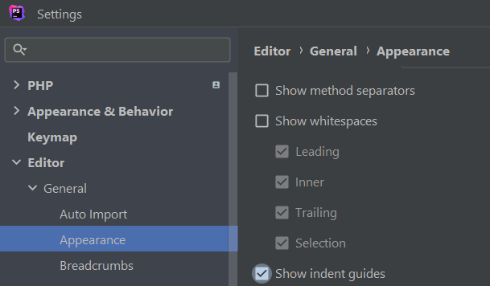
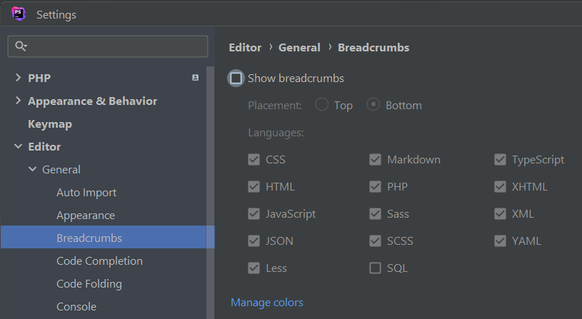
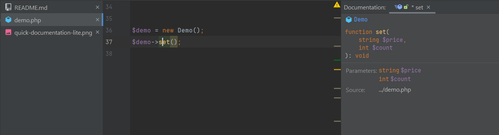
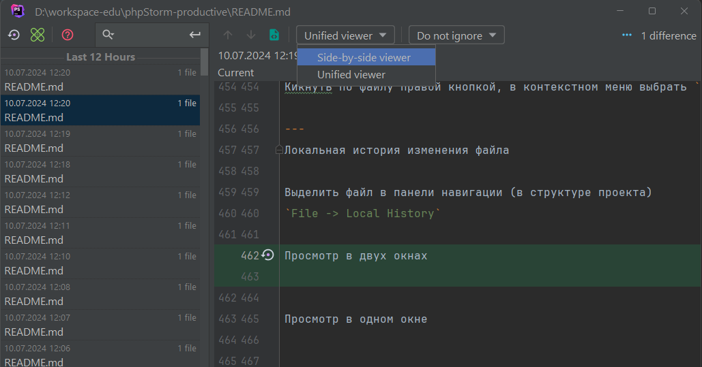

<!--
Меню

# оформление меню
[перейти](#headers)  
[Горизонтальные линии](#hr)  
[Выделение текста](#textSelecte)

# оформление заголовков на которые ссылаются меню
---
<a name="headers"><h2> </h2></a>
<a name="hr"><h2>Горизонтальные линии</h2></a>
<a name="textSelecte"><h2>Выделение текста</h2></a>

# Подключение картинки


- [Горячие клавиши](#keymap)

- [Установка](#install)
- [Настройка](#setting)
    - [Настройка параметров](#setting-params)
    - [Пользовательская настройка](#setting-users)
-->

# PhpStorm

- [https://www.jetbrains.com/help/phpstorm/getting-started.html](https://www.jetbrains.com/help/phpstorm/getting-started.html) -
  Справочник по работе с PhpStorm
- `[F1]` - в редакторе

---
<a name="headers"><h2> </h2></a>

##                                               

# Меню

- Установка плагинов [перейти](#install-plugins)
- Настройка параметров редактора [перейти](#setting-parameters-editor)
    - Настройка шрифта для всего редактора [перейти](#setting-font-all-editor)
    - Увеличить расстояние между строками в сайдбаре [перейти](#increase-line-spacing)
    - Настройка шрифта в окне редактора [перейти](#setting-font-in-window-editor)
    - Отключение / Включение лигатуры шрифта [перейти](#disable-enable-font-ligature)
    - Убрать / добавить ограничительную линию для кода - 120 символов по горизонтали [перейти](#line-for-code-120)
    - Прокрутка окончания файла до верха редактора [перейти](#scroll-end-of-file-to-top-of-editor)
    - Авто удаление пустых строк в конце файла [перейти](#auto-deleting-empty-string-to-end-file)
    - Добавление одной пустой строки в конце файла [перейти](#add-one-empty-string-to-end-file)
    - Добавить слева линии (метки) новых строк (отредактированных) [перейти](#add-lines-labels-to-the-left)
    - Отключение / Включение дерева тегов [перейти](#disable-enable-tag-tree)
    - Отключить кодовую линзу [перейти](#disable-code-lens)
    - Настроить сворачивание кода [перейти](#set-up-code-folding)
    - Отобразить компактно иконки ошибок и предупреждений вверху справа [перейти](#display-error-icons-compactly)
    - Отключение / Включение полосатой метки ошибок [перейти](#disable-enable-striped-error-flag)
    - Отключить хлебные крошки [перейти](#disable-breadcrumbs)
    - Отключить разделительную линию между методами в
      классе [перейти](#disable-dividing-line-between-methods-in-a-class)
    - Установить перенос файлов с клавишей - `[Alt]` (drag and drop) [перейти](#set-file-transfer-with-key-alt)
    - Настройка иконок браузеров [перейти](#setting-browser-icons)
    - Настройка моментального изменения редактирования в
      браузере [перейти](#setting-up-instant-editing-changes-in-the-browser)
    - Отключаем отображение методов навигации [перейти](#disable-display-of-navigation-methods)
    - Отображение / Скрытие вкладок вокруг редактора [перейти](#show-hiding-tabs-around-the-editor)
    - Отключение / Включение панели навигации наверху [перейти](#disable-enable-top-navigation-bar)
    - Отключение / Включение статус бара [перейти](#disable-enable-bar-status)
    - Подсвечивать измененные линии в коде [перейти](#highlight-changed-lines-in-code)
    - Отключение и включение подсказок для методов `hints` [перейти](#disable-or-enable-method-tooltips)

- Авто редактирование кода при сохранении файла [перейти](#auto-code-editing-when-saving-file)
- Laravel Pint - исправление стиля кода. [перейти](#laravel-pint-code-style-fix)
- Настройка автоматического применения `Laravel Pint` [перейти](#setting-up-automatic-application)
- Включение помощника презентаций [перейти](#enable-presentation-assistant)
- Открытие глобального поиска [перейти](#opening-global-search)
- Поиск настоек через глобальный поиск [перейти](#search-for-tinctures-through-global-search)
- Установка `KeyMap` через глобальный поиск [перейти](#setting-key-map-via-global-search)
- Назначение аббревиатур для команд [перейти](#assigning-abbreviations-to-commands)

- Навигация по файлам - переход по вкладкам [перейти](#file-navigation-tab-navigation)
- Просмотреть в окне все места где мы редактировали или
  открывали [перейти](#view-in-the-window-all-the-places-where-we-edited-or-opened)
- Удалить фрагмент из истории перемещений [перейти](#delete-a-fragment-from-the-movement-history)
- Вернуться в последнее место редактирования [перейти](#return-to-last-edit-location)
- Открыть список всех недавних файлов которые мы открывали [перейти](#open-a-list-of-all-recent-files-that-we-opened)
- Просмотр структуры класса [перейти](#view-class-structure)
- Перемещение по методам в классе [перейти](#navigate-through-methods-in-a-class)
- Перемещение на конкретную строку [перейти](#move-to-a-specific-line)
- Перемещение внутри блока - фигурных скобок [перейти](#move-inside-a-block-of-curly-braces)
- Просмотра предупреждений и ошибок на странице [перейти](#view-warnings-and-errors-on-the-page)
- Перемещение по ошибкам на странице [перейти](#navigate-through-errors-on-the-page)

- Мультивыделение на странице [перейти](#multi-select-on-page)
    - Одиночное выделение
    - Массовое выделение

- Навигация по классам, интерфейсам, методам [перейти](#navigation-through-classes-interfaces-methods)
    - Переместиться на интересуемый нас класс, интерфейс, метода
    - Вывести список всех подключенных интерфейсов и трейтов в
      классе [перейти](#list-all-connected-interfaces-and-traits-in-a-class)
    - Перейти в выбранный файл - трейт, интерфейс [перейти](#go-to-the-selected-file-trait-interface)
    - Открыть реализацию файла в модальном окне вместо перехода в
      файл [перейти](#open-the-file-implementation-in-a-modal-window-instead-of-going-to-the-file)

- Вернуться в последнее редактируемое место [перейти](#return-to-last-edited-location)
- Узнать, где используется метод, команды: [перейти](#find-out-where-the-command-method-is-used)
- Форматирование кода и оптимизация импортов [перейти](#code-formatting-and-import-optimization )
- Форматирование кода сразу для нескольких файлов [перейти](#formatting-code-for-several-files-at-once)
- Оптимизация импортированных классов в файле [перейти](#optimization-of-imported-classes-in-a-file)
- Автоматическое расположение свойств и методов в классе в порядке
  убывания [перейти](#automatic-layout-of-properties-and-methods)
- Отформатировать файл [перейти](#formated-file)

- Объединение строк [перейти](#combining-strings)

- Поиск с заменой [перейти](#search-and-replace)
    - Поиск по файлу
    - Поиск в выделенной области [перейти](#search-in-the-selected-area)
    - Просмотр истории поисковых запросов [перейти](#view-your-search-history)
    - Выводить результаты поиска в отдельное окно [перейти](#display-search-results-in-a-separate-window)
    - Глобальный поиск во всём проекте [перейти](#global-search-in-the-entire-project)
    - Поиск с заменой, Глобальный поиск с заменой [перейти](#search-with-replacement-global-search-with-replacement)

- Автодополнение кода [перейти](#code-completion)
- Завершение кода [перейти](#code-completion)
- Постфиксное завершение кода [перейти](#postfix-code-completion)
- Список постфикс конструкций [перейти](#list-of-postfix-structures)

- Просмотр быстрой документации [перейти](#view-quick-documentation)
- Подсказки в коде [перейти](#hints-in-the-code)
- Подсказка документации при наведении курсора мыши на
  элемент [перейти](#documentation-tooltip-on-hover)
- Подсказка при установке курсора на интересуемый элемент и
  клике [перейти](#hint-when-placing-the-cursor-on-the-element-of-interest)
- Включение / отключение подсказки `лампочки` [перейти](#enable-disable-light-bulb-prompt)

- Генерация кода [перейти](#code-generation)
- Перемещения между тестовым классом и классом который он
  тестирует [перейти](#move-between-test-class-and-class)

- Рефакторинг [перейти](#refactoring)

- Свернуть, развернуть блоки кода [перейти](#collapse-expand-code-blocks)
- Перемещение логических конструкций по коду вверх, вниз [перейти](#moving-logical-constructs-through-code)
- Перемещение строк по коду независимо от контекста [перейти](#moving-string)

- Обернуть выделенный код в комбинацию тегов [перейти](#wrap-the-highlighted-code)

- Использовать буфер обмена [перейти](#use-clipboard)
- Скопировать абсолютный или относительный путь к
  файлу [перейти](#copy-absolute-or-relative-path-to-file)

- Локальная история изменения файла [перейти](#local-file-change-history)

- Множественный курсор [перейти](#multiple-cursor)
- Добавить курсор в конец выделенных строк [перейти](#add-cursor-to-the-end-of-selected-lines)
- Выделение выбранного фрагмента по вертикали [перейти](#selecting-the-selected-fragment-vertically)
- Добавление курсоров в нескольких местах [перейти](#adding-cursors-in-multiple-places)
- Колоночный режим выделения [перейти](#column-selection-mode)
- Выход из множественных курсоров [перейти](#exit-multiple-cursors)

- Дополнительные комбинации клавиш  [перейти](#additional-keyboard-shortcuts)
    - Окно быстрых настроек редактора
    - Окно для выполнения различных команд в терминале

- Вывести имя автора кода (git) [перейти](#display-the-name-of-the-author-of-the-code)

- Создание скретч файла [перейти](#creating-a-scratch-file)

- Использовать определённый синтаксис в файлах с другим
  расширением [перейти](#use-a-specific-syntax-in-files-with-a-different-extension)
- Вставить синтаксис ругулярного выражения [перейти](#insert-regular-expression-syntax)
- Протестировать регулярное выражение [перейти](#test-regular-expression)

- Вызвать диалоговое окно проверки регулярного выражения [перейти](#call-the-regular-expression-validation-dialog)
- Проверка регулярного выражения [перейти](#checking-regular-expression)

- Быстрое переключение между файлами [перейти](#fast-switching-between-files)

- Сниппеты (live templates) [перейти](#snippets-live-templates)
- Просмотр всех сниппетов - live templates [перейти](#view-all-snippets)
- Создание пользовательских сниппетов [перейти](#creating-custom-snippets)
- Сниппет для оборачивания кода [перейти](#snippet-for-code-wrapping)
- Образец живого шаблона для [перейти](#sample-live-template-for)

- Вызывать меню для оборачивания кода [перейти](#call-menu-to-wrap-code)
- Обернуть HTML код в тег [перейти](#wrap-html-code-in-a-tag)

- Шаблоны файлов [перейти](#file-templates)

- Быстрые списки - `Quick lists` [перейти](#quick-lists)

- Работа с Git [перейти](#working-with-git)
    - Показать панель git ветки
    - Открыть окно выбора файлов для коммита
    - Настройка списка для файлов - для коммита
    - Слияние ветки через меню 1 вариант [перейти](#merging-a-branch-via-menu-option-1)
    - Слияние ветки через меню 2 вариант [перейти](#merge-branch-via-menu-option-2)
    - Решение конфликтов [перейти](#conflict-resolution)
    - Для ручного выбора изменений нажимаем на кнопку [перейти](#for-manual-selection-of-changes)
    - Настройка действий Git перед коммитом [перейти](#setting-up-git-actions-before-committing)
    - Используемые команды для git [перейти](#commands-used-for-git)

- Горячие клавиши [перейти](#hotkeys)
    - Структура файла - методы, разделы [перейти](#file-structure-methods-sections)
    - Закрытие всех активных окон [перейти](#closing-all-active-windows)
    - Открыть терминал [перейти](#open-terminal)
    - Переход к объявлению метода, класса [перейти](#go-to-class-method-declaration)
    - Рефакторинг - вызов меню рефакторинга [перейти](#refactoring-call-the-refactoring-menu)
    - Запуск конфигурации, тестов [перейти](#run-test-configuration)
    - Запуск - `Run Anything` [перейти](#launch-run-anything)
    - Вывести список файлов которые были просмотрены [перейти](#display-a-list-of-files-that-have-been-viewed)
    - Просмотр мест, где находился курсор [перейти](#view-the-places-where-the-cursor-was)
    - Выделение блока кода [перейти](#selecting-a-block-of-code)
    - Обратное уменьшение выделенного блока [перейти](#reverse-reduction-of-the-selected-block)
    - Открыть файл в режиме разделения экрана - второй части
      экрана [перейти](#open-file-in-split-screen-mode)
    - Подстановка `точки с запятой` - `;` в конце
      выражения [перейти](#inserting-a-semicolon-at-the-end-of-an-expression)
    - Горячие клавиши плагина - `Translation` [перейти](#hotkeys-for-the-translation-plugin)

- Настройка пользовательских горячих клавиш на Ubuntu [перейти](#setting-up-custom-hotkeys-on-ubuntu)

---
<a name="install-plugins"><h2> </h2></a>

## Установка плагинов

`GitToolBox` - Плагин для работы с Git


`.env` - Подсветка синтаксиса


`PHP inspections` - Статический анализатор кода


`Laravel Idea` - Плагин для работы с Laravel


`Make` - Плагин для работы с `Makefile`


`Markdown` - Для работы с Markdown файлами


`Key Promoter X` - Выводит подсказки горячих клавиш.


`Thanslate` - Переводчик текста


`Atom Material Icons` - Темы иконок для редактора


`Prettier` - Это инструмент для форматирования кода .js, .ts, .css, .less, .scss, .vue и .json


`String manipulation` - Это плагин для работы с строками


Установка плагина темы `Rios.jar`

  


---
<a name="setting-parameters-editor"><h2> </h2></a>

## Настройка параметров редактора

---
<a name="setting-font-all-editor"><h2> </h2></a>

## Настройка шрифта для всего редактора


---
<a name="increase-line-spacing"><h2> </h2></a>

## Увеличить расстояние между строками в сайдбаре


---
<a name="setting-font-in-window-editor"><h2> </h2></a>

## Настройка шрифта в окне редактора


---
<a name="disable-enable-font-ligature"><h2> </h2></a>

## Отключение / Включение лигатуры шрифта - `Enable ligatures`

  


---
<a name="line-for-code-120"><h2> </h2></a>

## Убрать / добавить ограничительную линию для кода - 120 символов по горизонтали

В разделе `Editor/General/Apperance` активировать / отменить
настройку

- `Show hard wrap and visual guides (configured in Code Style options)`


---
<a name="scroll-end-of-file-to-top-of-editor"><h2> </h2></a>

## Прокрутка окончания файла до верха редактора

При просмотре файла прокрутка останавливается внизу, и прокрутить выше файл для просмотра кода мы не можем.

Чтобы прокручивать файл вверх для удобного просмотра и редактирования данных нужно
в разделе `Editor/General/Virtual Space` активировать настройку

- `Show virtual space at the bottom of the file`


Теперь файл можно прокручивать выше чем он заканчивается.


---
<a name="auto-deleting-empty-string-to-end-file"><h2> </h2></a>

## Авто удаление пустых строк в конце файла

Автоматически удалять пустые строки в конце файла при сохранении файла
для этого нужно в разделе `Editor/General/On Save` активировать
настройку

- `Remove trailing blank lines at the end of saved files`


---
<a name="add-one-empty-string-to-end-file"><h2> </h2></a>

## Добавление одной пустой строки в конце файла

Для того чтобы оставлять одну пустую строку в конце каждого файла нужно
в разделе `Editor/General/On Save` активировать настройку

- `Ensure every saved file ends with a line break`


---
<a name="add-one-empty-string-to-end-file"><h2> </h2></a>

## Добавить слева линии (метки) новых строк (отредактированных)

Убрать или добавить отображение вспомогательных линий между выражениями, методами, функциями
В разделе `Editor/General/Apperance` активировать/отменить настройку

- `Show indent guides`

  


---
<a name="disable-enable-tag-tree"><h2> </h2></a>

## Отключение / Включение дерева тегов - `tag tree`


---
<a name="disable-code-lens"><h2> </h2></a>

## Отключить кодовую линзу

- `Show code lens on scrollbar hover`


---
<a name="set-up-code-folding"><h2> </h2></a>

## Настроить сворачивание кода

По умолчанию PhpStorm сворачивает некоторый код.
Это поведение можно настроить в разделе `Editor/General/Code Folding`,
отметив те пункты - которые должны быть свёрнуты


---
<a name="display-error-icons-compactly"><h2> </h2></a>

## Отобразить компактно иконки ошибок и предупреждений вверху справа


Наводим мышку на иконки, кликаем по настройкам и выбираем меню - `Compact View`


---
<a name="disable-enable-striped-error-flag"><h2> </h2></a>

## Отключение / Включение полосатой метки ошибок на странице для темы `Rios`

- `Error stripe mark`


---
<a name="disable-breadcrumbs"><h2> </h2></a>

## Отключить хлебные крошки - `breadcrums`

  


---
<a name="disable-dividing-line-between-methods-in-a-class"><h2> </h2></a>

## Отключить разделительную линию между методами в классе

- `Show method separators`


Отключение / Включение разделителей методов в теме `Rios` - `method separators`


---
<a name="set-file-transfer-with-key-alt"><h2> </h2></a>

## Установить перенос файлов с клавишей - `[Alt]` (drag and drop)


---
<a name="setting-browser-icons"><h2> </h2></a>

## Настройка иконок браузеров

Отключить иконки браузера на странице

В настройке ищем раздел `Web Browsers` и отключаем иконки браузеров.


Чтобы убрать иконку PhpStorm браузера - отключаем настройку `For HTML files`


---
<a name="setting-up-instant-editing-changes-in-the-browser"><h2> </h2></a>

## Настройка моментального изменения редактирования в браузере

> Для автоматического обновления содержимого браузера во время редактирования `HTML` и `CSS` на странице `*.html`

Отмечаем браузеры в которых будет смотреть результат и
настраиваем авто обновление при изменении кода в файл


---
<a name="disable-display-of-navigation-methods"><h2> </h2></a>

## Отключаем отображение методов навигации

в глобальном поиске отключаем настройку

- `Show Members`


---
<a name="show-hiding-tabs-around-the-editor"><h2> </h2></a>

## Отображение / Скрытие вкладок вокруг редактора

- `[Alt]` + `[B]`
- `View` -> `Apperance` -> `Tool Window Bars`


---
<a name="disable-enable-top-navigation-bar"><h2> </h2></a>

## Отключение / Включение панели навигации наверху


---
<a name="disable-enable-bar-status"><h2> </h2></a>

## Отключение / Включение статус бара

- `View` -> `Apperance` -> `Status Bar`


---
<a name="highlight-changed-lines-in-code"><h2> </h2></a>

## Подсвечивать измененные линии в коде - `modified lines`

  
  


---
<a name="disable-or-enable-method-tooltips"><h2> </h2></a>

## Отключение и включение подсказок для методов `hints`

  
  
  


---
<a name="auto-code-editing-when-saving-file"><h2> </h2></a>

## Авто редактирование кода при сохранении файла


- `Reformat code` - Код переформатирования (PSR12)
- `Optimize import` - Оптимизировать импорт (use)
- `Rearrange code` - Переставить код
- `Run code cleanup` - Запустите очистку кода
- `Run Prettier` - Запустить Prettier
- `File Watcher` - Наблюдатель за файлами
- `Upload to default server` - Загрузить на сервер по умолчанию

`[Alt]` + `[Enter]` - показать подсказку в редакторе

---
<a name="laravel-pint-code-style-fix"><h2> </h2></a>

## Laravel Pint - исправление стиля кода.

Установка и настройка `Laravel Pint`

`Laravel Pint` - Исправление стиля кода.  
`Laravel Pint` - Оболочка для инструмента `PHP-CS-Fixer`

[https://laravel.com/docs/11.x/pint](https://laravel.com/docs/11.x/pint) - Laravel Pint

```bash
# установка
composer require laravel/pint --dev

# запуск
./vendor/bin/pint 

# также можно запускать Pint для определенных каталогов или файлов:
./vendor/bin/pint app/Models
./vendor/bin/pint app/Models/User.php
```

---
<a name="setting-up-automatic-application"><h2> </h2></a>

## Настройка автоматического применения `Laravel Pint`

Создаём отслеживание файлов


Добавляем `pint` для исправления файлов


Заменяем путь к проекту - переменной макроса `$ProjectFileDir$`

  


Добавляем путь к файлу - переменной макроса `$FileRelativePath$`


> Дополнительные параметры: - `Advanced Options`

- `Auto-save edited files to trigger the watcher` (Автоматически сохранять отредактированные файлы для запуска
  наблюдателя - `выключаем`)
- `Trigger the watcher on external changes` (Запуск наблюдателя при внешних изменениях - `отмечаем`)


В разделе действия и сохранение исключаем файлы `php` из форматирования кода

  
  


---
<a name="enable-presentation-assistant"><h2> </h2></a>

## Включение помощника презентаций

- `[Shift]` + `[Shift]`
- `presentation`

---
<a name="opening-global-search"><h2> </h2></a>

## Открытие глобального поиска

- `[Shift]` + `[Shift]`


> Перемещение по вкладкам клавишей `[Tab]`,
>
>Обратное перемещение `[Shift]` + `[Tab]`

Назначение вкладок

- `All` - отображает все результаты поиска (`[Shift]` + `[Shift]`)
- `Classes` - поиск по названию класса (`[Ctrl]` + `[N]`)
- `Files` - поиск по названию файла (`[Ctrl]` + `[Shift]` + `[N]`)
- `Symbols` - названия методов, функций, констант (`[Ctrl]` + `[Alt]` + `[Shift]` + `[N]`)
- `Actions` - запускает разные команды и переключает настройки (`[Ctrl]` + `[Shift]` + `[A]`)
- `Text` - поиск по тексту в файлах, по содержимому (`[Ctrl]` + `[Alt]` + `[Shift]` + `[E]`)

> Чтобы сразу открыть нужную вкладку - для каждой вкладки есть комбинации горячих клавиш.

- `All` - (`[Shift]` + `[Shift]`)
- `Classes` - (`[Ctrl]` + `[N]`)
- `Files` - (`[Ctrl]` + `[Shift]` + `[N]`)
- `Symbols` - (`[Ctrl]` + `[Alt]` + `[Shift]` + `[N]`)
- `Actions` - (`[Ctrl]` + `[Shift]` + `[A]`)
- `Text` - (`[Ctrl]` + `[Alt]` + `[Shift]` + `[E]`)

---
<a name="search-for-tinctures-through-global-search"><h2> </h2></a>

## Поиск настоек через глобальный поиск

Настройки разбиты по категориям.
`/editor`
`/plugins`

---
<a name="setting-key-map-via-global-search"><h2> </h2></a>

## Установка `KeyMap` через глобальный поиск

Для этого в секции `Actions` внизу страницы нажать на `Assign Shortcut`


---
<a name="assigning-abbreviations-to-commands"><h2> </h2></a>

## Назначение аббревиатур для команд

Они назначаются так же как и
горячие клавиши, но будут применяться только при поиске команды.

Например, назначим аббревиатуру `pa` для команды `Presentation Assistant`


Использование


---
<a name="file-navigation-tab-navigation"><h2> </h2></a>

## Навигация по файлам

Навигация по вкладкам:

- Назад - `[Alt]` + `[Shift]` + `[<-]`
- Вперёд - `[Alt]` + `[Shift]` + `[->]`

---
<a name="view-in-the-window-all-the-places-where-we-edited-or-opened"><h2> </h2></a>

## Просмотреть в окне все места где мы редактировали или открывали

- `[Ctrl]` + `[Shift]` + `[E]`

Повторное нажатие `[Ctrl]` + `[Shift]` + `[E]` оставит только файлы - которые были отредактированы.


---
<a name="delete-a-fragment-from-the-movement-history"><h2> </h2></a>

## Удалить фрагмент из истории перемещений

- Открыть окно просмотра
- Выбрать код который нужно удалить
- Нажать клавишу `[Backspace]`

Удалять фрагмент можно:

- Из окна истории просмотров
- Из окна истории редактирования

В истории перемещений можно применять поиск

- набирать нужный текст, содержимое будет фильтроваться по наличию в блоке текста.

---
<a name="return-to-last-edit-location"><h2> </h2></a>

## Вернуться в последнее место редактирования

- `[Ctrl]` + `[Shift]` + `[Backspace]`

---
<a name="open-a-list-of-all-recent-files-that-we-opened"><h2> </h2></a>

## Открыть список всех недавних файлов которые мы открывали

- `[Ctrl]` + `[E]`

Повторное нажатие комбинации оставляет модифицированные файлы


- Для удаления отдельных элементов из этого списка нажимаем клавишу `[Backspace]`

---
<a name="view-class-structure"><h2> </h2></a>

## Просмотр структуры класса

- `[Alt]` + `[7]` - слева в окне - свойства и методы класса (структура файла)
- `[Ctrl]` + `[F12]` - в модальном окне - свойства и методы класса (структура файла)

Для перемещения по элементам используются стрелки вверх/вниз.

---
<a name="navigate-through-methods-in-a-class"><h2> </h2></a>

## Перемещение по методам в классе

- `[Alt]` + `[Стрелка Вниз]` - перемещение вниз
- `[Alt]` + `[Стрелка Вверх]` - перемещение вверх

> В Windows работает при английской раскладке клавиатуры.
>
>При русской не работает.
---
<a name="move-to-a-specific-line"><h2> </h2></a>

## Перемещение на конкретную строку

- `[Ctrl]` + `[G]`

---
<a name="move-inside-a-block-of-curly-braces"><h2> </h2></a>

## Перемещение внутри блока - фигурных скобок

- `[Ctrl]` + `[` - в начало блока
- `[Ctrl]` + `]` - в конец блока

---
<a name="view-warnings-and-errors-on-the-page"><h2> </h2></a>

## Просмотра предупреждений и ошибок на странице

На странице в верхнем правом углу нужно нажать на иконку


Либо нажать комбинацию клавиш:

`[Alt]` + `[6]`

Откроется окно с сообщениями, для перехода к нужной строке можно кликнуть по нужному сообщению


Для выхода из этого окна нажать  
`[Shift]` + `[Esc]`

---
<a name="navigate-through-errors-on-the-page"><h2> </h2></a>

## Перемещение по ошибкам на странице

- `[F2]` - для перемещения (вниз) к следующей ошибке
- `[Shift]` + `[F2]` - для перемещения (вверх) к предыдущей ошибке

---
<a name="multi-select-on-page"><h2> </h2></a>

## Мультивыделение на странице

Одиночное выделение

- `[Alt]` + `[J]` - одно нажатие выделяет по одному слову найденном в документе
- `[Alt]` + `[Shift]` + `[J]` - отменяет по одному выделению

Массовое выделение

- `[Ctrl]` + `[Shift]` + `[Alt]` + `[J]` - выделяет сразу все найденные совпадения на странице

---
<a name="navigation-through-classes-interfaces-methods"><h2> </h2></a>

## Навигация по классам, интерфейсам, методам

Переместиться на интересуемый нас класс, интерфейс, метода

- `[Ctrl]` + `[B]` - переместимся в файл, где определён данный класс, интерфейс
- `[Ctrl]` + `[Click Mouse]` - переместимся в файл, где определён данный класс, интерфейс

---
<a name="list-all-connected-interfaces-and-traits-in-a-class"><h2> </h2></a>

## Вывести список всех подключенных интерфейсов и трейтов в классе

- `[Ctrl]` + `[U]` - в списке выбрать файл в который мы хотим переместиться

---
<a name="go-to-the-selected-file-trait-interface"><h2> </h2></a>

## Перейти в выбранный файл - трейт, интерфейс

- `[F4]`

---
<a name="open-the-file-implementation-in-a-modal-window-instead-of-going-to-the-file"><h2> </h2></a>

## Открыть реализацию файла в модальном окне вместо перехода в файл

выбрать нужный файл - класс, интерфейс, трейт

- `[Ctrl]` + `[Shift]` + `[I]`

---
<a name="return-to-last-edited-location"><h2> </h2></a>

## Вернуться в последнее редактируемое место

- `[Ctrl]` + `[Shift]` + `[Backspace]`

---
<a name="find-out-where-the-command-method-is-used"><h2> </h2></a>

## Узнать, где используется метод, команды:

> Команды искать в глобальном поиске в разделе `Actions`

- `[Ctrl]` + `[Shift]` + `[A]`
- `[Ctrl]` + `[Alt]` + `[F7]`

- `Find Usages` - найти место, где используется метод
- `Show Usages` - показать место, где используется метод

Внизу откроется панель со списком тех файлов - где используется метод.

---
<a name="code-formatting-and-import-optimization"><h2> </h2></a>

## Форматирование кода и оптимизация импортов

`[Ctrl]` + `[Alt]` + `[L]`

---
<a name="formatting-code-for-several-files-at-once"><h2> </h2></a>

## Форматирование кода сразу для нескольких файлов

Кликаем по папке правой кнопкой мыши,  
в выпавшем меню выбираем пункт
`Reformate Code`, либо нажимаем

- `[Ctrl]` + `[Alt]` + `[L]`

---
<a name="optimization-of-imported-classes-in-a-file"><h2> </h2></a>

## Оптимизация импортированных классов в файле

Вызовем команду `Optimize imports`

- `[Ctrl]` + `[Alt]` + `[O]` - она находится в `Code -> Optimize imports`

> Неиспользуемые импорты будут удалены, остальные расположены в алфавитном порядке.

---
<a name="headers"><h2> </h2></a>

## Автоматическое расположение свойств и методов в классе в порядке убывания

вызывается командой `Code ->  Rearrange Code`

- публичные свойства
- защищённые свойства
- приватные свойства
- публичные методы
- защищённые методы
- приватные методы

В настройках найти раздел `Tools -> Actions on Save` и отмечаем пункты

- `Reformat code`
- `Optimize imports`
- `Rearrange code`


---
<a name="formated-file"><h2> </h2></a>

## Отформатировать файл - `Code ->  Reformate file`

- `[Ctrl]` + `[Shift]` + `[J]` + `[L]`

Есть ещё способ как выполнить эти три команды одновременно

- `[Ctrl]` + `[Shift]` + `[A]` - Откроем глобальный поиск по командам
- в поиске введём `Reformat File`

Или введём команду

- `[Ctrl]` + `[Shift]` + `[Alt]` + `[L]`

---
<a name="combining-strings"><h2> </h2></a>

## Объединение строк

- `[Ctrl]` + `[Shift]` + `[J]`

---
<a name="search-and-replace"><h2> </h2></a>

## Поиск с заменой

Поиск по файлу

- `[Ctrl]` + `[F]`

В открытом поле пишем поисковый запрос.
> Найденные результаты будут подсвечены.

- `[Enter]` - для перемещения по результатам вперёд
- `[Shift]` + `[Enter]` - чтобы двигаться в обратном направлении
- `[Esc]` - для закрытия поисковой панели

> Выделенный текст при открытии поисковой панели будет автоматически добавлен в поисковое поле.

---
<a name="search-in-the-selected-area"><h2> </h2></a>

## Поиск в выделенной области

Выделить курсором область кода, в поисковике задать строку поиска.

---
<a name="view-your-search-history"><h2> </h2></a>

## Просмотр истории поисковых запросов

Установить курсор на поле
`[Alt]` + `Стрелка вниз`


---
<a name="display-search-results-in-a-separate-window"><h2> </h2></a>

## Выводить результаты поиска в отдельное окно


- `[Alt]` + `[7]`

---
<a name="global-search-in-the-entire-project"><h2> </h2></a>

## Глобальный поиск во всём проекте

- `[Ctrl]` + `[Shift]` + `[F]`

> В глобальном поиске так же можно просмотреть историю запросов.

---
<a name="search-with-replacement-global-search-with-replacement"><h2> </h2></a>

## Поиск с заменой, Глобальный поиск с заменой

- `[Ctrl]` + `[R]` - поиск с заменой
- `[Ctrl]` + `[Shift]` + `[R]` - Глобальный поиск с заменой

> В поиске с заменой и глобальном поиске в поле так же можно просмотреть историю запросов.

> При глобальном поиске и глобальном поиске с заменой можно скопировать путь к файлу в котором найдена поисковая строка.
> Для этого по результату кликаем правой кнопкой мыши и нажимаем на пункт `Copy Path`, откроется окно с вариантами пути.


---
<a name="code-completion"><h2> </h2></a>

## Автодополнение кода

Для появления списка автодополнения во время написания кода

- `[Ctrl]` + `[Пробел]`

За показ списка автодополнения отвечает настройка
`Show suggestions as you type` в разделе `Editor -> General -> Code Comppetion`


---
<a name="code-completion"><h2> </h2></a>

## Завершение кода - фигурные скобки, точка с запятой

При написании имени метода

- `[Ctrl]` + `[Shift]` + `[Enter]` - автодополнение кода фигурными скобками

> Эта комбинация работает и для других выражений, например если набрать `if` или `for` и нажать
> `[Ctrl]` + `[Shift]` + `[Enter]` - редактор автоматически допишет фигурные скобки.

> Для строки с выражением редактор поставит в конце точку с запятой `;`
---
<a name="postfix-code-completion"><h2> </h2></a>

## Постфиксное завершение кода

> Пишется через `.` после выражения

```
 $isActive.if + `[Tab]`
```

---
<a name="list-of-postfix-structures"><h2> </h2></a>

## Список постфикс конструкций

Список постфикс конструкций находится по адресу  
`Editor -> General -> Postfix Completion`

---
<a name="view-quick-documentation"><h2> </h2></a>

## Просмотр быстрой документации

При наборе или переходе на интересуемый метод, класса, функции, констант
выбираем интересуемые данные и нажимаем на комбинацию клавиш

- `[Ctrl]` + `[Shift]` + `[I]` - откроется окно для просмотра,
- `[F4]`- для перехода к редактированию из окна просмотра

---
<a name="hints-in-the-code"><h2> </h2></a>

## Подсказки в коде

Подсказка параметров принимаемых функцией

Поместить курсор на метод, функцию

- `[Ctrl]` + `[P]`

> По умолчанию отображаются в кратком формате, чтобы показывали в расширенном формате - нужно активировать в настройках

В разделе `Editor -> General -> Code Completion`
опцию `Show full method signatures`


---
<a name="documentation-tooltip-on-hover"><h2> </h2></a>

## Подсказка документации при наведении курсора мыши на элемент

В разделе `Editor -> General -> Code Editing`
активировать опцию `Show quick documentation on hover`


---
<a name="hint-when-placing-the-cursor-on-the-element-of-interest"><h2> </h2></a>

## Подсказка при установке курсора на интересуемый элемент и клике

- `[Ctrl]` + `[Q]` - в модальном окне появится описание
- `[Ctrl]` + `[Q]` - повторное нажатие откроет окно с описанием, в котором будут отображаться описание при клике на
  другие элементы

  


---
<a name="enable-disable-light-bulb-prompt"><h2> </h2></a>

## Включение / отключение подсказки `лампочки`


В разделе `Editor -> General -> Appearance`
пункт `Show intenting bulb`


Так же отображать окно с подсказками можно клавишами

- `[Alt]` + `[Enter]`

---
<a name="code-generation"><h2> </h2></a>

## Генерация кода

Быстрая генерация кода в классе

- `[Alt]` + `[Insert]` - появляется окно с вариантами генерации кода


---
<a name="move-between-test-class-and-class"><h2> </h2></a>

## Перемещения между тестовым классом и классом который он тестирует

и возврата назад

- `[Ctrl]` + `[Shift]` + `[T]`

---
<a name="refactoring"><h2> </h2></a>

## Рефакторинг

- `[Ctrl]` + `[Shift]` + `[Alt]` + `[T]`

  


---
<a name="collapse-expand-code-blocks"><h2> </h2></a>

## Свернуть, развернуть блоки кода

- `[Ctrl]` + `[-]` - свернуть блок
- `[Ctrl]` + `[+]` - развернуть блок
- `[Ctrl]` + `[Shift]` + `[-]` - свернуть все блоки
- `[Ctrl]` + `[Shift]` + `[+]` - развернуть все блоки

---
<a name="moving-logical-constructs-through-code"><h2> </h2></a>

## Перемещение логических конструкций по коду вверх, вниз

Перемещение методов вверх, вниз по классу

- `[Ctrl]` + `[Shift]` + `[стрелка вверх]` - перемещение блока метода верх
- `[Ctrl]` + `[Shift]` + `[стрелка вниз]` - перемещение блока метода вниз

---
<a name="moving-string"><h2> </h2></a>

## Перемещение строк по коду независимо от контекста

- `[Alt]` + `[Shift]` + `[стрелка вверх]` - перемещение блока метода верх
- `[Alt]` + `[Shift]` + `[стрелка вниз]` - перемещение блока метода вниз

---
<a name="wrap-the-highlighted-code"><h2> </h2></a>

## Обернуть выделенный код в комбинацию тегов

Выделить нужный блок для оборачивания

- `[Ctrl]` + `[Alt]` + `[T]`


---
<a name="use-clipboard"><h2> </h2></a>

## Использовать буфер обмена

- `[Ctrl]` + `[Shift]` + `[V]`
- `[Ctrl]` + `[Shift]` + `[Insert]`

> Выбирать варианты можно несколькими способами:
>- цифрой по номеру строки
>- стрелками вверх / вниз и клавишей `[Enter]`
>- кликнуть мышью

---
<a name="copy-absolute-or-relative-path-to-file"><h2> </h2></a>

## Скопировать абсолютный или относительный путь к файлу

`Edit -> Copy Path/Reference..`

Кликнуть по файлу правой кнопкой, в контекстном меню выбрать `Copy Path/Reference`

---
<a name="local-file-change-history"><h2> </h2></a>

## Локальная история изменения файла

Выделить файл в панели навигации (в структуре проекта)
`File -> Local History`

Просмотр в двух окнах  


Просмотр в одном окне  


---
<a name="multiple-cursor"><h2> </h2></a>

## Множественный курсор

Выделить интересующий элемент для поиска - слово, символ

- `[Ctrl]` + `[Shift]` + `[Alt]` + `[J]` - выделит все найденные совпадения в документе
- `[Alt]` + `[J]` - выделяет по 1 дополнительному совпадению
- `[Alt]` + `[Shift]` + `[J]` - снимает выделение по 1 дополнительному совпадению

---
<a name="add-cursor-to-the-end-of-selected-lines"><h2> </h2></a>

## Добавить курсор в конец выделенных строк

`Edit -> Add Carets to Ends of Selected Lines`

Выделяем несколько строк курсором

- `[Alt]` + `[Shift]` + `[G]` - добавятся курсоры в конце строк

> Пользовательское сочетание клавиш - `[Alt]` + `[G]`

---
<a name="selecting-the-selected-fragment-vertically"><h2> </h2></a>

## Выделение выбранного фрагмента по вертикали

- `[Ctrl]` + `[Ctrl]` + `[стрелка вниз]` - множественные курсоры добавляются вниз
- `[Ctrl]` + `[Ctrl]` + `[стрелка вверх]` - множественные курсоры добавляются вверх

---
<a name="adding-cursors-in-multiple-places"><h2> </h2></a>

## Добавление курсоров в нескольких местах

- `[Alt]` + `[клик мышью]` - в тех местах, где хотим добавить курсоры

---
<a name="column-selection-mode"><h2> </h2></a>

## Колоночный режим выделения

`Edit -> Column Selection Mode`

По умолчанию работает строчный режим выделения


Чтобы включить колоночный режим выделения

- `[Alt]` + `[Shift]` + `[Insert]` - включён колоночный режим выделения


> Для выключения колоночного режима нужно повторна нажать комбинацию клавиш
>- `[Alt]` + `[Shift]` + `[Insert]`

> Колоночный режим включается и выключается отдельно для каждой страницы

---
<a name="exit-multiple-cursors"><h2> </h2></a>

## Выход из множественных курсоров

- `[Esc]`

---
<a name="additional-keyboard-shortcuts"><h2> </h2></a>

## Дополнительные комбинации клавиш

Окно быстрых настроек редактора

- `[Ctrl]` +  ``[`]``


Окно для выполнения различных команд в терминале

- `[Ctrl]` + `[Ctrl]`


---
<a name="display-the-name-of-the-author-of-the-code"><h2> </h2></a>

## Вывести имя автора кода `(git)`

- `[Shift]` + `[Shift]` + `git blame -> ON` - выводит имя автора напротив каждой строки документа

  


> Включить можно только в тех файлах - которые уже добавлены в `Git`

---
<a name="creating-a-scratch-file"><h2> </h2></a>

## Создание скретч файла

- `[Ctrl]` + `[Shift]` + `[Alt]` + `[Insert]`

> Скретч файлы выполняют роль заметок с кодом. Они не принадлежат к проекту, а принадлежат к редактору.

> Созданные скретч файлы в одном проекте можно использовать в любом другом.

---
<a name="use-a-specific-syntax-in-files-with-a-different-extension"><h2> </h2></a>

## Использовать определённый синтаксис в файлах с другим расширением

`json` не распознаётся в файле php - подсвечивается одним цветом


- выделяем код - который нужно интерпретировать другим языком
- `[Ctrl]` + `[Shift]` + `[A]` -> `inject language or reference`


---
<a name="insert-regular-expression-syntax"><h2> </h2></a>

## Вставить синтаксис ругулярного выражения

- выделить строку 
- `[Ctrl]` + `[Shift]` + `[A]` -> `inject language or reference`


---
<a name="test-regular-expression"><h2> </h2></a>

## Протестировать регулярное выражение

- `[Ctrl]` + `[Shift]` + `[A]` -> `check rege`


---
<a name="call-the-regular-expression-validation-dialog"><h2> </h2></a>

## Вызвать диалоговое окно проверки регулярного выражения

- Навести курсор на регулярное выражение
- `[Alt]` + `[Enter]`

> Пункт `Check RegExp` появится если
>- регулярное выражение прописано в функции для работы с регулярными выражениями.
>- переменная с регулярным выражением используется в функции для работы с регулярными выражениями


иначе


[//]: # (![картинка]&#40;img1/regular-form/regular-norm.png&#41;)

---
<a name="checking-regular-expression"><h2> </h2></a>

## Проверка регулярного выражения

> Если в регулярном выражении будет ошибка, в поле регулярного выражения будет красный значёк


иначе


В поле `Sample` ввести проверяемую строку, найденное совпадение подсветится


---
<a name="fast-switching-between-files"><h2> </h2></a>

## Быстрое переключение между файлами

- `[Ctrl]` + `[Tab]` - выбор файлов нажатием клавиши `[Tab]` и стрелками: `вверх`, `вниз`, `влево`, `вправо`


---
<a name="snippets-live-templates"><h2> </h2></a>

## Сниппеты (live templates)

`Editor -> Live Templates`

- `[Ctrl]` + `[J]` - выбрать нужный сниппет

---
<a name="view-all-snippets"><h2> </h2></a>

## Просмотр всех сниппетов - live templates

- `[Ctrl]` + `[J]` - просмотр всех сниппетов

Увидеть все сниппеты
`Editor` -> `Live Templates`

---
<a name="creating-custom-snippets"><h2> </h2></a>

## Создание пользовательских сниппетов

1. выделяем строку кода
2. `[Ctrl]` + `[Shift]` + `[A]` -> `live template` (Save as Live Template)


Использование списков, переменных в сниппетах


Для вызова сниппета в коде пишем

- `route` -> `[Tab]`

Заполняем динамические данные, для перемещения нажимаем клавишу `[Tab]`

---
<a name="snippet-for-code-wrapping"><h2> </h2></a>

## Сниппет для оборачивания кода

> Для оборачивания кода используется переменная `$SELECTION$`.

> В этой переменной будет храниться выделенный кода.


---
<a name="sample-live-template-for"><h2> </h2></a>

## Образец живого шаблона для `Surround with href`

```
<a href="$LINK$">$SELECTION$</a>
```

```
private function $NAME$($PARAMETERS$)
{
    $END$
}
```

```
private function $NAME$($PARAMETERS$)
{
    $SELECTION$
}
```

```
it('$NAME$', function () {
    $END$
});
```


---
<a name="call-menu-to-wrap-code"><h2> </h2></a>

## Вызывать меню для оборачивания кода

- `выделить текст` -> `[Ctrl] + [J]` -> `выбрать вариант`
- `выделить текст` -> `[Ctrl] + [Alt] + [T]` -> `выбрать вариант`

> Обернуть в тег

При втором варианте появятся конструкции в которые можно оборачивать код.


---
<a name="wrap-html-code-in-a-tag"><h2> </h2></a>

## Обернуть HTML код в тег

- выделить код
- 
- `[Ctrl]` + `[Alt]` + `[J]`
  

---
<a name="file-templates"><h2> </h2></a>

## Шаблоны файлов

- `Settings | Editor | File and Code Templates`

В шаблонах файлов можно использовать логические конструкции и переменный.
Список переменных определён ниже в описании для каждого файла шаблона.


---
<a name="quick-lists"><h2> </h2></a>

## Быстрые списки - `Quick lists`

- `Settings | Appearance & Behavior | Quick Lists`

> Быстрые списки это набор сгруппированных команд.
> По умолчанию уже существует быстрый список `Deployment`.  


- Создаём набор часто используемых команд
- Назначаем горячие клавиши для вызова быстрого списка
    - в разделе `Settings | Keymap` находим быстрый список по названию
    - назначаем ему комбинацию клавиш


- `[Alt]` + `[F]` - вызов созданного быстрого списка

---
<a name="working-with-git"><h2> </h2></a>

## Работа с Git

Показать панель git ветки

- `[Alt]` + `[9]`

Открыть окно выбора файлов для коммита

- `[Alt]` + `[0]`

Настройка списка для файлов - для коммита  


- Создать список изменений для коммита
- Сделать его активным по умолчанию (все изменения будут добавляться в него)
- Написать `сообщение` для коммита

Перед коммитом выбрать список для фиксации  


---
<a name="merging-a-branch-via-menu-option-1"><h2> </h2></a>

## Слияние ветки через меню 1 вариант


---
<a name="merge-branch-via-menu-option-2"><h2> </h2></a>

## Слияние ветки через меню 2 вариант

`[Ctrl]` + `[Shift]` + ``[`]``


---
<a name="conflict-resolution"><h2> </h2></a>

## Решение конфликтов

При слиянии веток через меню или через плавающее окно и возникновении конфликта - появится окно для решения конфликта


> Можно сразу принять изменения из одной или из другой ветки - кнопками `Accept Yours` или `Accept Thrirs`.

> В окне подписано какой кнопке соответствуют изменения из веток.
> Если слияние производилось через терминал, окно не появится.
>
> Его можно открыть через меню   
> `Git` -> `Resolve Conflicts`


---
<a name="for-manual-selection-of-changes"><h2> </h2></a>

## Для ручного выбора изменений нажимаем на кнопку `Merge...`


В появившемся окне выбираем нужные изменения стрелками  


Непринятые изменения отменяем крестиком  

---
<a name="setting-up-git-actions-before-committing"><h2> </h2></a>

## Настройка действий Git перед коммитом


---
<a name="commands-used-for-git"><h2> </h2></a>

## Используемые команды

```bash
# создать файл для теста 
php artisan make:test Example2  # по умолчанию создастся в папке Feature

git merge git-conflict
git merge --abort

git merge git-conflict
git reset --hard HEAD~1

git log --oneline --all --graph
```

---
<a name="hotkeys"><h2> </h2></a>

## Горячие клавиши

---
<a name="file-structure-methods-sections"><h2> </h2></a>

## Структура файла - методы, разделы

- `[Alt]` + `7`
- `[Ctrl]` + `[F12]`

---
<a name="closing-all-active-windows"><h2> </h2></a>

## Закрытие всех активных окон

`[Ctrl]` + `[Shift]` + `[F12]`

---
<a name="open-terminal"><h2> </h2></a>

## Открыть терминал

- `[Alt]` + `[F12]`

---
<a name="go-to-class-method-declaration"><h2> </h2></a>

## Переход к объявлению метода, класса

- `[Ctrl]` + `ClickMouse`
- `[Ctrl]` + `[B]`

---
<a name="refactoring-call-the-refactoring-menu"><h2> </h2></a>

## Рефакторинг - вызов меню рефакторинга

`[Alt]` + `[R]`

---
<a name="run-test-configuration"><h2> </h2></a>

## Запуск конфигурации, тестов

`[Ctrl]` + `[Shift]` + `[F10]`

---
<a name="launch-run-anything"><h2> </h2></a>

## Запуск - `Run Anything`

`[Alt]` + `[A]`

---
<a name="display-a-list-of-files-that-have-been-viewed"><h2> </h2></a>

## Вывести список файлов которые были просмотрены

`[Ctrl]` + `[E]`

---
<a name="view-the-places-where-the-cursor-was"><h2> </h2></a>

## Просмотр мест, где находился курсор

`[Ctrl]` + `[Shift]` + `[E]`

---
<a name="selecting-a-block-of-code"><h2> </h2></a>

## Выделение блока кода

- `[Ctrl]` + `[W]`

> Повторное нажатие на `[Ctrl]` + `[W]` увеличивает выделение

Обратное уменьшение выделенного блока

- `[Ctrl]` + `[Shift]` + `[W]`

---
<a name="open-file-in-split-screen-mode"><h2> </h2></a>

## Открыть файл в режиме разделения экрана - второй части экрана

Выделить нужный файл стрелками

- `[Shift]` + `[Enter]`

> Также работает с файловым деревом проекта.
> Выбрать нужный файл и нажать `[Shift]` + `[Enter]`

---
<a name="inserting-a-semicolon-at-the-end-of-an-expression"><h2> </h2></a>

## Подстановка `точки с запятой` - `;` в конце выражения

(автоматически дополняет код, для `if` - дописывает скобки)

- `[Ctrl]` + `[Shift]` + `[Enter]`

---
<a name="hotkeys-for-the-translation-plugin"><h2> </h2></a>

## Горячие клавиши плагина - `Translation`

- `[Ctrl]` + `[Shift]` + `[O]` - Открыть диалоговое окно перевода
- `[Ctrl]` + `[Shift]` + `[Y]` - Показать перевод выделенного текста
- `[Ctrl]` + `[Shift]` + `[X]` - Перевести и заменить выделенный текст

---
<a name="setting-up-custom-hotkeys-on-ubuntu"><h2> </h2></a>

## Настройка пользовательских горячих клавиш на Ubuntu

`Settings | Keymap`

- Выделить всю строку
    - `Select Single Line at Caret` -  `[Alt]` +  `[S]`

- Открыть окно настроек
    - `Settings` -  `[Ctrl]` + `[Windows]`

- Установка бейджа для локальной истории файла
    - `Put Label` - `[Alt]` + `[H]`

- Скопировать имя файла
    - `Copy File Name` - `[Alt]` + `[C]`

- Добавить курсоры в конце строк выделенных строк
    - `Add Carets to Ends of Selected Lines` - `[Alt]` + `[G]`

- Скрыть/показать панели вокруг редактора
    - `Tool Window Bars` - `[Alt]` + `[B]`

- Включить/отключить перенос строк в окне редактора
    - `Soft-Wrap` (`Active Editor`) - `[Alt]` + `[W]`

- Обернуть с помощью
    - `Surround With` - `[Alt]` + `[T]`

- Laravel
    - `Code Generation` - `[Ctrl]` + `[Shift]` + `[Windows]`

- Refactor
    - `Refactor This` - `[Alt]` + `[R]`

- Intentions
    - `Intention 'Declara property'` - `[Alt]` + `[I]`

- Quick Lists
    - `Favorite` - `[Alt]` + `[F]`

- `Run Anything` - `[Alt]` + `[A]` 
