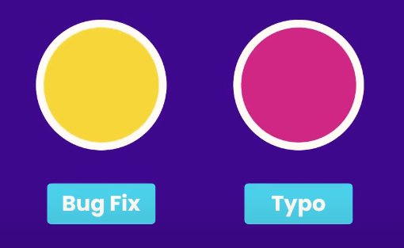
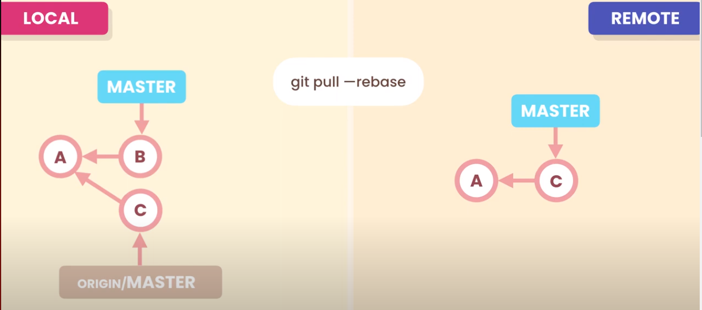
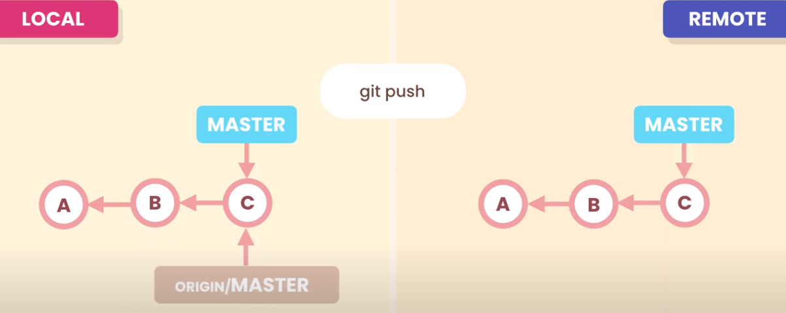
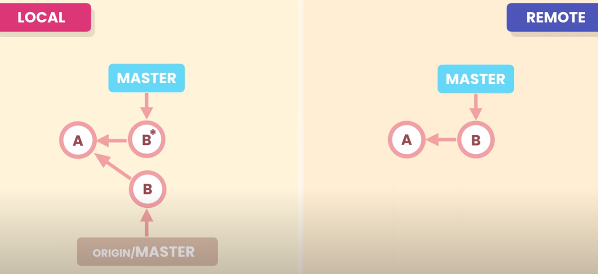

# GIT

---

- [1 - Введение](#coutse_introduction)  
- [2 - Что такое Git](#what_is_git)  
- [3 - Использование Git](#using_git)  
- [4 - Установка Git](#installing_git)  
- [5 - Настройка Git](#configuring_git)  
- [6 - Получение справки](#getting_help)  
- [7 - Шпаргалка](#cheat_sheet)  

Создание снимков - Creating snapshots  
- [1 - Введение](#git_introduction)  
- [2 - Инициализация репозитория](#initializing_a_repository)  
- [3 - Рабочий процесс Git](#git_workflow)  
- [4 - Промежуточные файлы](#staging_files)  
- [5 - Фиксация изменений](#committing_changes)  
- [6 - Фиксация рекомендации](#committing_best_practices)  
- [7 - Пропуск промежуточной области](#skipping_the_staging_area)  
- [8 - Удаление файлов](#removing_files)  
- [9 - Переименование или перемещение файлов](#renaming_or_moving_files)  
- [10 - Игнорирование файлов `.gitignore`](#ignoring_files)  
- [11 - Короткий статус](#short_status)  
- [12 - Просмотр поэтапных и неустановленных изменений](#viewing_staged_and_unstaged_changes)  
- [13 - Инструменты визуального анализа различий](#visual_diff_tools)  
- [14 - Просмотр истории](#viewing_history)  
- [15 - Просмотр фиксации](#viewing_a_commit)  
- [17 - Удаление локальных изменений](#discarding_local_changes)  
- [18 - Восстановление файла до более ранней версии](#restoring_a_file_to_an_earlier_version)  

История браузера - Browsing history  
- [1 - Введение](#history_introduction)  
- [2 - Получение репозитория](#getting_a_repository)  
- [3 - Просмотр и фильртация истории](#viewing_the_history)
- [5 - Форматирование выходных данных журнала](#formatting_the_log_output)  
- [6 - Псевдонимы](#aliases)  
- [7 - Просмотр фиксации](#viewing_a_commit)  
- [8 - Просмотр изменений в разных коммитах](#viewing_the_changes_across_commits)  
- [9 - Проверка фиксации](#checking_out_a_commit)  
- [10 - Поиск ошибок с помощью Bisect](#finding_bugs_using_bisect)  
- [11 - Поиск участников с помощью Shortlog](#finding_contributors_using_shortlog)  
- [12 - Просмотр истории файла](#viewing_the_history_of_a_file)  
- [13 - Восстановление удаленного файла](#restoring_a_deleting_file)  
- [14 - Поиск автора строки с помощью Blame](#finding_the_author_of_line_using_blame)  
- [15 - Пометка тегов](#tagging)  

Ветвление и слияние - Branching & merging  
- [1 - Введение](#branching_introduction)  
- [2 - Что такое ветви](#what_are_branches)  
- [3 - Получение репозитория](#getting_a_repository)  
- [4 - Работа с ветвями](#working_with_branches)  
- [5 - Сравнение ветвей](#comparing_branches)  
- [6 - Тайник](#stashing)  
- [7 - Слияние](#merging)  
- [8 - Быстрая перемотка слияний](#fastorward_merges)  
- [9 - Трехсторонние слияния](#threeay_merges)  
- [10 - Просмотр объединенных и несоединенных ветвей](#viewing_merged_and_unmerged_branches)  
- [11 - Конфликты слияния](#merge_conflicts)  
- [12 - Графические инструменты слияния](#graphical_merge_tools)  
- [13 - Прерывание слияния](#aborting_a_merge)  
- [14 - Отмена ошибочного слияния](#undoing_a_faulty_merge)  
- [15 - Слияние в Сквош](#squash_merging)  
- [16 - Перебазирование](#rebasing)  
- [17 - Выбор вишенки](#cherry_picking)  
- [18 - Выбор файла из другой ветки](#picking_a_file_from_another_branch)  

Совместная работа с использованием Git и GitHub - Collaboration using Git & GitHub  
- [1 - Введение](#workflows_introduction)  
- [2 - Рабочие процессы](#workflows)  
- [3 - Создание репозитория GitHub](#creating_a_github_repository)
- [5 - Клонирование репозитория](#cloning_a_repository)  
- [6 - Выборка](#fetching)  
- [7 - Извлечение](#pulling)  
- [8 - Отправка](#pushing)  
- [9 - Сохранение учетных данных](#storing_credentials)  
- [10 - Совместное использование тегов](#sharing_tags)  
- [11 - Релизы](#releases)  
- [12 - Совместное использование ветвей](#sharing_branches)  
- [13 - Рабочий процесс совместной работы](#collaboration_workflow)  
- [14 - Запросы на извлечение](#pull_requests)  
- [15 - Разрешение конфликтов](#resolving_conflicts)  
- [16 - Проблемы](#issues)  
- [17 - Метки](#labels)   
- [18 - Участие в проектах с открытым исходным кодом](#contributing_to_openource_projects)  

Переписывая историю - Rewriting history  
- [1 - Введение](#history_introduction)  
- [2 - Зачем переписывать историю](#why_rewrite_history)  
- [3 - Золотое правило переписывания истории](#the_golden_rule_of_rewriting_history)  
- [4 - Пример плохой истории](#example_of_a_bad_history)  
- [5 - Отмена коммитов](#undoing_commits)  
- [6 - Возврат коммитов](#reverting_commits)  
- [7 - Восстановление потерянных коммитов](#recovering_lost_commits)  
- [8 - Внесение изменений в последний коммит](#amending_the_last_commit)  
- [9 - Внесение изменений в предыдущий коммит](#amending_an_earlier_commit)  
- [10 - Удаление коммитов](#dropping_commits)  
- [11 - Изменение формулировок сообщений о коммитах](#rewording_commit_messages)  
- [12 - Изменение порядка коммитов](#reordering_commits)  
- [13 - Объединение нескольких коммитов](#squashing_commits)  
- [14 - Разделение коммита](#splitting_a_commit)  
- [15 - Переписывание истории с помощью GitKraken](#rewriting_history_using_gitkraken)  
- [17 - Завершение курса](#course_wrap_up)   

---

<a name="introduction"><h2>1 - Введение</h2></a> 

https://forum.codewithmosh.com/

---
<a name="what_is_git"><h2>2 - Что такое Git</h2></a>

Система контроля версий. Без системы контроля версий весь проект постоянно придётся хранить в разных папках.

Система контроля версий позволяет: 
- отслеживать историю проекта
- работать командой над проектом

Есть централизованная и распределённая система контроля версий.
- централизованная - единый сервер (проект хранится на одном сервере)
- распределённая - проект хранится у каждого участника

---
<a name="using_git"><h2>3 - Использование Git</h2></a>

- Использование терминала
- Программы с графическим интерфейсом

https://git-scm.com/download/gui/windows

- GitKraken - https://www.gitkraken.com/ (Windows, Linux, Mac)
- SourceTree - https://www.sourcetreeapp.com/ (Windows, Mac)

---
<a name="installing_git"><h2>4 - Установка Git</h2></a>

### Установка в Linux - Debian/Ubuntu

```bash
sudo apt install git
sudo apt-get install git
```

### Установка в Windows
```
https://git-scm.com/downloads
https://git-scm.com/download/win
```

- `Git GUI Here` (графическая программа с простым интерфейсом)
- `Git Bash Here` (консоль для работы с Git - которая и понадобится)


### Установка на macOS
```bash
brew install git
```

---
<a name="configuring_git"><h2>5 - Настройка Git</h2></a>

### Настройка данных
- имя пользователя 
- электронная почта пользователя 
- обработка окончания строк
- редактор по умолчанию
- другие настройки

### В Git есть три уровня конфигурации
- `system` - общесистемные
- `global` - на уровне пользователя
- `local` - (default) на уровне текущего проекта

### Хранение конфигов:
```
--system
    /etc/gitconfig                          # Linux
    C:\Program Files\Git\etc\gitconfig      # Windows
    C:\ProgramData\Git\config

--global
    ~/.gitconfig                            # Linux
    ~/.config/git/config	            # Linux
    C:\Users\<USERNAME>\.gitconfig          # Windows

--local
    <project>/.git/config                   # Linux и Windows
```

### Очерёдность загрузки конфигураций
```
    --system
->
    --glogal
->
    --local

! Если данные повторяются, они перезаписываются
    настройки из -- glogal перезапишут настройки из --system 
    настройки из -- local перезапишут настройки из --glogal 
```

### Установка имени и email

```bash
# установка имени и email для всех проектов - которым будут подписаны коммиты
git config --global user.name "Your Name"
git config --global user.email "name@example.com"

# установка имени и email для текущего репозитория
git config --local user.name "Your Name"
git config --local user.email "name@example.com"
```

### Настройка переноса строк

Windows и Linux используют разные переводы строк

```
Windows - CR LF (0d 0a)
Linux - LF (0a)
```

- `core.autocrlf=false`		/ ни чего не делать
- `core.autocrlf=input`		/ при сохранении заменять все `CR LF` на `LF`
- `core.autocrlf=true`		/ при сохранении заменять все `CR LF` на `LF`, а при чтении заменять все `LF` на `CR LF`

```
core.autocrlf = true

       CRLF --> LF
file                GIT
       CRLF <-- LF
```

```
core.autocrlf = input
       CRLF --> LF
file                GIT
       LF   <-- LF
```

```bash
# настройка изменений перевода строк при сохранении в репозиторий
git config --global core.autocrlf input     # для Linux/Mac
git config --global core.autocrlf true      # для Windows
```

### Устанавливаем редактор по умолчанию
```
nano                          git config --global core.editor "nano -w"
Atom                          git config --global core.editor "atom --wait"
Vim                           git config --global core.editor "vim --nofork"
Visual Studio Code            git config --global core.editor "code --wait"

------------------------------
Windows - [Program Files] или [Program Files (x86)]

Notepad (Windows 64-bit)      git config core.editor notepad
Notepad++ (Windows 64-bit)    git config --global core.editor "'C:\Program Files\Notepad\notepad.exe' -multiInst -notabbar -nosession -noPlugin"
Gvim (Windows 64-bit)         git config --global core.editor "'C:\Program Files\Vim\vim72\gvim.exe' --nofork '%*'" 
Sublime Text (Windows 64-bit) git config --global core.editor "'C:\Program Files\Sublime Text 3\sublime_text.exe' -w" 
Textpad (Windows 64-bit)      git config --global core.editor "'C:\Program Files\TextPad 5\TextPad.exe' -m" 
WordPad                       git config --global core.editor "'C:\Program Files\Windows NT\Accessories\wordpad.exe'"

Notepad++ (Windows 32-bit)    git config --global core.editor "'C:/Program Files (x86)/Notepad++/notepad++.exe' -multiInst -notabbar -nosession -noPlugin"
Sublime Text (Windows 32-bit) git config --global core.editor "'C:/Program Files (x86)/sublime text 3/subl.exe' -w"
------------------------------
Linux - Ubuntu

Gedit (Linux)                 git config --global core.editor "gedit --wait --new-window"
Scratch (Linux)               git config --global core.editor "scratch-text-editor"
Kate (Linux)                  git config --global core.editor "kate"

------------------------------
macOS

BBEdit (Mac, with command line tools) git config --global core.editor "bbedit -w"
TextEdit (macOS)              git config --global --add core.editor "open -W -n"
Sublime Text (macOS)          git config --global core.editor "/Applications/Sublime\ Text.app/Contents/SharedSupport/bin/subl --new-window --wait"
```

### Настройка ветки по умолчанию

>При инициализации репозитория командой `git init`, Git создаёт ветку с именем `master` по умолчанию. Начиная с версии 2.28, вы можете задать другое имя для создания ветки по умолчанию.

```bash
git config --global init.defaultBranch main
```

### Другие настройки
```bash
# Настройка безопасности переноса строк Git
git config --global core.safecrlf true

# Настройка цвета в терминале
git config --global color.ui true

# Для добавления пустых папок
git config core.ignorecase false

# Для игнорирования пустых папок
git config core.ignorecase true

# Установка глобального файла атрибутов .gitattributes
git config --global core.attributesFile ~/.gitattributes
git config --global core.attributesFile "C:\Users\<USERNAME>\.gitattributes"

# Указание глобального файла .gitignore
git config --global core.excludesFile ~/.gitignore
git config --global core.excludesFile "C:\Users\<USERNAME>\.gitignore"

# Запретить слияния методом `fast-forward`
git config --global merge.ff false
git config --global merge.ff no

# Разрешить слияния методом `fast-forward`
git config --global merge.ff true

# Запрет слияния методом `fast-forward` для ветки `main`
git config branch.main.mergeoptions '--no-ff'

# Включить параметры –extended-regexp и -n команды grep.
git config --global grep.extendRegexp true
git config --global grep.lineNumber true
```

### Настройка программы для решения конфликтов

```bash
# указываем название программы для решения конфликтов
git congig --global merge.tool p4merge

# указываем расположение пути для запуска программы
git config --global mergetool.p4merge.path "C:\Program Files\p4merge\p4merge.exe"
```

### Установить файл `.gitignore` для всех проектов

```bash
git config --global core.excludesFile ~/.gitignore
git config --global core.excludesFile "C:\Users\<USERNAME>\.gitignore"
```

### Установка `.gitattributes` глобального файла атрибутов для всех проектов
```bash
git config --global core.attributesFile ~/.gitattributes
git config --global core.attributesFile "C:\Users\<USERNAME>\.gitattributes"
```

### Создание псевдонимов для git команд

```bash
git config --global alias.lg "log --pretty=format:'%an committed %h'"
```

```bash
# восстановление всех файлов в промежуточной области
git config --global alias.unstage "restore --staged ."
```

```bash
git add .

git unstage
```

### Просмотр выбранной конфигурации

```bash
# local
git config --list --local   # cat .git/config

# global
git config --list --global  # cat ~/.gitconfig

# system
git config --list --system  # cat /etc/gitconfig

# Вывести все настройки
git config --list

# Вывести настройки и файлы где они указаны
git config --list --show-origin
```

### Открыть в редакторе глобальный конфиг файл

```bash
git config --global --edit
git config --global -e
```

### Удаление параметров конфигурации

```bash
# Удаление по одному параметру
git config --unset user.name
git config --unset user.email

# Удаление всей секции [user]
git config --remove-section user
```

---

### После введения команды `git config --global -e` терминал ждёт закрытия программы редактирования 

```bash
git config --global -e
```
```
[user]
	name = Andrey Morozov
	email = andreysssr@yandex.ru
[core]
	editor = 'C:/Program Files/Notepad++/notepad++.exe' -multiInst -notabbar -nosession -noPlugin
	excludesFile = C:\\Users\\user\\.gitignore
	autocrlf = true
[init]
	defaultBranch = main
[color]
	ui = true
[filter "lfs"]
	clean = git-lfs clean -- %f
	smudge = git-lfs smudge -- %f
	process = git-lfs filter-process
	required = true

[alias]
	lg = log --pretty=format:'%an committed %h'
	unstage = restore --staged .
```

---
<a name="getting_help"><h2>6 - Получение справки</h2></a>

Получение справки по команде git config
```bash
git config --help
```

- `Пробел` - чтобы продолжить читать в консоли  
- `q` - выход из режима справки

Получение краткой информации по команде
```bash
git config -h
```

---
## Создание снимков - Creating snapshots

<a name="git_introduction"><h2>1 - Введение</h2></a>

Структура подкаталога `.git`
```
dir .git

Mode                 LastWriteTime         Length Name
----                 -------------         ------ ----
d-----        08.01.2024     13:34                hooks
d-----        08.01.2024     13:34                info
d-----        08.01.2024     16:22                logs
d-----        09.01.2024     14:36                objects
d-----        08.01.2024     13:34                refs
-a----        09.01.2024     13:29             28 COMMIT_EDITMSG                                                                                                                         
-a----        08.01.2024     21:13            130 config
-a----        08.01.2024     13:34             73 description
-a----        08.01.2024     17:51             21 HEAD
-a----        09.01.2024     14:37            270 index
```

Для подсвечивания git в терминале нужно установить
- Mac: Zch with git plugin
- Windows: posh-git

---
<a name="initializing_a_repository"><h2>2 - Инициализация репозитория</h2></a>
Создание репозитория

```bash
# создание директории проекта
mkdir projectName

# переход в директорию проекта
cd projectName

# инициализация git репозитория
git init # создаёт в директории подкаталог .git 
```

---
<a name="git_workflow"><h2>3 - Рабочий процесс Git</h2></a> 

В git есть:
- индекс (список файлов по которому git отслеживает изменения)
- текущие директории и файлы (рабочий каталог)
- промежуточная область - Staging Area (файлы - чьи изменения попадут в коммит)
- репозиторий (хранилище коммитов)


Процесс разработки коротко:
- После редактирования, создания, удаления или переименования файлов мы добавляем их в промежуточную область.
- Затем сохраняем в репозиторий снимок.


>Git отслеживает изменения в файлах - которые находятся у него в индексе.  
> - Если файл был хоть раз добавлен через `add` - он автоматически добавляется в индекс.  
> - Файлы можно вручную удалить из индекса

```bash
# Показать информацию о файлах в индексе и рабочем дереве.
git ls-files

# удаления файлов из промежуточной области и из индекса отслеживания
git rm --cached file1.txt file2.txt # удаление файла/файлов
git rm --cached -r bin/             # удаление директории с файлами

# удаления файла из промежуточной области
git restore --staged file1.txt
git restore --staged *
git restore --staged *.txt

# удаление неотслеживаемых файлов из рабочей директории 
git clean 
```

---

## Базовый рабочий процесс git - workflow

Есть каталог нашего проекта и репозиторий git который находится в скрытом подкаталоге `.git` в каталоге нашего проекта.  

    

Работая над задачами проекта мы изменяем один или несколько файлов  
    

Когда наш проект достигает состояния которое мы хотим зафиксировать - мы фиксируем эти изменения в нашем репозитории.  

    
    

Создание фиксации - это как создание моментального снимка нашего проекта  

В git есть промежуточная область (staging area) или индекс (index)  
Это то что мы предлагаем для следующего коммита (моментального снимка)  
    

Когда мы закончим вностиь изменения, мы добавим изменённые файлы в промежуточную область.  
    

Проверим данные, если всё хорошо - тогда мы сделаем коммит. И созданный снимок будет постоянно хранится в нашем репозитории git.  
    

Промежуточная область позволяет просмотреть наши данные перед записью снимка. Если какие-то изменения не должны быть записаны как часть текущего снимка, мы можем отключить их и сделать часть другого снимка. 

---
Описание рабочего процесса git - workflow

В начале наш каталог пуст, мы добавляем 2 файла.

```bash
echo "file 1" > file1.txt
echo "file 2" > file2.txt
```
    

Теперь мы готовы записать это состояние.
Используем команду `add` чтобы добавить эти файлы в промежуточную область.

```bash
git add file1.txt file2.txt
```

    

Теперь эти файлы находятся в промежуточной области  
  

Просматриваем эти файлы - всё в порядке, используем команду фиксации чтобы навсегда сохранить этот снимок в репозитории.  
  

Теперь у нас есть 1 коммит в репозитории.

>Распространённое заблуждение о git - что после фиксации изменений промежуточная область становится пустой. Это не верно.

Сейчас в промежуточной области находится тот же моментальный снимок который мы сохранили в репозитории.  
  

В рамках исправления ошибки мы вносим изменения в `file1`.  
  

В настоящее время в промежуточной области находится старая версия файла `file1`.

Поэтому используем команду `add` для поэтапного внесения изменений.  
  

Теперь в промежуточной области то же что и в нашем рабочем каталоге.

Теперь зафиксируем наше состояние  
  

Теперь у нас в репозитории есть 2 коммита.

Теперь мы поняли что `file2` нам больше не нужен. В нем содержится не используемый код. И мы удаляем его из нашего рабочего каталога, но он ещё находится в промежуточной области.

  

Поэтому нам следует использовать команду `add file2` чтобы осуществить это изменения в промежуточной области.

  
  

Git удалит этот файл из промежуточной области.

Теперь зафиксируем эти изменения  
  

Теперь у нас в репозитории есть 3 фиксации (коммита)

Каждая фиксация `commit` содержит данные
- `ID` - уникальный идентификатор который генерируется git
- `Message` - сообщение фиксации
- `Date/time` - время фиксации
- `Author` - автор фиксации 
- `Complete snapshot` - полный снимок нашего проекта на момент его создания

---
Просмотреть файлы находящиеся в промежуточной области

```bash
git ls-files
```

---
Процесс разработки

```bash
echo "file 1" > file1.txt
echo "file 2" > file2.txt
```

После инициализации `git` он не будет автоматически отслеживать файлы в каталоге. Поэтому нам нужно поручить `git` отслеживать нужные файлы.

Просмотр состояния каталога и промежуточной области.
```bash
git status      # вывести состояние репозитория
git status -s   # вывести коротко состояние репозитория

git status -sb  # вывести название текущей ветки

git status -u   # вывести неотслеживаемые файлы
git status -su  # вывести коротко неотслеживаемые файлы
```

```
On branch main

No commits yet

Untracked files:
  (use "git add <file>..." to include in what will be committed)
        file1.txt
        file2.txt

nothing added to commit but untracked files present (use "git add" to track)
```

Эти файлы ещё не находятся в промежуточной зоне. Чтобы добавить их в промежуточную зону нужно использовать команду `add`

---
<a name="staging_files"><h2>4 - Промежуточные файлы</h2></a>

```bash
git add file1 file2     # добавить файлы file1 и file2

git add .               # добавить все файлы в текущей папке
git add *.php           # добавить все файлы в текущей папке с расширением .php
git add "*.php"         # добавить все файлы в проекте с расширением .php
git add someDir/*.php	# добавить все файлы в папке someDir с расширением .php
git add someDir/        # добавить все файлы в папке someDir

git add -f file1        # то же самое что и (git add --force file1) 
git add --force file1   # добавить файл в индекс приндутельно не обращая внимания 
                        # на его игнорирование в файле .gitignore
```

```bash
# добавляет только файлы file1.txt file2.txt 
git add file1.txt file2.txt 

git status
```

```
On branch main

No commits yet

Changes to be committed:
  (use "git rm --cached <file>..." to unstage)
        new file:   file1.txt
        new file:   file2.txt
```

---
<a name="committing_changes"><h2>5 - Фиксация изменений</h2></a> 

```bash
echo "world" >> file1.txt 
echo "world" >> file2.txt 
git status
```

```
On branch main

No commits yet

Changes to be committed:
  (use "git rm --cached <file>..." to unstage)
        new file:   file1.txt
        new file:   file2.txt

Changes not staged for commit:
  (use "git add <file>..." to update what will be committed)
  (use "git restore <file>..." to discard changes in working directory)
        modified:   file1.txt
```

Вот текущая ситуация

В промежуточной области у нас есть первая версия первого файла. Мы изменили этот файл после того как добавили в промежуточную область. Так что в данный момент в рабочем каталоге находится вторая версия этого файла которая ещё не была внесена в промежуточную область.  

  

```bash
git add .
```

```
On branch main

No commits yet

Changes to be committed:
  (use "git rm --cached <file>..." to unstage)
        new file:   file1.txt
        new file:   file2.txt
```

```bash
git commit -m "Initial commit"
```

Бывают случаи когда одно кратного сообщения не достаточно и нужно объяснить детали на нескольких строках - для этого набираем команду `commit` git откроет редактор для сохранения сообщения о фиксации.

```bash
git commit
```

```
#A short description. 
# в идеале не более 80 символов
Initial commit

#Long descroption.
This is our first commit.

# Please enter the commit message for your changes. Lines starting
# with '#' will be ignored, and an empty message aborts the commit.
#
# On branch main
#
# Initial commit
#
# Changes to be committed:
#	new file:   file1.txt
#	new file:   file2.txt
#
```

После этого будут выведены статистические данные фиксации.

```
[main (root-commit) b3b8fee] Initial commit
 2 files changed, 1 insertion(+)
 create mode 100644 file1.txt
 create mode 100644 file2.txt
```

---
<a name="committing_best_practices"><h2>6 - Фиксация рекомендации</h2></a>

Лучшие методы фиксации кода

- Коммиты не должны быть слишком большими и не должны быть слишком маленькими.
- Коммиты должны быть для фиксации контрольных точек разработки.
- Каждая фиксация должна представлять логически отдельный набор цепочек.
- Создавать значимые сообщения о фиксации (для одной единицы работы проще придумать название), а не добавление и удаление отдельных файлов.


Если вы исправляете ошибку и обнаружили опечатку изменения - их не следует фиксировать в одном коммите.  

Нужно использовать 2 коммита - один для исправления ошибки, другой для исправления опечатки.

  

Формулировки для коммитов:

Большинство используют описание в текущем времени

```
PRESENT: Fix the bug.
PAST:    Fixed the bug.
```
```
НАСТОЯЩЕЕ: Исправьте ошибку.
ПРОШЛОЕ:   Исправлена ошибка.
```

---
<a name="skipping_the_staging_area"><h2>7 - Пропуск промежуточной области</h2></a>

>! Если вы на 100% уверены - что ваш код исправен и изменения не нужно пересматривать.

```bash
echo test >> file1.txt

# -a означает все изменённые файлы
git commit -a -m "Fix the bug that prevented the users from signing up."
git commit -am "Fix the bug that prevented the users from signing up."
```

---
<a name="removing_files"><h2>8 - Удаление файлов</h2></a>

```bash
# удалить файл
rm file2.txt

# выводит список отслеживаемых файлов (индекс)
git ls-files
```
```
file1.txt
file2.txt
```

```bash
git status
```
```
On branch main
Changes not staged for commit:
  (use "git add/rm <file>..." to update what will be committed)
  (use "git restore <file>..." to discard changes in working directory)
        deleted:    file2.txt

no changes added to commit (use "git add" and/or "git commit -a")
```
```bash
# добавляет файл в промежуточную область и в индекс 
git add file2.txt

# выводит список отслеживаемых файлов. (индекс)
git ls-files
> file1.txt
```

```bash
git status
```
```
On branch main
Changes to be committed:
  (use "git restore --staged <file>..." to unstage)
        deleted:    file2.txt
```
```bash
git commit -m "Remove unused code."
```

Вместо стандартной команды удаления в `git` предусмотрена встроенная команда удаления - которая удаляет файл из каталога проекта и удаляет его из промежуточной области.

```bash
git rm file2.txt
```

---
<a name="renaming_or_moving_files"><h2>9 - Переименование или перемещение файлов</h2></a>

```bash
mv file1.txt main.js
git status
```
```
On branch main
Changes not staged for commit:
  (use "git add/rm <file>..." to update what will be committed)
  (use "git restore <file>..." to discard changes in working directory)
        deleted:    file1.txt

Untracked files:
  (use "git add <file>..." to include in what will be committed)
        main.js

no changes added to commit (use "git add" and/or "git commit -a")
```
```bash
git add file1.txt
git add main.js 

# git add file1.txt main.js 

git status
```
```
On branch main
Changes to be committed:
  (use "git restore --staged <file>..." to unstage)
        renamed:    file1.txt -> main.js
```
Переименование или перемещение это двухэтапная операция.

Git предоставляет команду для переименования или перемещения файлов

```bash
git mv main.js file1.js
git status
```
```
On branch main
Changes to be committed:
  (use "git restore --staged <file>..." to unstage)
        renamed:    file1.txt -> file1.js
```


```bash
git commit -m "Refactor code"
```
```
[main 00c1571] Refactor code
1 file changed, 0 insertions(+), 0 deletions(-)
rename file1.txt => file1.js (100%)
```

---
<a name="ignoring_files"><h2>10 - Игнорирование файлов `.gitignore`</h2></a>

`.gitignore` - файл для указания игнорирования файлов и директорий.

### Описание настроек в .gitignore

```
*.[oa]      # Игнорировать любые файлы заканчивающиеся на “.o” или “.a”
*~          # Игнорировать все файлы заканчивающиеся на тильду
*.a         # Игнорировать все файлы с расширение .a
_*          # Игнорировать все файлы начинающиеся на _
!lib.a      # Отслеживать файл lib.a даже если он подпадает под исключение выше
/TODO       # Исключить файл TODO в корневой директории, но не файл в subdir/TODO
build/      # Игнорировать все файлы в директории build/
doc/*.txt       # Игнорировать файл doc/notes.txt, но не файл doc/server/arch.txt
doc/**/*.txt    # Игнорировать все .txt файлы в директории doc/
```

```
# .gitignore

logs/
main.js
*.txt
*.md
!README.md
```

Почти в каждом проекте мы должны указывать `git` игнорировать определённые файлы или каталоги.

Например мы не хотим включить log-файлы или двоичные файлы которые генерируются в результате компиляции нашего кода. Добавление этих файлов просто увеличит размер нашего репозитория.

```bash
mk logs # linux
mkdir logs # windows

echo hello > logs/dev.log
git status
```
```
On branch main
Untracked files:
  (use "git add <file>..." to include in what will be committed)
        logs/

nothing added to commit but untracked files present (use "git add" to track)
```
```bash
echo logs/ > .gitignore
git status
```
```
On branch main
Untracked files:
  (use "git add <file>..." to include in what will be committed)
        .gitignore

nothing added to commit but untracked files present (use "git add" to track)
```
```bash
git add .gitignore
git commit -m "Add git gitignore"
```

>Если файлы или каталоги уже были добавлены в git репозиторий, а позже были добавлены в `.gitignore` - Git не будет его игнорировать.

---

### Проверка игнорирования пути / файла

Проверить игнорирование пути "install/sometthing"

```bash
git check-ignore -v "install/sometthing"
```

### Проверить игнорирование пути ".idea"

```bash
git check-ignore -v ".idea"
```

---
### Пример - рабочий момент:

Случайно добавили файл или каталог который не нужно отслеживать. И теперь его нужно удалить из промежуточной области (из индекса)

Создали файлы и часто приходится их изменять, но не хотим чтобы постоянно после git status он подсвечивался в модифицируемых, для этого можно его один раз добавить в коммит и удалить из отслеживаемых файлов (из индекса)

```bash
mk bin
mkdir bin

echo hello > bin/app.bin
git status
```
```
On branch main
Untracked files:
  (use "git add <file>..." to include in what will be committed)
        bin/

nothing added to commit but untracked files present (use "git add" to track)
```
```bash
git add .
git commit -m "Added bin"
echo bin/ >> .gitignore

git status
```
```
On branch main
Changes not staged for commit:
  (use "git add <file>..." to update what will be committed)
  (use "git restore <file>..." to discard changes in working directory)
        modified:   .gitignore

no changes added to commit (use "git add" and/or "git commit -a")
```

```bash
git add .
git commit -m "Include bin/ in gitignore"
echo helloworld > bin/app.bin

git status
```
```
On branch main
Changes not staged for commit:
  (use "git add <file>..." to update what will be committed)
  (use "git restore <file>..." to discard changes in working directory)
        modified:   bin/app.bin

no changes added to commit (use "git add" and/or "git commit -a")
```

Чтобы решить эту проблему - мы должны удалить этот файл из промежуточной области. 

---
### Удаление файла из промежуточной области

Для удаления файла из промежуточной области используется команда `git rm` с опцией `--cached`. С её помощью мы можем удалять данные только из индекса

```bash
# удаления файла из промежуточной области
git rm --cached -r bin/
git ls-files
```
```
On branch main
Changes to be committed:
  (use "git restore --staged <file>..." to unstage)
        deleted:    bin/app.bin
```
```bash
git commit -m "Remove the bin directory that was accidentally committed."
```

### Примеры готовых файлов gitignore

[https://github.com/github/gitignore](https://github.com/github/gitignore)

---
<a name="short_status"><h2>11 - Короткий статус</h2></a>

```bash
echo  sky >> file1.js
echo  sky >> file2.js

git status
```
```
On branch main
Changes not staged for commit:
  (use "git add <file>..." to update what will be committed)
  (use "git restore <file>..." to discard changes in working directory)
        modified:   file1.js

Untracked files:
  (use "git add <file>..." to include in what will be committed)
        file2.js

no changes added to commit (use "git add" and/or "git commit -a")
```
```bash
git status -s
```
```
PS D:\workspace-edu\git> git status -s
 M file1.js
?? file2.js
```
```bash
git add file1.js

git status -s
```

---
<a name="viewing_staged_and_unstaged_changes"><h2>12 - Просмотр поэтапных и неустановленных изменений</h2></a>

```bash
# сравнение данных из промежуточной области с последним коммитом
git diff --staged

# сравнение данных из промежуточной области с данными в директории 
git diff # изменения которые мы не внесли в промежуточную область.

git difftool
```

```
            diff-tree
             +----+
             |    |
             |    |
             V    V
          +-----------+
          | Object DB |
          |  Backing  |
          |   Store   |
          +-----------+
            ^    ^
            |    |
            |    |  diff-index --cached
            |    |
diff-index  |    V
            |  +-----------+
            |  |   Index   |
            |  |  "cache"  |
            |  +-----------+
            |    ^
            |    |
            |    |  diff-files
            |    |
            V    V
          +-----------+
          |  Working  |
          | Directory |
          +-----------+
```

---
<a name="visual_diff_tools"><h2>13 - Инструменты визуального анализа различий</h2></a>

- KDiff3
- P4Merge
- WinMerge (Windows Only)
- VSCode

---
<a name="viewing_history"><h2>14 - Просмотр истории</h2></a>

```bash
# просмотр истории коммитов
git log

# нажать пробел - для продолжения просмотра
# q - для выхода из просмотра
# стрелки вверх/вниз - перемещение вверх/вниз для просмотра

# просмотр коммитов в 1 строку
git log --oneline

# Просмотр коммитов в 1 строку в обратном порядке
git log --oneline --reverse
```

---
<a name="viewing_a_commit"><h2>15 - Просмотр фиксации</h2></a>

Показывает разницу - изменённые и внесённые данные
```bash
# используя хеш коммита
git show e5b21c3

# используя указатель HEAD
git show HEAD
git show HEAD~1 # на сколько шагов вернуться назад от коммита на который указывает указатель HEAD
```

Для просмотра только внесённых данных нужно указать файл через двоеточие
```bash
git show HEAD~1:.gitignore
```

Просмотреть все каталоги и файлы фиксации
```bash
git ls-tree HEAD~1
```
```bash
git ls-tree HEAD
```
```bash
git show 76a5d78c
```

>С помощью команды show - можно просмотреть любые объекты в базе данных git
> - Commits - коммиты
> - Blobs (Files) - двоичные объекты файлы
> - Trees (Directories) - каталоги
> - Tags - теги

```bash
git ls-tree HEAD

git show 76a5d78c # коммит
git show de80a7b6 # файл
git show 41ba2ee5 # каталог
git show v1.0 # тег
```

---
<a name="discarding_local_changes"><h2>17 - Удаление локальных изменений</h2></a>

Команда восстановления берёт копию из следующей среды.
- для промежуточной области это будет последняя фиксация.
- для каталога это будет промежуточная область

Удаление файла из промежуточной области
```bash
git restore --staged file.js
git restore --staged file1.js file2.js 
git restore --staged *.js 
git restore --staged . 
```

Отменить изменения в рабочем каталоге
```bash
git restore file1.js
git restore file1.js file2.js
git restore *.js
git restore .
```

Удалить не отслеживаемые файлы
```bash
git clean
```
```bash
# -f удаление принудительно (force)
# -d удаление целых каталогов
git clean -fd 
```

```bash
# удаляем файл из промежуточной области (индекса) и директории
git rm file1.js

# удаляем файл из индекса
git rm --cached file1.js
```

---
<a name="restoring_a_file_to_an_earlier_version"><h2>18 - Восстановление файла до более ранней версии</h2></a>

```bash
# удаляем файл из промежуточной области
git rm --cached file.js

# удаляем файл из индекса и из каталога
git rm -f file.js
```

Восстановить файл из предыдущей фиксации
```bash
# восстановление файла из предыдущего коммита
git restore --source=HEAD~1 file1.js
```

---
# История браузера - Browsing history

<a name="history_introduction"><h2>1 - Введение</h2></a>

```bash
git log
```

---
<a name="getting_a_repository"><h2>2 - Получение репозитория</h2></a>

```bash
git clone https://github.com/andreysssr/andreysssr
```

---
<a name="viewing_the_history"><h2>3 - Просмотр и фильтрация истории</h2></a>

Узнаем:
- как искать коммиты по автору, дате, сообщению, содержанию
- как просмотреть коммит (какие файлы были изменены и каким образом)
- как восстановить проект на более ранний момент времени
- как сравнить коммиты, чтобы увидеть какие файлы были изменены
- как просматривать историю файла, как он развивался с первого дня, и кто написал каждую строку кода
- как пользоваться поиском неправильной фиксации которая привела к ошибкам в приложении

```bash
# просмотр истории коммитов
git log
# псевдографика дерева коммитов
git log --graph
git log --graph --all # показать все коммиты

# просмотр истории коммитов в одну строку
git log --oneline
git log --oneline --all # показать все коммиты
git log --oneline --graph --all # показать все коммиты

# все файлы которые были изменены в каждом коммите
git log --stat
git log --oneline --stat 
git log --oneline --stat --reverse

# просмотр информации по 3 последним коммитам
git log --oneline --stat -3

# просмотр исправлений в файлах
git log --oneline --patch
# количество коммитов для вывода 3.
git log --oneline --patch -3 

# фильтрация по автору
git log --oneline --author="Mosh"

# Фильтрация по дате
# до 
git log --oneline --before=""

# после
git log --oneline --after="2020-08-17"

# относительные даты
# yesterday - вчерашние
git log --oneline --after="yesterday"
# one week ago - недельной давности
git log --oneline --after="one week ago"

# Фильтрация по сообщению
# коммиты в сообщение которых есть слово "GUI" 
# операция чувствительна к регистру
git log --oneline --grep="GUI"

# Фильтрация по содержимомму
# все коммиты в которых добавили строку hello(), OBJECTIVES
git log --oneline -S"hello()"
git log --oneline -S"OBJECTIVES"
git log --oneline -S"OBJECTIVES" --patch

# просмотр диапазона коммитов
# первым указывается более старый, вторым более новый коммит
git log --oneline fb0d184..edb3594

# все коммиты которые изменили содержимое файла
git log --oneline toc.txt

# если git не может понять что это файл - его отделяют двумя дефисами
git log --oneline -- toc.txt

# просмотреть все изменения связанные с файлом 
git log --oneline --patch -- toc.txt
git log --oneline --patch -1 -- toc.txt # количество 1
git log --oneline --patch -2 -- toc.txt # количество 2
```

Если данных много
- пробел для перехода на следующую страницу
- стрелки вниз/вверх для перемещения вниз/вверх
- q - для выхода из страничного режима

---
<a name="formatting_the_log_output"><h2>5 - Форматирование выходных данных журнала</h2></a>

```bash
# настроить команду log по умолчанию
git log --pretty=format:"hello"
git log --pretty=format:"hello %an"
git log --pretty=format:"%an committed %H"
git log --pretty=format:"%an committed %h"
git log --pretty=format:"%an committed %h on %cd"
git log --pretty=format:"%Cgreen%an committed %h on %cd"
git log --pretty=format:"%Cgreen%an%Creset committed %h on %cd"
git log --pretty=format:"%Cred%an%Creset committed %h on %cd"
git log --pretty=format:"%Cblue%an%Creset committed %h on %cd"
```
```
%Cred
switch color to red

%Cgreen
switch color to green

%Cblue
switch color to blue

%Creset
reset color
```

---
<a name="aliases"><h2>6 - Псевдонимы</h2></a>

Создание псевдонимов для git команд

```bash
git config --global alias.lg "log --pretty=format:'%an committed %h'"
```
```bash
git config --global -e
```
```bash
# восстановление всех файлов в промежуточной области
git config --global alias.unstage "restore --staged ."
```
```bash
git add .
git unstage
```

---
<a name="viewing_a_commit"><h2>7 - Просмотр фиксации</h2></a>

```bash
git log --oneline
```
```
a642e12 (HEAD -> master) Add header to all pages.
50db987 Include the first section in TOC.
555b62e Include the note about committing after staging the changes.
91f7d40 Explain various ways to stage changes.
edb3594 First draft of staging changes.
24e86ee Add command line and GUI tools to the objectives.
36cd6db Include the command prompt in code sample.
9b6ebfd Add a header to the page about initializing a repo.
fa1b75e Include the warning about removing .git directory.
dad47ed Write the first draft of initializing a repo.
fb0d184 Define the audience.
1ebb7a7 Define the objectives.
ca49180 Initial commit.
```

```bash
# Например мы хотим посмотреть коммит 555b62e
# перейти к последнему коммиту и вернуться на 2 шага назад
git show HEAD~2
git show master~2

# покажет информацию по коммиту на котором находится указатель HEAD 
git show 

# увидеть окончательные изменения в файле
git show HEAD~2:sections/creating-snapshots/staging-changes.txt 

# увидеть файлы которые были добавлены, изменены или удалены в этом коммите
git show HEAD~2 --name-only
git show HEAD~2 --name-only --oneline

# увидеть файлы которые были добавлены, изменены или удалены в этом коммите с указанием действия (добавлен, изменен, удалён)
git show HEAD~2 --name-status

# посмотреть что изменилось в последних 3 комитах
git diff HEAD~2 HEAD

# посмотреть что изменилось в последних 3 комитах в файле audience.txt
git diff HEAD~2 HEAD audience.txt

# список файлов которые были изменены в диапазоне нескольких коммитов
git show HEAD~2 HEAD --name-only
git diff HEAD~2 HEAD --name-only
git diff HEAD~2 HEAD --name-status

```

---
<a name="viewing_the_changes_across_commits"><h2>8 - Просмотр изменений в разных коммитах</h2></a>

Переход между коммитами
```bash
# переход на коммит по хешу
git checkout dad47ed

# переход на последний коммит в ветке (по названию ветки)
git checkout master
```

---
<a name="checking_out_a_commit"><h2>9 - Проверка фиксации</h2></a>

```bash
# увидеть окончательные изменения в файле
git show HEAD~2:sections/creating-snapshots/staging-changes.txt 

# увидеть файлы которые были добавлены, изменены или удалены в этом коммите
git show HEAD~2 --name-only

# увидеть файлы которые были добавлены, изменены или удалены в этом коммите с указанием действия (добавлен, изменен, удалён)
git show HEAD~2 --name-status

# посмотреть что изменилось в последних 3 коммитах
git diff HEAD~2 HEAD

# посмотреть что изменилось в последних 3 коммитах в файле audience.txt
git diff HEAD~2 HEAD audience.txt

# список файлов которые были изменены в диапазоне нескольких коммитов
git diff HEAD~2 HEAD --name-only

# список файлов со статусами (М - модификация, А - добавление)
git diff HEAD~2 HEAD --name-status
```

```bash
git log --oneline

a642e12 (HEAD -> master) Add header to all pages.
50db987 Include the first section in TOC.
555b62e Include the note about committing after staging the changes.
91f7d40 Explain various ways to stage changes.
edb3594 First draft of staging changes.
24e86ee Add command line and GUI tools to the objectives.
36cd6db Include the command prompt in code sample.
9b6ebfd Add a header to the page about initializing a repo.
fa1b75e Include the warning about removing .git directory.
dad47ed Write the first draft of initializing a repo.
fb0d184 Define the audience.
1ebb7a7 Define the objectives.
ca49180 Initial commit.
```

Например: мы хотим посмотреть коммит 555b62e

```bash
# переход между коммитами
git checkout dad47ed
```

```bash
git log --oneline
git log --oneline --all
git checkout master
```

---
<a name="finding_bugs_using_bisect"><h2>10 - Поиск ошибок с помощью Bisect</h2></a>

Поиск ошибок - bisect

Процесс поиска ошибки в коммитах
```bash
# начало поиска ошибки
git bisect start

# указываем git что текущий коммит плохой
git bisect bad 

# указать идентификатор хорошего коммита
git bisect good ca49180

# запускаем приложение или проводим тесты
# если ошибка существует - значит она была в первой половине истории
# если коммит хороший - значит ошибка была внесена позже
# сообщаем git о фиксации (good - хорошая или bad - плохая)
git bisect good

# проводим тесты если они хорошие сообщаем об этом
git bisect good

# проводим тесты если они плохие сообщаем об этом
git bisect bad

# проводим тесты если они хорошие сообщаем об этом
git bisect good

# проводим тесты если они плохие сообщаем об этом
git bisect bad

# после найденного комита останавливаем поиск
git bisect reset
```

---
<a name="finding_contributors_using_shortlog"><h2>11 - Поиск участников с помощью Shortlog</h2></a>

Найти всех людей которые внесли вклад

```bash
git shortlog
```
```
Moshfegh Hamedani (13):
      Initial commit.
      Define the objectives.
      Define the audience.
      Write the first draft of initializing a repo.
      Include the warning about removing .git directory.
      Add a header to the page about initializing a repo.
      Include the command prompt in code sample.
      Add command line and GUI tools to the objectives.
      First draft of staging changes.
      Explain various ways to stage changes.
      Include the note about committing after staging the changes.
      Include the first section in TOC.
      Add header to all pages.
```

```bash
# выведет имя автора и описание каждого коммита который он сделал
git shortlog -n

# выведет имя автора и число сделанных коммитов
git shortlog -n -s
# 13  Moshfegh Hamedani

# выведет имя автора и число сделанных коммитов и адрес электронной почты
git shortlog -n -s -e
# 13  Moshfegh Hamedani <moshfegh@live.com.au>

# фильтровать список до и после даты
git shortlog -n -s -e --before="" --after=""
```

---
<a name="viewing_the_history_of_a_file"><h2>12 - Просмотр истории файла</h2></a>

```bash
# все коммиты которые касались файла
git log --oneline toc.txt

# вывести статистику изменений файла
git log --oneline --stat toc.txt

# вывести фактические изменения в файле
git log --oneline --patch toc.txt
```

---
<a name="restoring_a_deleting_file"><h2>13 - Восстановление удаленного файла</h2></a>

```bash
git rm toc.txt
git commit -m "Remove toc.txt"
git log --oneline toc.txt
```
```
fatal: ambiguous argument 'toc.txt': unknown revision or path not in the working tree.
Use '--' to separate paths from revisions, like this:
'git <command> [<revision>...] -- [<file>...]'
```
```bash
git log --oneline -- toc.txt
```
```
023d0d0 (HEAD -> master) Remove toc.txt
a642e12 Add header to all pages.
50db987 Include the first section in TOC.
ca49180 Initial commit.
```
```bash
git checkout a642e12 toc.txt

git commit -m "Restore toc.txt"
```

---
<a name="finding_the_author_of_line_using_blame"><h2>14 - Поиск автора строки с помощью Blame</h2></a>

Поиск автора написанной строки

```bash
# выводит хеш коммита, автора, время, номер строк и текст строк
git blame audience.txt
```
```
a642e122 (Moshfegh Hamedani 2020-08-18 09:23:19 -0700 1) AUDIENCE
a642e122 (Moshfegh Hamedani 2020-08-18 09:23:19 -0700 2)
fb0d184c (Moshfegh Hamedani 2020-08-17 14:18:09 -0700 3) This course is for anyone who wants to learn Git.
a642e122 (Moshfegh Hamedani 2020-08-18 09:23:19 -0700 4) No prior experience is required.
```

```bash
# выводит хеш коммита, адрес почты, время, номер строк и текст строк
git blame -e audience.txt
```
```
a642e122 (<moshfegh@live.com.au> 2020-08-18 09:23:19 -0700 1) AUDIENCE
a642e122 (<moshfegh@live.com.au> 2020-08-18 09:23:19 -0700 2)
fb0d184c (<moshfegh@live.com.au> 2020-08-17 14:18:09 -0700 3) This course is for anyone who wants to learn Git.
a642e122 (<moshfegh@live.com.au> 2020-08-18 09:23:19 -0700 4) No prior experience is required.
```

```bash
# вывести данные строк с 1 по 3 из файла audience.txt
git blame -e -L 1,3 audience.txt
```
```
a642e122 (<moshfegh@live.com.au> 2020-08-18 09:23:19 -0700 1) AUDIENCE
a642e122 (<moshfegh@live.com.au> 2020-08-18 09:23:19 -0700 2)
fb0d184c (<moshfegh@live.com.au> 2020-08-17 14:18:09 -0700 3) This course is for anyone who wants to learn Git.
```

---
<a name="tagging"><h2>15 - Пометка тегов</h2></a>

Пометить коммит тегом
есть 2 вида тегов
- простой
- аннотированный (полноценный объект в системе git)

Создание простого тега
```bash
# Простой тег
# Пометить тегом более раннюю фиксацию
git tag v1.0 023d0d0
git log --oneline --all
```
```
c35211e (HEAD -> master) Restore toc.txt
023d0d0 (tag: v1.0) Remove toc.txt
a642e12 Add header to all pages.
50db987 Include the first section in TOC.
```
```bash
git checkout v1.0
```
```bash
# вывести все теги
git tag 

# вывести все теги и описание
git tag -n
```

```
v1.0
```

Создание аннотированного тега (с описанием)
с помощъю аннотированного тега можно связать сообщение с тегом
в обычных тегах сообщением является сообщение коммита
```bash
git tag -a v1.1  -m "My version 1.1"
git tag -a v0.1 50db987 -m "My version 0.1"
```
```bash
git show v1.1
```

Удаление тега
```bash
git tag -d v1.1
```

---
## Ветвление и слияние - Branching & merging

<a name="branching_introduction"><h2>1 - Введение</h2></a>

Ветвление - ветки
- как использовать ветки
- как сравнивать ветки
- как объединять ветки (трёхстороннее слияние, быстрое слияние, переадресация, сквош-слияние, перебазирование)
- решение конфликтов слияния
- отмене ошибочного слияния
- хранение (stashing, cherry picking)

Разные ветки можно рассматривать как отдельные рабочие пространства.

---
<a name="what_are_branches"><h2>2 - Что такое ветви</h2></a>

Ветви git это указатель на фиксацию  
  

Указатель HEAD используется для указания активной ветки

---
<a name="getting_a_repository"><h2>3 - Получение репозитория</h2></a>

```bash
git clone https://github.com/andreysssr/andreysssr
```

---
<a name="working_with_branches"><h2>4 - Работа с ветвями</h2></a>

Допустим мы получили сообщение об обнаружении ошибки
Сначала мы должны создать ветку для решения этой задачи
создадим ветку `bugfix`

```bash
# Создание новой ветки (bugfix)
git branch bugfix

# создать ветку (bugfix) и переключиться на неё
git switch -C bugfix

# вывести список веток
git branch
```
```
bugfix
* master
```

Переключиться на ветку bugfix
```bash
git switch bugfix
git checkout bugfix
```

Если в репозитории сделаны изменения и они не зафиксированные, то при попытке переключиться на другую ветку будет выброшено сообщение об этом и переключение на другую ветку не произойдёт.
```
error: Your local changes to the following files would be overwritten by checkout:
        audience.txt
Please commit your changes or stash them before you switch branches.
Aborting
```
```
ошибка: ваши локальные изменения в следующих файлах будут перезаписаны при извлечении:
        аудитория.txt
Пожалуйста, зафиксируйте свои изменения или сохраните их, прежде чем переключать ветки.
Прерывание
```

---

Переименовать ветку bugfix на bugfix/signup-form
```bash
# вводим старое имя ветки и новое
git branch -m bugfix bugfix/signup-form
git branch -m bugfix bugfix-signup-form
```

Удаление ветки
```bash
git branch -d bugfix/signup-form
```

Принудительное удаление ветки
```bash
git branch -D bugfix/signup-form
```

---
<a name="comparing_branches"><h2>5 - Сравнение ветвей</h2></a> 

Вывести коммиты которые находятся в ветке bugfix/signup-form и не находятся в ветке master
```bash
git log master..bugfix/signup-form
```

Показать изменения в коммитах которые находятся в ветке bugfix/signup-form и не находятся в ветке master
```bash
# сравнение ветки master с другой веткой
git diff master..bugfix/signup-form
```

Если мы находимся на ветке `master` - то указывается только ветка с которой будет сравнение
```bash
git diff bugfix/signup-form

# равносильно команде 
# сравнение другой ветки с веткой master
git diff bugfix/signup-form..master
```

Если нужно узнать только имя файла в которых затронуты изменения
```bash
git diff --name-only bugfix/signup-form
git diff --name-status bugfix/signup-form
```

---
<a name="stashing"><h2>6 - Тайник</h2></a>

Тайники - stash

Сохранить все изменения в файлах в тайник

>Новые файлы - не проиндексированные не включаются в тайник

```bash
# добавить в тайник все отслеживаемые файлы
git stash push -m "New tax rules."
```

```bash
# добавить в тайник все файлы (отслеживаемые и не отслеживаемые)
git stash push --all 

git stash push -a -m
git stash push -am "My new stash."
```

Вывести все тайники - карманы
```bash
git stash list
```
```
stash@{0}: On master: My new stash.
stash@{1}: On master: New tax rules.
```

Просмотреть изменения в хранилище
```bash
git stash show stash@{1}
git stash show 1
```
```
 audience.txt | 4 ++--
 1 file changed, 2 insertions(+), 2 deletions(-)
```

Применить изменения из хранилища к рабочему каталогу
```bash
# применить изменения из хранилища под индексом 1
git stash apply 1
```

Удалить тайник 1
```bash
git stash drop 1
``` 

Удалить тайник 0
```bash
git stash drop 0
``` 

Удалить все тайники
```bash
git stash clear
``` 

---

<a name="merging"><h2>7 - Слияние</h2></a>

Слияние это перенос изменений из одной ветки в другую.

В git есть 2 типа слияний:
- Fast-forward merges - быстрое слияние (перемотка)
- 3-way merges - трёхсторонее

---
Пример Fast-forward слияния

Есть осноная ветка с тремя коммитами  
    
мы создаём новую верку `bugfix`  
    
теперь мы перелючаемся на новую ветку `bugfix` и делаем 2 комита. 
На этом мы закончили. Теперь нам нужно внести эти изменения в ветку `master`  
    

Теперь посколку эти ветви не разошлись и существует прямой путь от изменения до ветки `master` - всё что нужно сделать git это переместить указатель `master` вперёд.   
    

Это называется ускоренным слиянием (Fast-forward)  
    

Теперь когда мы закончили с веткой исправления мы можем удалить её, что приведёт удалению указателя.  
    

---

Пример трёхстороннего слияния

Наша ветка опережает основную на 2 коммита  
    

в основную ветку добавим фиксацию, теперь наши ветки отличаются друг от друга, мы не можем перемотать указатель основной ветки на новый, так как ветки теперь отличаются, иначе мы потеряем последнюю фиксацию в главной ветке

  


Для этого слияния создаётся новый коммит  

  

Причина по которой это называется трёхсторонним слиянием - то что слияние (новый коммит) основано на сравнении 3 коммитов.

- Это общий предок наших ветвей, содержат код - Before

  

- и концы наших ветвей которые содержат код - After
  
  

`git` просматривает 3 разных коммита - код before и код after, основываясь на них он определит как нам следует объединить изменения.

Таким образом он создаёт новую фиксацию - которая называется `Merge commit` коммит изменений.

  


>В git есть быстрое слияние `Fast-forward` - если ветви не разошлись, и `трёхстороннее` слияние - если ветви разошлись.

---
<a name="fastorward_merges"><h2>8 - Быстрая перемотка слияний</h2></a>

```bash
# просмотреть историю коммитов с включением псевдографики (--graph)
git log --oneline --all --graph
```

Для слияния нужно:
- перейти на ветку master
- указать какую ветку мы хотим влить в текущую 

```bash
git switch master
git merge bugfix/signup-form
```
```
Updating 1edec9f..428ab19
Fast-forward
 audience.txt | 5 ++---
 1 file changed, 2 insertions(+), 3 deletions(-)
```

---

Слияние без быстрой перемотки

```bash
# создадим ветку и переключимся на неё
git switch -C bugfix/login-form

# редактируем файлы
# фиксируем изменения в коммите
```

```bash
# переключаемся на ветку master
git switch master

# выполнить слияние без fast-forward даже если возможна быстрая перемотка.
# создать коммит слияния - который объединить изменения из двух веток и перенесёт их в ветку master
git merge --no-ff bugfix/login-form
```

```bash
git log --oneline --all --graph
```
```
*   7580c5d (HEAD -> master) Merge branch 'bugfix/login-form'
|\
| * 39e9875 (bugfix/login-form) Updated toc.txt
|/
* 428ab19 (bugfix/signup-form) Fixed bug Form login
* 941b698 Fix the bug that prevented the users from signing up.
* 1edec9f Restored toc.txt
* 19defe5 Remove toc.txt
```

---
<a name="threeay_merges"><h2>9 - Трехсторонние слияния</h2></a>

```bash
git switch -C feature/change-password
echo hello > change-password.txt
git add .
git commit -m "Build the change password form."

git switch master
# редактируем файл objectives.txt
git add .
git commit -m "Update objectives.txt"

git merge feature/change-password
```

---
<a name="viewing_merged_and_unmerged_branches"><h2>10 - Просмотр объединенных и несоединенных ветвей</h2></a>

В данный момент мы находимся на главной ветке `master`, чтобы просмотреть список ветвей объединенных с текущей 
```bash
# Просмотр объединенных ветвей
git branch --merged

# Просмотр несоединенных ветвей
git branch --no-merged
```
```
  bugfix/login-form
  bugfix/signup-form
  feature/change-password
* master
```
```bash
git branch -d bugfix/login-form
```
```
Deleted branch bugfix/login-form (was 39e9875).
```

---
<a name="merge_conflicts"><h2>11 - Конфликты слияния</h2></a>

Конфликты возникают: 
- когда одна и та же строка кода была изменена в разных ветвях
- если файл был изменён в одной ветви, но удалён в другой
- когда один и тот же файл добавляется в разные ветви, но содержимое этого файла отличается.

В этих случаях GIT не может понять как объединить изменения, это останавливает процесс слияния, тогда нужно вмешаться и
указать GIT как мы хотим действовать дальше.

```bash
git switch -C bugfix/change-password

# редактируем файл change-password.txt
# переключаемся на ветку master
# производим слияние ветки bugfix/change-password в текущую ветку (master)
git merge bugfix/change-password
```
```
PS D:\workspace-edu\Venus> git merge bugfix/change-password
warning: Cannot merge binary files: change-password.txt (HEAD vs. bugfix/change-password)
Auto-merging change-password.txt
CONFLICT (content): Merge conflict in change-password.txt
Automatic merge failed; fix conflicts and then commit the result.
```
```
PS D:\workspace-edu\Venus> git merge fix/change-password
предупреждение: невозможно объединить двоичные файлы: изменить-пароль.txt (HEAD или исправление ошибки/изменение-пароля)
Автоматическое объединение файла Change-password.txt
КОНФЛИКТ (содержание): объединить конфликт в файлеchange-password.txt.
Автоматическое слияние не удалось; исправить конфликты и затем зафиксировать результат.
```

В конфликтном файле появляются маркеры конлфикта - это строки из текущей ветки `HEAD` в данном случае `master` и ниже после 
разделителя `=======` строки из ветки `bugfix/change-password`. Требуется оставить выбранный вариант и удалить маркеры `<<<<<<< HEAD`,
`=======`, `>>>>>>> bugfix/change-password`.

>! Не желательно добавлять новый код который не был в этих строках (хотя это и допускается).
```
hello
<<<<<<< HEAD
Change in the master branch.
=======
Change in the bugfix branch.
>>>>>>> bugfix/change-password
```

После исправления конфликта, добавляем файлы в промежуточную область и создаём коммит.
```bash
# после редактирования конфликтных строк в файле его нужно добавить в промежуточную область
git add change-password.txt

# и зафиксировать изменения (GIT предложит в редакторе свой комментарий к слиянию)
# его можно отредактировать или оставить
git commit

# сразу указать своё короткое описание слияния
git commit -m "Merged Conflict in change-password."
```

---
<a name="graphical_merge_tools"><h2>12 - Графические инструменты слияния</h2></a>

Грфические инструменты слияния
- Kdiff
- P4Merge
- WinMerge (Windows Only)

Установка p4merge
https://gist.github.com/tony4d/3454372

P4Merge - http://www.perforce.com/perforce/downloads/index.html  
P4Merge - http://www.perforce.com/downloads/visual-merge-tool

Настройка p4merge как инструмента визуального слияния
```bash
$ git config --global merge.tool p4mergetool
$ git config --global mergetool.p4mergetool.cmd \
"/Applications/p4merge.app/Contents/Resources/launchp4merge \$PWD/\$BASE \$PWD/\$REMOTE \$PWD/\$LOCAL \$PWD/\$MERGED"
$ git config --global mergetool.p4mergetool.trustExitCode false
$ git config --global mergetool.keepBackup false
```

Настройка p4merge как инструмента визуального разделения
```bash
$ git config --global diff.tool p4mergetool
$ git config --global difftool.p4mergetool.cmd \
"/Applications/p4merge.app/Contents/Resources/launchp4merge \$LOCAL \$REMOTE"
```

---
<a name="aborting_a_merge"><h2>13 - Прерывание слияния</h2></a>

```bash
git metge --abort
```

После этой команды мы вернёмся в состояние до начала слияния, и все сделанные изменения в конфликтных файлах будут востановлены 
в изначальное состояние.

Если во время слияния была сделана ошибка, слияние можно прервать.

---
<a name="undoing_a_faulty_merge"><h2>14 - Отмена ошибочного слияния</h2></a>

Иногда после слияния можем обнаружить что наш код не работает

Есть разные варианты
- удаление коммита (переписывание истории)


Переписывание истории - это нормально если разработка ведётся локально, но если мы поделились нашим репозиторием в удалённый
репозиторий, то нам не следует переписывать нашу историю.

В подобных ситуациях нужно вернуть коммит обратно - создать новый коммит, который отменит все изменения в этом коммите.

---

Как мы можем удалить последнюю фиксацию.  

  
  

Для сброса указателя `reset` у нас есть 3 варианта
- `--soft` (мягкий)
- `--mixed`(смешанный)
- `--hard` (жёсткий)

  

---

Когда мы сбросим HEAD с помощью опции `--soft`,
- GIT установит указатель HEAD на другой снимок, 
- наши промежуточная область и рабочий каталог не будут затронуты

```bash
git reset --soft HEAD~1
```

  

---

Если мы используем смешанный вариант `--mixed` который используется по умолчанию (так что нам не нужно его указывать)
- GIT установит указатель HEAD на другой снимок, 
- так же поместит его в промежуточную область, 
- изменения в рабочем каталоге не будут затронуты

```bash
git reset --mixed HEAD~1
git reset HEAD~1
```

  

---

Если мы используем жёсткий вариант `--hard` :
- GIT установит указатель HEAD на другой снимок,
- так же поместит его в промежуточную область,
- помесит его в наш рабочий каталог

Таким образом все наши 3 среды будут выглядеть одинаково. Это то наше состояние в котором мы находились до того как начали слияние.

```bash
git reset --hard HEAD~1
```
  

---
6884846 - хеш нашего коммита слияния

```bash
git reset --hard HEAD~1
git reset --hard 6884846
```

Если мы поделились своей историей - то придётся отменить коммит. Для этого мы вводим команду `revert`

```bash
# 1 - первый родитель
# HEAD - последней фиксации 
git revert -m 1 HEAD 
```

---

Squash слияние

```bash
git switch -C bugfix/photo-upload
echo >> audience.txt
git commit -am "Update audience.txt"
git commit -am "Update toc.txt"
```

```bash
# не делает слияние, а только подготавливает - помещает файлы в промежуточную область.
git merge --squash bugfix/photo-upload
```
```
Updating 6884846..984187e
Fast-forward
Squash commit -- not updating HEAD
 audience.txt | 1 +
 toc.txt      | 4 +++-
 2 files changed, 4 insertions(+), 1 deletion(-)
```

Оба файла находятся в промежуточной области

Теперь нам нужно сделать фиксацию (коммит)
```bash
git commit -m "Fix the bug in the photo upload page."
```
```bash
git branch --merged
```
При слиянии сквош (`merge --squash`) важно удалить ветку после слияния, так как она не учитывается GIT как используемой в слиянии. Это может привести к путанице в будущем.
```
  bugfix/change-password
  bugfix/signup-form
  feature/change-password
* master
```
```bash
git branch --no-merged
```
```
bugfix/photo-upload
```

```bash
git branch -d bugfix/photo-upload
```
```
error: The branch 'bugfix/photo-upload' is not fully merged.
If you are sure you want to delete it, run 'git branch -D bugfix/photo-upload'.

ошибка: ветка «исправление ошибок/загрузка фотографий» объединена не полностью.
Если вы уверены, что хотите удалить его, запустите «git Branch -D bugfix/photo-upload».
```
```bash
git branch -D bugfix/photo-upload
```

```
Deleted branch bugfix/photo-upload (was 984187e).
```


---
<a name="squash_merging"><h2>15 - Слияние в Сквош</h2></a>

При --squash слиянии git создает один коммит вместо слияния
Git не учитывает такой коммит как слияние.

```bash
git merge --squash
```

---

<a name="rebasing"><h2>16 - Перебазирование</h2></a>


  

Теперь использую команду rebase мы можем перенести основание нашей ветки `feature`

  

  

>Rebase - переписывает историю. Перебазирование можно использовать только для коммитов и ветвей, которые являются локальными в вашем репозитории.

>Если коммитами поделились с другими участниками разработки - нельзя использовать перебазирование, чтобы избежать ошибок.

Почему перебазирование переписывает историю.

  

Когда мы перебазируем ветвь, GIT не изменяет базовую или родительскую ветвь `F1` (комиты имеют своих хеши и их нельзя изменить). GIT создаст новые коммиты
которые будут выглядеть как `F1` и `F2` и применит их поверх `master`. 

  

Затем он переместит указатель на созданные коммиты

  

```bash
git switch -c feature/shopping-cart
git add .
git commit -m "Added cart.txt"

echo hello >> toc.txt
git commit -am "Update toc.txt"
```

```
* 52f5446 (master) Update toc.txt
| * ed88070 (HEAD -> feature/shopping-cart) Added cart.txt
|/
* 7a8e6ce Fix the bug in the photo upload page.
```
```bash
# переходим на ту ветку - которую нужно перебазировать
git switch feature/shopping-cart

# говорим GIT чтобы он перебазировал ветку по ветке master
git rebase master 
```
```
* c579a8d (HEAD -> feature/shopping-cart) Added cart.txt
* 52f5446 (master) Update toc.txt
* 7a8e6ce Fix the bug in the photo upload page.
```


Прерывание перебазирования
подсказка: «git add/rm <conflicted_files>», затем запустите «git rebase --continue».
Подсказка: вместо этого вы можете пропустить этот коммит: запустите «git rebase --skip».
Подсказка: чтобы прервать работу и вернуться в состояние до «git rebase», запустите «git rebase --abort».

---
<a name="cherry_picking"><h2>17 - Выбор вишенки</h2></a>

Допустим в коммите `F1` есть интересные изменения которые мы хотим применить к ветке `master`.

  

Здесь можно применить `cherry-pick` для слияния коммита F1 поверх ветки `master`.

  

```bash
# копируем хеш коммита - который нужно внести в ветку master
# переходим на ветку master
git cherry-pick f3c8366
```

Будет предложено сообщение той фиксации - которую мы добавляем в `master`. Можно отредактировать его на другое.

---
<a name="picking_a_file_from_another_branch"><h2>18 - Выбор файла из другой ветки</h2></a> 

```bash
git switch -C feature/send-email
git commit -am "Update toc.txt" 
git switch master

git restore --source=feature/send-email toc.txt
git restore --source=19defe58 toc.txt
```

---
## Совместная работа с использованием Git и GitHub - Collaboration using Git & GitHub

<a name="workflows_introduction"><h2>1 - Введение</h2></a> 

- Совместная разработка
- Отправка, получение и слияние из удаленных хранилищ (pushing, fetching и pulling)
- pull requests
- Вклад в проекты с открытым исходным кодом (open-sourse)

---
<a name="creating_a_github_repository"><h2>3 - Создание репозитория GitHub</h2></a>


---

…или создайте новый репозиторий в командной строке
```bash
echo "# edu" >> README.md
git init
git add README.md
git commit -m "first commit"
git branch -M main
git remote add origin git@github.com:andreysssr/edu.git
git push -u origin main
```
…или отправить существующий репозиторий из командной строки
```bash
git remote add origin git@github.com:andreysssr/edu.git
git branch -M main
git push -u origin main
```

### Подключение удалённого репозитория

```bash
git remote add origin https://github.com/andreysssr/cheatsheets.git
git remote add upstream git@github.com:andreysssr/cheatsheets.git
```
---

### Варианты подключения удалённого репозитория

- Локального репозитория `нет`
- Удаленный репозиторий `есть` 

```
Локальный репозиторий | Удалённый репозиторий
нет                   | есть
----------------------------------------------
git clone https://github.com/andreysssr/cheatsheets.git
git clone git@github.com:andreysssr/cheatsheets.git
```

---

- Локального репозитория `нет`
- Удаленного репозитория `нет`

```
Локальный репозиторий | Удалённый репозиторий
нет                   | нет
----------------------------------------------
echo "# cheatsheets" >> README.md
git init
git add README.md
git commit -m "first commit"
git branch -M main
git remote add origin git@github.com:andreysssr/cheatsheets.git
git push -u origin main
```

---

- Локальный репозиторий `есть`
- Удаленного репозитория `нет`

```
Локальный репозиторий | Удалённый репозиторий
есть                  | нет
----------------------------------------------
git remote add origin git@github.com:andreysssr/cheatsheets.git
git branch -M main
git push -u origin main
```

---

``` bash
# добавить удалённый репозиторий (с сокр. именем origin) с указанным URL
git remote add origin git@github.com:andreysssr/cheatsheets.git

# создать локальную ветку github_branch (данные взять из удалённого репозитория origin, ветка github_branch) и переключиться на неё
git checkout --track origin/github_branch 

git remote -v              # показать список удалённых репозиториев, связанных с локальным    

git remote remove origin   # убрать привязку удалённого репозитория с сокр. именем origin
git remote rm origin       # удалить привязку удалённого репозитория

git remote show origin     # получить данные об удалённом репозитории с сокращенным именем origin

git fetch origin           # скачать все ветки с удаленного репозитория (с сокр. именем origin), но не сливать со своими ветками
git fetch origin master    # то же, но скачивается только указанная ветка

git push -u origin master  # отправить изменения и связать удалённую ветку origin/master с веткой master
git push origin master     # отправить в удалённый репозиторий (с сокр. именем origin) данные своей ветки master
git push --tags            # отправить в удалённый репозиторий со всеми тегами

# если история коммитов в локальном репозитории была измена, 
# она также изменится и в удалённом репозитории
# ! не использовать при командной разработке 
git push -f                # форсировать отправку в удалённый репозиторий 
git push --force           

git pull origin            # влить изменения с удалённого репозитория (все ветки)
git pull origin master     # влить изменения с удалённого репозитория (только указанная ветка)
```

---
<a name="cloning_a_repository"><h2>5 - Клонирование репозитория</h2></a>

```bash
git clone https://github.com/andreysssr/andreysssr
```

```bash
git log --oneline --all --graph
```
```
* a050209 (HEAD -> main, origin/main, origin/HEAD) Update README.md
* da846e6 Update README.md
* cba78c0 Initial commit
```

```bash
# список удалённых репозиториев
git remote

# подробная информация об удалённом репозитории
git remote -v 
```

---
<a name="fetching"><h2>6 - Выборка</h2></a>

```bash
# загрузить все коммиты из удалённого репозитория
git fetch origin

# указываем удалённый репозиторий и ветку которую нужно загрузить
git fetch origin branch

# получить изменения в репозиторий с удалённого репозитория
git fetch

# произвести слияние удалённого и локального репозитория
git merge origin/master

# показывает как расходятся наши локальные и удалённые ветви отслеживания
git branch -vv
# наша ветвь отстаёт на 1 фиксацию
# * main 5557c66 [origin/main: behind 1] Update README.md of main

#                              впереди  позади
# * main ccd02a2 [origin/main: ahead 1, behind 1] Add file1

# выполнить слияние удалённой ветки с нашей
git merge origin/main
# Updating 5557c66..baa06e4
# Fast-forward
#  README.md | 1 +
#  1 file changed, 1 insertion(+)

git log --oneline --all --graph
# * baa06e4 (HEAD -> main, origin/main, origin/HEAD) 2 new line
# * 5557c66 Update README.md of main
# * f33f738 Initial commit
```

```bash
git branch -vv
# * main baa06e4 [origin/main] 2 new line
```

>Чтобы перенести удалённые изменения из удалённого репозитория в наш локальный репозиторий большую часть времени будем делать выборку за которой будет слияние `fetch` + `merge`

В GIT есть команда которая объединяет эти два процесса. Это команда `pull`, `pull = fetch + merge`

---
<a name="pulling"><h2>7 - Извлечение</h2></a>

```bash
# заменяет две команды: git fetch; git merge origin/master
git pull 
```

Если наши истории на локальном и удалённом репозитории расходятся, то при запуске команды `pull` GIT скачивает коммит и автоматически производит слияние в коммит `M`. Такие коммиты загрязняют историю. Вместо этого можно использовать перебазирование.

  

```bash
git pull --rebase
```

  
  

---

Использование pull при расхождении локальной и удалённой истории создаёт коммит слияния.

```bash
git pull
git log --oneline --all --graph
```
```
*   26ce854 (HEAD -> main) Merge branch 'main' of https://github.com/andreysssr/testRepository
|\
| * 6386adc (origin/main, origin/HEAD) Update README.md
* | 8cec659 Add file1
|/
* baa06e4 2 new line
* 5557c66 Update README.md of main
* f33f738 Initial commit
```

```bash
git reset --hard HEAD~1
```

Использование `pull --rebase` позволяет сделать простую линейную историю.

```bash
git pull --rebase
git log --oneline --all --graph
```
```
* 76300db (HEAD -> main) Add file1
* 6386adc (origin/main, origin/HEAD) Update README.md
* baa06e4 2 new line
* 5557c66 Update README.md of main
* f33f738 Initial commit
```

---
<a name="pushing"><h2>8 - Отправка</h2></a>


```bash
# проверяем расхождение коммитов в локальном и удалённом репозиториях
git branch -vv
```
```
* main 76300db [origin/main: ahead 1] Add file1
```
Наш репозиторий содержит на 1 коммит больше удалённого репозитория. Нужно отправить изменения в удалённый репозиторий.

  

Когда мы запустим команду `git push`, GIT отправит наш новый коммит в удалённый репозиторий, 

  

затем он передвинет указатель удалённого репозитория вперёд - чтобы он указывал на `C`

  

после этого он переместит указатель локального репозитория вперёд - чтобы он так же указывал на `C`

  


```bash
# отправить изменения в удалённый репозиторий origin из ветки master
git push origin master

# если мы сейчас на ветке master, можно не указывать из какой ветки посылать изменения
# автоматически будут отправляться изменения из текущей (активной) ветки
git push origin

# если не указывать удалённый репозиторий - по умолчанию будет использоваться origin
git push 
```

>Ни когда не использовать в командной разработке команду `git push -f` - принудительное обновление удалённого репозитория

Пример:

Наш локальный репозиторий опережает `origin` на 1 коммит

  

Допустим перед тем как мы сделаем push запрос кто-то другой сделал push запрос и добавил новый коммит в `origin`

  

Теперь если мы сделаем push запрос, наш push запрос будет отклонён, потому что наши истории развивались по-разному.

```bash
git branch -vv
# * main ccd02a2 [origin/main: ahead 1] Add file1

git push 
```
```
To https://github.com/andreysssr/testRepository.git
 ! [rejected]        main -> main (fetch first)
error: failed to push some refs to 'https://github.com/andreysssr/testRepository.git'
hint: Updates were rejected because the remote contains work that you do
hint: not have locally. This is usually caused by another repository pushing
hint: to the same ref. You may want to first integrate the remote changes
hint: (e.g., 'git pull ...') before pushing again.
hint: See the 'Note about fast-forwards' in 'git push --help' for details.
```
```
Чтобы https://github.com/andreysssr/testRepository.git
 ! [отклонено] main -> main (сначала получить)
ошибка: не удалось отправить некоторые ссылки на https://github.com/andreysssr/testRepository.git.
подсказка: обновления были отклонены, поскольку на удаленном компьютере содержится работа, которую вы выполняете.
подсказка: не иметь локально. Обычно это происходит из-за того, что другой репозиторий отправляет
подсказка: к тому же исх. Возможно, вы захотите сначала интегрировать удаленные изменения.
подсказка: (например, «git pull ...») перед повторным нажатием.
Подсказка: подробности см. в разделе «Примечание о быстрой перемотке вперед» в «git push --help».
```
Таким образом `GIT` не позволяет нам переписывать чужую работу.

Что будет если использовать `push -f` (force) - принудительное обновление? Этим мы предлагаем GIT отказаться от работы других людей 

  


и заменить её своей работой.

  

Что же мы можем здесь сделать?
- мы должны получить удалённые коммиты `git pull`
- разрешить конфликты слияния - если они будут
- отправить свои коммиты в удалённый репозиторий `git push`


---
<a name="storing_credentials"><h2>9 - Сохранение учетных данных</h2></a>

```bash
# GIT сохранит учётные данные в течении 15 минут
git config --gloobal credentile.helper cache
```

Для хранения учётных данных можно использовать:
- Mac: Keychain
- Windows: Windows Credential Store

Учётные данные будут храниться в зашифрованном виде.

Установка на Mac
```bash
# выяснить установлен helper или нет
git credential-osxkeychain
# если он установлен - будет сообщение на экране:
# usage: git credential-osxkeychain <get|store|erase>
# если он не установлен - на экране будут инструкции по установке

# Mac - устанавливаем помощник
git config --global credential.helper osxkeychain
```

Установка на Windows
https://github.com/microsoft/Git-Credential-Manager-for-Windows

  

https://github.com/Microsoft/Git-Credential-Manager-for-Windows/releases/tag/1.20.0


---
<a name="sharing_tags"><h2>10 - Совместное использование тегов</h2></a>

По умолчанию команда `push` не переносит наши теги на удалённый репозиторий, мы должны явно передать их.

```bash
# этот тег добавится к последнему коммиту
git tag v1.0
```

```bash
git log --oneline --all --graph
```
```
* ccd02a2 (HEAD -> main, tag: v1.0) Add file1
* 6386adc (origin/main, origin/HEAD) Update README.md
* baa06e4 2 new line
* 5557c66 Update README.md of main
* f33f738 Initial commit
```

Теперь этот тег доступен в локальном репозитории. Если мы хотим отправить его на удалённый репозиторий - нужно ввести команду:
```bash
git push origin v1.0
```
```
To https://github.com/andreysssr/testRepository.git
 * [new tag]         v1.0 -> v1.0
```

Удаление тега из удалённого репозитория `origin`

```bash
git push origin --delete v1.0
```
```
To https://github.com/andreysssr/testRepository.git
 - [deleted]         v1.0
```

Но тег ещё находится в локальном репозитории. Если он не нужен - его тоже можно удалить
```bash
git tag -d v1.0
# Deleted tag 'v1.0' (was ccd02a2)
```

---
<a name="releases"><h2>11 - Релизы</h2></a>

```bash

```

---
<a name="sharing_branches"><h2>12 - Совместное использование ветвей</h2></a>

Создаём локальную ветку в репозитории, её нет в удалённом репозитории
```bash
# создаём ветку и переключаемся на неё 
git switch -C feature/change-password
```

Если мы сейчас запустим команду `push` - то получим ошибку
```bash
git push
```
```
fatal: The current branch feature/change-password has no upstream branch.
To push the current branch and set the remote as upstream, use

    git push --set-upstream origin feature/change-password

To have this happen automatically for branches without a tracking
upstream, see 'push.autoSetupRemote' in 'git help config'.
```
```
фатальный: текущая функция ветки/изменение пароля не имеет восходящей ветки.
Чтобы отправить текущую ветку и установить удаленный доступ в качестве восходящего, используйте

    git push --set-upstream origin feature/change-password

Чтобы это происходило автоматически для филиалов без отслеживания
восходящий поток, см. «push.autoSetupRemote» в «git help config».
```

>GIT предлагает связать текущую ветку с удалённой используя команду `git push --set-upstream origin feature/change-password`

Перед тек как связать текущую и удалённую ветку просмотрим локальные ветки

```bash
# выводит локальыне и удалёные ветви
git branch -vv
```
```
* feature/change-password ccd02a2 Add file1
  main                    ccd02a2 [origin/main: ahead 1] Add file1
```

Ветка `main` связана с удалённой веткой `origin/main`, но ветка `feature/change-password` не связана ни с какой удалённой веткой.

```bash
# вывести все ветку удалённого отслеживания
git branch -r
```
```
  origin/HEAD -> origin/main
  origin/main
```

Чтобы связать удалённую ветку с локальной в первый раз когда мы хотим отправить нужно использовать опции
```bash
# привязать локальную ветку (feature/change-password) в удалённую (origin/feature/change-password)
git push --set-upstream origin feature/change-password

# или 

# (-u) это сокращённая запись (--set-upstream)
git push -u origin feature/change-password
```

Теперь проверим связанные удалённые ветки
```bash
# выводит связанные локальные ветки с удалёнными
git branch -vv
```
```
* feature/change-password ccd02a2 [origin/feature/change-password] Add file1
  main                    ccd02a2 [origin/main: ahead 1] Add file1
```

Просмотреть все удалённые ветки
```bash
# выводит все удалённые ветки отслеживания
git btanch -r 
```
```
  origin/HEAD -> origin/main
  origin/feature/change-password
  origin/main
```

В какой-то момен понадобиться удалить удалённые ветки
```bash
# удаление удалённый ветки в удалённом репозитории origin
git push -d origin feature/change-password
```
```
To https://github.com/andreysssr/testRepository.git
 - [deleted]         feature/change-password
```
```bash
git branch -r
```
```
  origin/HEAD -> origin/main
  origin/main
```

Но в локальном репозитории удалённая ветка ещё привязана к локальной ветке.
```bash
git branch -vv
```
```
* feature/change-password ccd02a2 [origin/feature/change-password: gone] Add file1
  main                    ccd02a2 [origin/main: ahead 1] Add file1
```
```bash
git branch
```
```
* feature/change-password
  main
```

Теперь мы можем удалить локальную ветвь 
- переключаемся на другую ветку
- удаляем не нужную ветку

```bash
git switch main
git branch -d feature/change-password
```

---
<a name="collaboration_workflow"><h2>13 - Рабочий процесс совместной работы</h2></a>

Два человека работают над функцией
- 1 вариант: один из двух человек должен создать локальную ветку и отправить её на GIT
- 2 вариант: создать ветку на github

---
<a name="pull_requests"><h2>14 - Запросы на извлечение</h2></a>

Получаем эту новую ветку с удалённого репозитория

```bash
git fetch
```
```
From https://github.com/andreysssr/testRepository
   6386adc..be11d04  main                    -> origin/main
 * [new branch]      feature/change-password -> origin/feature/change-password
```

Но у нас ещё нет локальной ветки `feature/change-password`
```bash
git branch
```
```
* main
```

Хотя удалённые ветки отслеживания уже присутствуют в нашем репозитории
```bash
git branch -r
```
```
  origin/HEAD -> origin/main
  origin/feature/change-password
  origin/main
```

Теперь нам нужно создать локальную ветку в нашем репозитории которая сопоставляется с удалённой веткой отслеживания
```bash
git switch -C feature/change-password origin/feature/change-password
```
```
Switched to a new branch 'feature/change-password'
branch 'feature/change-password' set up to track 'origin/feature/change-password'.
```

Когда кто-то из участников сделал коммит в удалённый репозиторий и мы начинаем работать
```bash
# переключаемся на рабочую ветку
git switch feature/change-password

# получаем изменения
git pull
```
```
remote: Enumerating objects: 5, done.
remote: Counting objects: 100% (5/5), done.
remote: Compressing objects: 100% (2/2), done.
remote: Total 3 (delta 0), reused 0 (delta 0), pack-reused 0
Unpacking objects: 100% (3/3), 932 bytes | 133.00 KiB/s, done.
From https://github.com/andreysssr/testRepository
   be11d04..b1a7706  feature/change-password -> origin/feature/change-password
Updating be11d04..b1a7706
Fast-forward
 file1.txt | 2 +-
 1 file changed, 1 insertion(+), 1 deletion(-)
```
```bash
# проверим нашу историю
git log --oneline --all --graph
```

Функциональная ветвь опережает наш репозиторий
```
* b1a7706 (HEAD -> feature/change-password, origin/feature/change-password) Update file1.txt
* be11d04 (origin/main, origin/HEAD) Create file1.txt
| * ccd02a2 (main) Add file1
|/
* 6386adc Update README.md
```

Переключаемся на главную ветвь и делаем слияние
```bash
# переключаемся на главную ветку
git switch main

# объединяем данные из ветки feature/change-password
git merge feature/change-password
```

После решения конфликтов отправляем коммит на удалённый репозиторий
```bash
git push 
```

С функцией реализации смены пароля (feature/change-password) мы закончили, теперь нам следует удалить эту ветку в удалённом репозитории
```bash
git push -d origin feature/change-password
```
```
To https://github.com/andreysssr/testRepository.git
 - [deleted]         feature/change-password
```

Просмотрим наши ветки 
```bash
git branch
```
```
feature/change-password
* main
```

Эта ветка нам больше не нужна в локальном репозитории. Удаляем ее.
```bash
git branch -d feature/change-password
```
```
Deleted branch feature/change-password (was b1a7706).
```

---
Удаление удалённой ветви отслеживания, которой нет в локальном репозитории

```bash
git branch 
```
```
* main
```
```bash
git branch -r
```
```
  origin/HEAD -> origin/main
  origin/feature/change-password
  origin/main
```

Чтобы удалить ветви которые не находятся в разделе `remote` мы введём команду отчистки.

```bash
# удаляет ветви которые не существуют на удалённом сервере
git remote prune origin
```
```
Pruning origin
URL: https://ginhub.com/andreysssr/testRepository.git
 * [pruned] origin/feature/change-password
```

---
<a name="resolving_conflicts"><h2>15 - Разрешение конфликтов</h2></a>

```bash
git merge dev
# Auto-merging README.md
# CONFLICT (content): Merge conflict in README.md
# Automatic merge failed; fix conflicts and then commit the result.

git status
# Unmerged paths:
#   (use "git add <file>..." to mark resolution)
#       both modified:   README.md

# открываем файл README.md
<<<<<<< HEAD
70
=======
20
>>>>>>> dev

в секции HEAD - строка из текущей ветки
в секции dev - строка из сливаемой ветки dev

нужно выбрать нужный вариант или изменить на новый
убрать маркеры
  <<<<<<< HEAD
  =======
  >>>>>>> dev
  
# после этого добавить файл в индекс и продолжить коммит без дополнительных аттрибутов
git add README.md
git commit  
  
git merge --abort # прервать слияние во время конфликта
```

---
<a name="labels"><h2>17 - Метки</h2></a>

Создание анотированного тега (с описанием)
```bash
git tag -a v1.1  -m "My version 1.1"
git tag -a v0.1 50db987 -m "My version 0.1"
```
```bash
git show v1.1
```

Удаление тега

```bash
git tag -d v1.1
```

---
<a name="contributing_to_openource_projects"><h2>18 - Участие в проектах с открытым исходным кодом</h2></a>

Обычно главный удалённый репозиторий называется `origin`

Бывают ситуации когда нужно получить данные из одного удалённого репозитория и сохранять их в другой удалённый репозиторий.

  

Добавление в репозиторий ещё одной ссылки на удалённый репозиторий.
```bash
# просмотр удалённых репозиториев
git remote
```
```
origin
```

Для просмотра более подробной информации
```bash
# просмотр удалённых репозиториев
git remote -v
```
```
origin  https://github.com/andreysssr/testRepository.git (fetch)
origin  https://github.com/andreysssr/testRepository.git (push)
```

Добавить ещё один канал для получения репозитория. 
Часто его называют `upstream`, называть можно как угодно, например `base`
```bash
git remote add upstream https://github.com/andreysssr/php-xdebug.git

git remote
```
```
origin
upstream
```

Вывести подробную информацию об удалённых репозиториях
```bash
git remote -v
```
```
origin  https://github.com/andreysssr/testRepository.git (fetch)
origin  https://github.com/andreysssr/testRepository.git (push)
upstream        https://github.com/andreysssr/php-xdebug.git (fetch)
upstream        https://github.com/andreysssr/php-xdebug.git (push)
```

Допустим мы допустили ошибку и хотим переименовать удалённый репозиторий `upstream` в `base`
```bash
git remote rename upstream base
git remote -v
```
```
base    https://github.com/andreysssr/php-xdebug.git (fetch)
base    https://github.com/andreysssr/php-xdebug.git (push)
origin  https://github.com/andreysssr/testRepository.git (fetch)
origin  https://github.com/andreysssr/testRepository.git (push)
```

Когда мы закончили работу с удалёнными репозиториями, мы можем их удалить
```bash
git remote rm base
git remote -v
```
```
origin  https://github.com/andreysssr/testRepository.git (fetch)
origin  https://github.com/andreysssr/testRepository.git (push)
```

---
# Переписывая историю - Rewriting history

<a name="history_introduction"><h2>1 - Введение</h2></a>

Мы можем удалять или изменять коммиты объединять и разделять их, и т.д.

Почему и когда нужно переписывать историю.
Как отменять и возвращать фиксации (коммиты)
Как использовать интерактивную перебазировку с помощью интерактивной перебазировки мы можем удалять, изменять объединять коммиты и т.д.

Восстановление потерянных коммитов

Посмотрим что было изменено где и когда.


---
<a name="why_rewrite_history"><h2>2 - Зачем переписывать историю</h2></a>

- если наши сообщения не имеют смысла
- если наши коммиты слишком большие и содержат не связанные изменения
- если наши коммиты слишком маленькие и разбросаны по всей истории


- Нам нужна чистая и читабельная история
- если есть небольшие коммиты - можем объединить их в 1 коммит который представляет собой логический набор изменений
- если есть большой коммит с кучей не связанных логически изменений - мы можем разбить этот коммит на несколько меньших коммитов, каждый из которых представляет логически отдельный набор изменений.
- обновить сообщения коммитов чтобы они стали более содержательными
- если сделали коммит случайно - мы можем его удалить
- можем изменить содержание наших коммитов (добавить/удалить файлы)

Переписывание истории - опасная операция и нужно понимать что мы делаем.

Если мы опубликовали коммиты, они стали публичными, нам не следует их изменять

Коммиты в git являются не изменяемыми. Если мы попытаемся изменить коммит - GIT создаст другой коммит.

  

Старый коммит остаётся в системе некоторое время.

---
<a name="the_golden_rule_of_rewriting_history"><h2>3 - Золотое правило переписывания истории</h2></a>

!Не переписывать публичную историю.

Переписать личную историю в локальном хранилище - это нормально.


---
<a name="example_of_a_bad_history"><h2>4 - Пример плохой истории</h2></a>

  

---
<a name="undoing_commits"><h2>5 - Отмена коммитов</h2></a>


Сделаный последний коммит - который нужно исправить
  

---
```bash
git reset --soft HEAD~1
```
  

---
```bash
git reset --mixed HEAD~1
```
  

---
```bash
git reset --hard HEAD~1
```
  

---

- `--soft` - удалит только коммит. Это не коснётся промежуточной области и рабочего каталога. Будут изменения в промежуточной области готовые к фиксации
- `--mixed` - вернёмся ещё на один шаг назад. Git отменит изменения в промежуточной области.
- `--hard` - вернёмся ещё на один шаг назад. Git отменит наши локальные изменения  

```bash
# удалить коммит и вернуть но оставить последний коммит в промежуточной области
git reset --soft HEAD~1

# по умолчанию используется вариант --mixed, поэтому его можно не указывать
git reset --mixed HEAD

# то же самое что и вы (git reset --mixed HEAD)
# GIT отменил наши изменения в промежуточной области
git reset HEAD

# сравнить изменения в рабочем каталоге с промежуточной областью
git diff 
```

```bash
# наши изменения исчезнут и мы получим чистый каталог
git reset --hard HEAD

```

```bash
git reset --soft HEAD^  # Удаляет последний коммит, сохраняет изменения на стадии подготовки
git reset --mixed HEAD^ # Также отменяет изменения
git reset --hard HEAD^  # Отменяет локальные изменения
```

---
<a name="reverting_commits"><h2>6 - Возврат коммитов</h2></a>

Есть 2 варианта отмены коммитов:
- восстановление предыдущего коммита (`revert HEAD`)
- удаление текущего коммита (`reset HEAD`)

```bash
# отменить коммит 
git reset --soft HEAD~1
git status 
git diff --cached # сравнить промежуточную область с последним коммитом
git log --oneline --all --graph
git reset HEAD # git reset --mixed HEAD
git diff # сравнить рабочий каталог с промежуточной областью
git reset --hard HEAD # git reset HEAD 
```

Отмена коммита в удалённом репозитории при работе командой
```bash
git revert HEAD   # заменить последнюю фиксацию предыдущей
git revert HEAD~2 # заменить последнюю фиксацию на вторую с конца
git revert HEAD~3..HEAD # отменить последние 3 фиксации

git reset --hard HEAD~3 # отменяем последние 3 коммита
git revert --no-commit HEAD~3.. # git вносит изменения в промжетуочную область

git revert --abort # прервать изменение
git revert --continue # продолжить изменение (и изменить предлагаемое название коммита на своё)

git log --oneline --all --graph

```

---
<a name="recovering_lost_commits"><h2>7 - Восстановление потерянных коммитов</h2></a>

При не случайном удалении коммитов 
```bash
git reset --hard HEAD~6
```

Git хранит все объекты какое-то время, если они не используются, он соберёт и удалит эти объекты.

В гит есть журнал перемещения HEAD в нашей истории. Для его просмотра используется команда `reflog`

```bash
git reset --hard HEAD~6
git log --oneline --all --graph
```
```
* bb728c3 (HEAD -> main) Fix a type.
* 94bc47c Render restaurants the map.
* ebae1f2 Initial commit
```
```bash
git reflog
```
```
bb728c3 (HEAD -> main) HEAD@{0}: reset: moving to HEAD~6
cd7af4a HEAD@{1}: commit: Revert bad code.
fcf1b32 HEAD@{2}: reset: moving to HEAD~3
36649f3 HEAD@{3}: revert: Revert "WIP."
c9f8154 HEAD@{4}: revert: Revert "Update terms of servece and Google Map SDK version."
cb80dd7 HEAD@{5}: revert: Revert "WIP."
fcf1b32 HEAD@{6}: reset: moving to HEAD
fcf1b32 HEAD@{7}: reset: moving to HEAD
fcf1b32 HEAD@{8}: reset: moving to HEAD~1
798a9dc HEAD@{9}: commit: .
fcf1b32 HEAD@{10}: commit: WIP.
c4c10ca HEAD@{11}: commit: Update terms of servece and Google Map SDK version.
beb3542 HEAD@{12}: commit: WIP.
2c11034 HEAD@{13}: commit: Add a reference to Google Map SDK.
9ea7a02 HEAD@{14}: commit: Change the color of restaurant icons.
bb728c3 (HEAD -> main) HEAD@{15}: commit: Fix a type.
94bc47c HEAD@{16}: commit: Render restaurants the map.
ebae1f2 HEAD@{17}: commit (initial): Initial commit
```

Вернём указатель на второй коммит
- можно обращаться по идентификатору HEAD@{1}
- или по хешу

```bash
# возвращаем удалённые коммиты (передвинем указатель на этот коммит)
git reset --hard HEAD@{1}
git reset --hard cd7af4a
```

```bash
# показать reflog ветки feature
git reflog show feature
```

---
<a name="amending_the_last_commit"><h2>8 - Внесение изменений в последний коммит</h2></a>

Когда мы совершаем фиксацию, но потом понимаем что допустили ошибку:
- сделали опечатку
- случайно включили не нужный файл в нашу фиксацию
- забыли включить файл в последнюю фиксацию 

В таких случаях мы можем внести изменения в последнюю фиксацию.
```bash
echo cafes > mat.txt
git commit -am "Render cafe on the map."
```

```bash
# добавляем файлы в промежуточную область
git add .
# ввести новое сообщение
git commit --amend -m "New message commit" 
# принять сообщение последнего коммита
git commit --amend 
```

>На самом деле мы не изменили последнюю фиксацию, git не изменяет коммиты, он создаёт новые и заменяет ими другие.

```bash
git show HEAD
```

Например: мы забыли включить файл в последнюю фиксацию

```bash
echo hello > file1.txt

git add .
git commit --amend 
```

```bash
git log --oneline --all
git show HEAD
```

```bash
git reset --mixed HEAD~1
git status

# удаляет все не отслеживаемые файлы из рабочей директории
git clean -fd
git add .
git commit -m "Render cafes on the map."
```

---
<a name="amending_an_earlier_commit"><h2>9 - Внесение изменений в предыдущий коммит</h2></a>

```bash
git log --oneline --all
```
```
9095c52 (HEAD -> main) Render cafes on the map.
cd7af4a Revert bad code.
fcf1b32 WIP.
c4c10ca Update terms of servece and Google Map SDK version.
beb3542 WIP.
2c11034 Add a reference to Google Map SDK.
9ea7a02 Change the color of restaurant icons.
bb728c3 Fix a type.
94bc47c Render restaurants the map.
ebae1f2 Initial commit
```

Например: нужно изменить выбранную фиксацию:
- 2c11034 Add a reference to Google Map SDK.

```bash
# просмотр изменений выбранной фиксации
git show 2c11034
```

Для изменения коммита воспользуемся интерактивной перебазировкой. Перенесём остальные коммиты поверх предыдущего коммита.
Копируем идентификатор родительского коммита для выбранного коммита.

Для коммита - `2c11034 Add a reference to Google Map SDK.` родительским будет `9ea7a02 Change the color of restaurant icons.`
копируем коммит `9ea7a02`

```bash
git rebase -i 9ea7a02
```
```
pick 2c11034 Add a reference to Google Map SDK.
pick beb3542 WIP.
pick c4c10ca Update terms of servece and Google Map SDK version.
pick fcf1b32 WIP.
pick cd7af4a Revert bad code.
pick 9095c52 Render cafes on the map.
```
в предложенном меню нужно изменить pick на edit для выбранных коммитов
```
edit 2c11034 Add a reference to Google Map SDK.
pick beb3542 WIP.
pick c4c10ca Update terms of servece and Google Map SDK version.
pick fcf1b32 WIP.
pick cd7af4a Revert bad code.
pick 9095c52 Render cafes on the map.
```
В терминале будет сообщение - вы остановились на коммите 2c11034 
```
Stopped at 2c11034...  Add a reference to Google Map SDK.
You can amend the commit now, with

  git commit --amend

Once you are satisfied with your changes, run

  git rebase --continue
```
```
Остановился на 2c11034... Add a reference to Google Map SDK.
Вы можете изменить коммит сейчас, с помощью

  git commit --amend

Как только вы будете удовлетворены внесенными изменениями, запустите

  git rebase --continue
```

```bash
echo licence > licence.txt # добавим лицензию
git add .                  # добавим файлы для коммита
git commit --amend         # сохраним изменения в коммите
```
```bash
git log --oneline --all --graph
```
```
* 41873c1 (HEAD) Add a reference to Google Map SDK.
| * 9095c52 (main) Render cafes on the map.
| * cd7af4a Revert bad code.
| * fcf1b32 WIP.
| * c4c10ca Update terms of servece and Google Map SDK version.
| * beb3542 WIP.
| * 2c11034 Add a reference to Google Map SDK.
|/
* 9ea7a02 Change the color of restaurant icons.
* bb728c3 Fix a type.
* 94bc47c Render restaurants the map.
* ebae1f2 Initial commit
```

Продолжим перебазирование
```bash
git rebase --continue

git log --oneline --all --graph
```
```
* 6c1f893 (HEAD -> main) Render cafes on the map.
* 2f4a06e Revert bad code.
* f925442 WIP.
* dba0d9a Update terms of servece and Google Map SDK version.
* d9ea118 WIP.
* 41873c1 Add a reference to Google Map SDK.
* 9ea7a02 Change the color of restaurant icons.
* bb728c3 Fix a type.
* 94bc47c Render restaurants the map.
* ebae1f2 Initial commit
```
Просмотрим фиксацию которую мы изменили - `41873c1 Add a reference to Google Map SDK.`

```bash
git show 41873c1
```

---

>Для изменений можно выбрать и несколько коммитов например так:
>```
>edit 2c11034 Add a reference to Google Map SDK.
>pick beb3542 WIP.
>edit c4c10ca Update terms of servece and Google Map SDK version.
>pick fcf1b32 WIP.
>pick cd7af4a Revert bad code.
>pick 9095c52 Render cafes on the map.
>```

>Перебазирование можно использовать только для тех коммитов - которыми мы не поделились с другими.

---
<a name="dropping_commits"><h2>10 - Удаление коммитов</h2></a>

```bash
git log --oneline
```
```
6c1f893 (HEAD -> main) Render cafes on the map.
2f4a06e Revert bad code.
f925442 WIP.
dba0d9a Update terms of servece and Google Map SDK version.
d9ea118 WIP.
41873c1 Add a reference to Google Map SDK.
9ea7a02 Change the color of restaurant icons.
bb728c3 Fix a type.
94bc47c Render restaurants the map.
ebae1f2 Initial commit
```
```bash
git show d9ea118 # d9ea118 WIP.
git show dba0d9a # dba0d9a Update terms of servece and Google Map SDK version.
```

```bash
git rebase -i d9ea118~1
git rebase -i d9ea118^
```
```
pick d9ea118 WIP.
pick dba0d9a Update terms of servece and Google Map SDK version.
pick f925442 WIP.
pick 2f4a06e Revert bad code.
pick 6c1f893 Render cafes on the map.
```

Изменить в редакторе строку  `pick d9ea118 WIP.` на `drop d9ea118 WIP.`, или просто удалить эту строку.
```
pick dba0d9a Update terms of servece and Google Map SDK version.
pick f925442 WIP.
pick 2f4a06e Revert bad code.
pick 6c1f893 Render cafes on the map.
```
Сохранить и закрыть редактор.

Решить в редакторе возникающие конфликты

```bash
git add .
git rebase --continue

git log --oneline --graph
```
```
* f700a31 (HEAD -> main) Render cafes on the map.
* aef4dfe Revert bad code.
* 5b64e73 WIP.
* 4bd1696 Update terms of servece and Google Map SDK version.
* 41873c1 Add a reference to Google Map SDK.
* 9ea7a02 Change the color of restaurant icons.
* bb728c3 Fix a type.
* 94bc47c Render restaurants the map.
* ebae1f2 Initial commit
```

---

Удалить 3 последние фиксации
- * f700a31 (HEAD -> main) Render cafes on the map.
- * aef4dfe Revert bad code.
- * 5b64e73 WIP.

```bash
git rebase -i HEAD~3
```
```
pick 5b64e73 WIP.
pick aef4dfe Revert bad code.
pick f700a31 Render cafes on the map.
```

Удалим 2 коммита и сохраним изменения в редакторе
```
# осталась строка в редакторе
pick f700a31 Render cafes on the map.
```
```
# вывод сообщения в терминале
Successfully rebased and updated refs/heads/main.
```
```bash
git log --oneline --graph
```
```
* 8054581 (HEAD -> main) Render cafes on the map.
* 4bd1696 Update terms of servece and Google Map SDK version.
* 41873c1 Add a reference to Google Map SDK.
* 9ea7a02 Change the color of restaurant icons.
* bb728c3 Fix a type.
* 94bc47c Render restaurants the map.
* ebae1f2 Initial commit
```

---
<a name="rewording_commit_messages"><h2>11 - Изменение формулировок сообщений о коммитах</h2></a>

```bash 
git log --oneline --graph
```
```
* 8054581 (HEAD -> main) Render cafes on the map.
* 4bd1696 Update terms of servece and Google Map SDK version.
* 41873c1 Add a reference to Google Map SDK.
* 9ea7a02 Change the color of restaurant icons.
* bb728c3 Fix a type.
* 94bc47c Render restaurants the map.
* ebae1f2 Initial commit
```
Поменяем сообщение `Render restaurants the map.` в коммите `94bc47c`

```bash
# ^ - rebase от родителя указанного коммита
git rebase -i 94bc47c^
```
```
pick 94bc47c Render restaurants the map.
pick bb728c3 Fix a type.
pick 9ea7a02 Change the color of restaurant icons.
pick 41873c1 Add a reference to Google Map SDK.
pick 4bd1696 Update terms of servece and Google Map SDK version.
pick 8054581 Render cafes on the map.
```

заменим `pick` на `reword` для коммитов в которых нужно иpменить сообщение.

```
reword 94bc47c Render restaurants the map.
pick bb728c3 Fix a type.
pick 9ea7a02 Change the color of restaurant icons.
reword 41873c1 Add a reference to Google Map SDK.
pick 4bd1696 Update terms of servece and Google Map SDK version.
pick 8054581 Render cafes on the map.
```

В редакторе меняем сообщения:
- Render restaurants on the map. (добавили - on)
- Add a reference to Google Map SDK v1.0. (добавили - v1.0)

```bash
git log --oneline --graph
git log --oneline --all
```
```
2b182f0 (HEAD -> main) Render cafes on the map.
36aa76d Update terms of servece and Google Map SDK version.
944a605 Add a reference to Google Map SDK v1.0.
c727dd9 Change the color of restaurant icons.
41bb479 Fix a type.
b19ba24 Render restaurants on the map.
ebae1f2 Initial commit
```

---
<a name="reordering_commits"><h2>12 - Изменение порядка коммитов</h2></a>

```bash
git log --oneline --all --graph
```
```
* 2b182f0 (HEAD -> main) Render cafes on the map.
* 36aa76d Update terms of servece and Google Map SDK version.
* 944a605 Add a reference to Google Map SDK v1.0.
* c727dd9 Change the color of restaurant icons.
* 41bb479 Fix a type.
* b19ba24 Render restaurants on the map.
* ebae1f2 Initial commit
```

Переместим вниз коммит `Add a reference to Google Map SDK v1.0.` 

Начнём с первого коммита
```bash
# сможем видеть все наши коммиты от самого начала
git rebase -i ebae1f2
```
```
pick b19ba24 Render restaurants on the map.
pick 41bb479 Fix a type.
pick c727dd9 Change the color of restaurant icons.
pick 944a605 Add a reference to Google Map SDK v1.0.
pick 36aa76d Update terms of servece and Google Map SDK version.
pick 2b182f0 Render cafes on the map.
```
В редакторе перемещаем строку `pick 944a605 Add a reference to Google Map SDK v1.0.` в самое начало. Сохраняем и закрываем.

Если возникнут конфликты - решаем их.

---
<a name="squashing_commits"><h2>13 - Объединение нескольких коммитов</h2></a>

```bash
git log --oneline --all
```
```
1af7087 (HEAD -> main) Render cafes on the map.
ae7f4ae Change the color of restaurant icons.
2abd9b3 Fix a type.
eb96536 Render restaurants on the map.
ff08201 Add a reference to Google Map SDK v1.0.
ebae1f2 Initial commit
```

Объединим 3 коммита (которые логически относятся к одной единице работы):
- ae7f4ae Change the color of restaurant icons.
- 2abd9b3 Fix a type.
- eb96536 Render restaurants on the map.

```bash
git log --oneline --all
```
```
1af7087 (HEAD -> main) Render cafes on the map.
ae7f4ae Change the color of restaurant icons.
2abd9b3 Fix a type.
eb96536 Render restaurants on the map.
ff08201 Add a reference to Google Map SDK v1.0.
ebae1f2 Initial commit
```
```bash
git rebase -i ff08201
```
```
pick eb96536 Render restaurants on the map.
pick 2abd9b3 Fix a type.
pick ae7f4ae Change the color of restaurant icons.
pick 1af7087 Render cafes on the map.
```
меняем pick на squash
```
pick eb96536 Render restaurants on the map.
squash 2abd9b3 Fix a type.
squash ae7f4ae Change the color of restaurant icons.
pick 1af7087 Render cafes on the map.
```

Git выведет сообщение в редакторе 
```
# This is a combination of 3 commits.
# This is the 1st commit message:

Render restaurants on the map.

# This is the commit message #2:

Fix a type.

# This is the commit message #3:

Change the color of restaurant icons.
```
```
# Это комбинация трёх коммитов.
# Это первое сообщение коммита:

Отрисовка ресторанов на карте.

# Это сообщение о фиксации №2:

Исправьте тип.

# Это сообщение о коммите №3:

Измените цвет значков ресторанов.
```

Оставляем нужное сообщение, а остальные удаляем. Сохраняем и закрываем редактор.
```
Render restaurants on the map.
```

```bash
git log --oneline --all
```

```
0d1e43d (HEAD -> main) Render cafes on the map.
d61489d Render restaurants on the map.
ff08201 Add a reference to Google Map SDK v1.0.
ebae1f2 Initial commit
```

```bash
git reflog
```

```
2b182f0 HEAD@{14}: rebase (finish): returning to refs/heads/main
```

```bash
git reset --hard 2b182f0
```

```
pick b19ba24 Render restaurants on the map.
fixup 41bb479 Fix a type.
fixup c727dd9 Change the color of restaurant icons.
pick 944a605 Add a reference to Google Map SDK v1.0.
pick 36aa76d Update terms of servece and Google Map SDK version.
pick 2b182f0 Render cafes on the map.
```

Когда применяется `fixup` - гит не предложит пропустить эти сообщения и объединит эти фиксации со следующей.
```bash
git log --oneline --all --graph
```
```
* ff7bdd9 (HEAD -> main) Render cafes on the map.
* 2376528 Update terms of servece and Google Map SDK version.
* ef8497b Add a reference to Google Map SDK v1.0.
* a608d62 Render restaurants on the map.
* ebae1f2 Initial commit
```


---
<a name="splitting_a_commit"><h2>14 - Разделение коммита</h2></a> 

```bash
git log --oneline --all --graph
```
```
* ff7bdd9 (HEAD -> main) Render cafes on the map.
* 2376528 Update terms of servece and Google Map SDK version.
* ef8497b Add a reference to Google Map SDK v1.0.
* a608d62 Render restaurants on the map.
* ebae1f2 Initial commit
```

Разделим коммит `2376528 Update terms of servece and Google Map SDK version.` на две фиксации.

```bash
# начнём перебазировку с родительского коммита для выбранного коммита
git rebase -i 2376528^
```
```
edit 2376528 Update terms of servece and Google Map SDK version.
pick ff7bdd9 Render cafes on the map.
```
```
Stopped at 2376528...  Update terms of servece and Google Map SDK version.
You can amend the commit now, with

  git commit --amend

Once you are satisfied with your changes, run

  git rebase --continue
```
```bash
git log --oneline --all --graph
```
```
* ff7bdd9 (main) Render cafes on the map.
* 2376528 (HEAD) Update terms of servece and Google Map SDK version.
* ef8497b Add a reference to Google Map SDK v1.0.
* a608d62 Render restaurants on the map.
* ebae1f2 Initial commit
```
```bash
git reset HEAD^
git add doc.txt
git commit -m "Update Google Map SDK version 1.0 -> 2.0"

git log --oneline --all --graph

echo hi > package.txt
git add .\package.txt
git commit -m "Add terms of service."

git log --oneline --all --graph
```

```
* d8d5917 (HEAD) Add terms of service.
* fd96fc1 Update Google Map SDK version 1.0 -> 2.0
| * ff7bdd9 (main) Render cafes on the map.
| * 2376528 Update terms of servece and Google Map SDK version.
|/
* ef8497b Add a reference to Google Map SDK v1.0.
* a608d62 Render restaurants on the map.
* ebae1f2 Initial commit
```
```bash
# заканчиваем перебазировку
git rebase --continue

git log --oneline --all --graph
```
```
* 2120efb (HEAD -> main) Render cafes on the map.
* d8d5917 Add terms of service.
* fd96fc1 Update Google Map SDK version 1.0 -> 2.0
* ef8497b Add a reference to Google Map SDK v1.0.
* a608d62 Render restaurants on the map.
* ebae1f2 Initial commit
```
